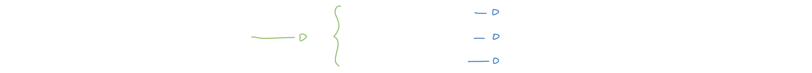
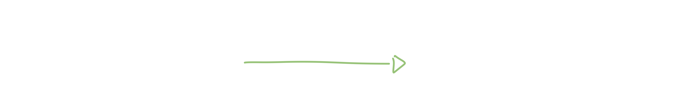
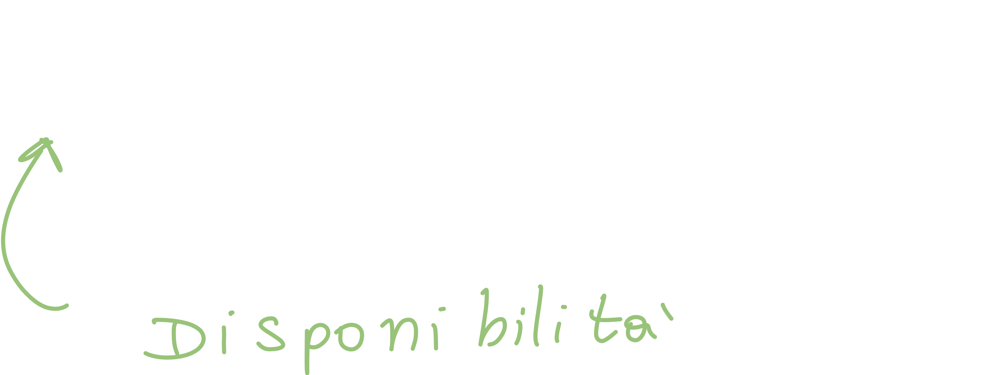

# 1. Fondamenti sui sistemi di produzione

L'esame "Sistemi di Produzione" si focalizza sull'analisi e la gestione dei processi produttivi aziendali. Si coprono i fondamenti dei sistemi di produzione, la valutazione di fattibilità, il project management, gli aspetti progettuali e il dimensionamento del sistema. Inoltre, si esplora la gestione degli approvvigionamenti e dei materiali, l'analisi dei tempi di lavoro e la conduzione multipla, nonché la manutenzione dei sistemi.

## 1.1 Definizioni di base

### L'impianto industriale

l'impianto industriale è un insieme di più componenti che ha come obbiettivo quello di **trasformare** le materie prime in modo da ottenere un **prodotto finito** il quale valore è **maggiore** delle materie prime utilizzate; il "prodotto finito" può essere sia un **bene** che un **servizio**.

Capiamo quindi che **l'obbiettivo è quello di produrre un utile** al netto di tutti i *costi di produzione*.

Come abbiamo detto, un sistema di produzione è composto da diversi altri "blocchi", senza i quali esso non potrebbe funzionare; questi sono **impianti complementari** come:

- Impianto elettrico
- Rete informatica
- Impianto idraulico
- etc.

Questi impianti vengono definiti come **impianti di servizio**.

### Classificazione dell'impianto industriale

Possiamo *classificare* un'impianto industriale a seconda di vari fattori, come:

- **Natura** delle trasformazioni e del prodotto finito
  
- **Dimensioni**
  
- **Capitale** e lavoro
  
- **Processo** produttivo
  
- **Continuità** del processo produttivo
  

### I diversi tipi di commesse

L'azienda può trovarsi davanti a tre tipi di commesse diverse:

- Produzione su commessa singola
- Produzione su commessa ripetitiva
- Produzione per il magazzino

#### Produzione su commessa singola

In questo caso l'azienda riceve ordini di natura anche molto diversa tra di loro; deve quindi impegnarsi a realizzare un **progetto dedicato** e studiare il **ciclo di lavorazione** anche per un singolo prodotto finito.

#### Produzione su commessa ripetitiva

In questo caso **il progetto è definito e consolidato**; le aziende che rientrano in questa categorie sono quelle che producono prodotti **con caratteristiche definite** oppure quelle che producono sulla base di un **catalogo**, ma solo dopo che è stato effettuato un ordine (ovvero non producono in anticipo).

#### Produzione per il magazzino

In questo caso l'azienda produce un volume medio-alto di prodotto che poi viene stoccato all'interno di un magazzino; l'azienda dispone di una **struttura logistica** che si occupa di **ridistribuire** il prodotto finito all'utente finale (che in fase di produzione non è noto!).

### Diversi output del prodotto

A seconda della frequenza dell'output del prodotto, le aziende possono essere classificate nel seguente modo:

1. Produzioni unitarie
   In questo caso l'aziende produce un singolo ordine; questo è dovuto principalmente alla grande diversità dei prodotti richiesti.
2. Produzioni intermittenti o a *lotti*
   L'azienda produce una quantità medio-alta di prodotti finiti, che vengono poi conservati in un magazzino; questo prodotto che rimane "fermo" è detto **scorta**.
3. Produzioni continue
   In questi casi il flusso di prodotti in uscita è ininterrotto.

### La natura del prodotto finito

Il prodotto finito può essere di due tipi, e di conseguenza la produzione può essere ulteriormente classificata nel seguente modo:

#### Produzioni per processo continuo

In questo caso il prodotto assume un "aspetto" che non permette il **riconoscimento delle singole**  materie prime utilizzate.
Rientrano in questa classificazione i seguenti beni:

- Carta
- Cemento
- Acciaio
- etc.

#### Produzioni per parti

In questo caso invece il prodotto finale può essere ulteriormente scomposto in elementi **discreti**. In questo caso il processo di produzione comprende sia le **fasi di fabbricazione** sia  le **fasi di montaggio**.

Rientrano in questa classificazione i seguenti beni:

- Automobili
- Elettrodomestici
- Apparecchiature elettroniche
- etc.

## 1.2 Classificazione delle tipologie di produzione

Le **produzioni manifatturiere** possono essere classificate a seconda che esse richiedano delle **specifiche trasformazioni** dei materiali; in questo caso parliamo di fabbricazioni o *assemblaggi*:

### Fabbricazioni

Queste **soluzioni** sono ordinate in ordine crescente di **scalabilità** e quindi di **volumi unitari di produzione**; è ovvio però che man mano che il volume aumenta, la **flessibilità** del sistema diminuisce.

1. **Produzione per reparti**
   In questo tipo di produzione ogni unità di lavoro (prodotto che si sta producendo) viene trasportata da un *reparto* all'altro in un contenitore chiamato **pallet**. In ogni reparto viene effettuata una serie di operazioni.
   In questo caso non si può effettuare altro raggruppamento oltre a quello che prevede tutte le macchine che effettuano lavorazioni simili in un unico reparto.

2. **Produzione per celle di macchine**
   A partire dal caso precedente, quando è possibile individuare delle *famiglie di pezzi* con cicli di lavorazione che hanno in comune *macchine* e/o *attrezzature*, è possibile **creare gruppi/celle** di macchine diverse tra loro.
   In questo modo è possibile abbassare sia i tempi di produzione che di trasporto

3. **Linee di produzione per prodotto**
   In questo caso, che solitamente è **automatizzato**, abbiamo un insieme di macchine diverse che vengono aggregate in modo da realizzare *rigidamente* una sequenza **prefissata** di operazioni al fine di produrre un pezzo finito standardizzato.

### Montaggi

- **Montaggio a posto fisso**
  In questo caso l'oggetto da realizzare non viene spostato; è l'operatore invece che compie l'assemblaggio del prodotto (spostandosi).
- **Montaggio a trasferimento (linea)**
  - **Linee a ritmo non imposto**
    In questo caso abbiamo una serie di stazioni di lavoro che sono disposte in successione con **polmoni** (ovvero dei depositi che fungono da buffer) intermedi; queste stazioni sono collegate da un sistema di trasporto meccanico.
    Le varie stazioni possono essere considerate come postazioni di montaggio a posto fisso; la linea che li congiunge facilita lo spostamento del prodotto che gli operatori completano step dopo step (in maniera fissa).
  - **Linee con ritmo imposto**
    In questo caso non sono presenti dei veri e propri polmoni (ma potrebbero essercene per rendere più flessibile la linea) e quindi **il ritmo è scandito dalla velocità del trasporto**. Questa soluzione è adottata per **prodotti di grandi dimensioni** come automobili o lavatrici.

#### Differenza tra fabbricazione e montaggio

La differenza sostanziale tra i due, è che nella fabbricazione vengono adottati macchinari e processi che **trasformano** le materie prime, mentre nell'assemblaggio diverse **parti fabbricate** vengono **unite** (assemblate) in modo da ottenere un prodotto finito.

Un esempio di processo di fabbricazione totalmente diverso da quello di assemblaggio potrebbe essere la produzione di materiali plastici mediante **estrusione**. Questo processo di fabbricazione plastica si concentra sulla trasformazione del materiale grezzo (granuli di plastica) in una forma specifica.

### Classificazione in funzione del grado di automazione

Il livello di automazione di un impianto è il **livello di autosufficienza degli impianti nello svolgere le attività produttive**:

- **Linee semiautomatiche**
  In questo caso sono presenti un gran numero di operazioni automatiche che vengono però accompagnate da operazioni manuali; questo approccio è adottato nel montaggio di prodotti di media/alta serie, come ad esempio i motori.
- **Linee automatiche**
  Questo approccio è adottato nell'assemblaggio in produzione di **altissima serie**, come ad esempio le *schede elettroniche* o nelle *lampadine*

### Gli stati di un impianto

Gli stati sono **espressi in ore** e si parte dalle ore totali, dette **tempo di apertura impianto T**.

- **Produzione buona PB**
- **Produzione di scarto PS**
- **Prove PR**
- **Guasti G**
  - svuotamento della macchina, raffreddamento della macchina, etc.
  - Intervento di manutenzione
  - etc.
- **Fermata programmata F**
- **Setup S** (la macchina viene *riattrezzata* per poter passare da un tipo di produzione all'altro)
- **Mancanza ordini MO**
- **Mancanza materiali MM**
- **Scioperi SC**
- **Organizzazione O** l'impianto è fermo per motivi organizzativi:
  - Mancanza di materiali nonostante siano disponibili nel magazzino.
  - esistono degli ordini di produzione che richiedono la macchina, ma i prodotti sono ancora ad una fase precedente.

#### Disponibilità A

Possiamo calcolare la disponibilità con la seguente formula:

## 1.3 Flessibilità e versatilità nei sistemi produttivi

La **Flessibilità** solitamente fa riferimento a diversi ambiti del processo produttivo, come al personale, agli impianti, tecnologie, perfino le strutture.

La **Versatilità**, invece, fa riferimento **solo ed unicamente** ai macchinari ed agli impianti. 

La versatilità e la flessibilità sono necessari per poter far fronte a **rapidi cambiamenti**.

Misuriamo la flessibilità in termini di **tempi** e di **costi**:

- **Flessibilità statica**: in questo caso il processo di produzione **non è ancora partito**; questa è la capacità del sistema di riassortire in tempi e costi contenuti i prodotti
- **Flessibilità dinamica**: ovvero la capacità di **industrializzare un nuovo prodotto** quando il sistema sta già producendo un altro prodotto. Capiamo quindi che è detta *"dinamica"* perché il sistema è già avviato alla produzione di *un altro* prodotto.
- **Flessibilità di Mix**: ovvero la capacità di cambiare "il mix" di prodotti con tempi e costi contenuti
- **Flessibilità di volume:** ovvero la capacità **di incrementare** il volume di produzione (il che è relativamente semplice andando ad  esempio ad aumentare il numero di macchine) **senza incidere troppo sui costi e sui tempi**.

Per quanto riguarda l'ultimo punto, ci sono diversi modi per aumentare il volume di produzione:

- Aumentare i turni dei lavoratori
- Acquistare nuove macchine
- Subappaltare il lavoro

Dobbiamo però mantenere uguale (o molto simile) il **costo unitario** dell'oggetto: questo è il **costo effettivo** del **singolo** prodotto finito. Se riusciamo ad aumentare  il volume senza aumentare anche il prezzo del singolo prodotto, allora **abbiamo un'alta flessibilità di volume**.

#### Misurare la flessibilità

Possiamo anche misurare la flessibilità:

- **Statica**: si misura in **Lead Time** di consegna: "il tempo necessario per la consegna dei prodotti con l'impianto riconfigurato". Con questo si intende che il prodotto non deve solo essere prodotto, ma anche **consegnato al cliente**. 
  In questo caso il sistema deve solo essere **riconfigurato**; questa è un'operazione relativamente semplice visto che il processo di produzione non è ancora partito (non bisogna arrestare il processo di produzione come nel caso successivo).
- **Dinamica:** L'impianto deve essere **riconvertito**, quindi misuriamo la **convertibilità**, che è misurata da un tempo detto **Time to market**: questo valore misura il tempo che impiega il prodotto ad essere **disponibile sul mercato** (e non solo prodotto!).
  Questa operazione è più complessa e dispendiosa, visto che il processo di produzione deve essere arrestato. Questo tempo aggiuntivo necessario all'arresto è detto **tempo di inattività**.
- **Di Volume:** in questo caso misuriamo la flessibilità con un valore detto **break-even-point**.

