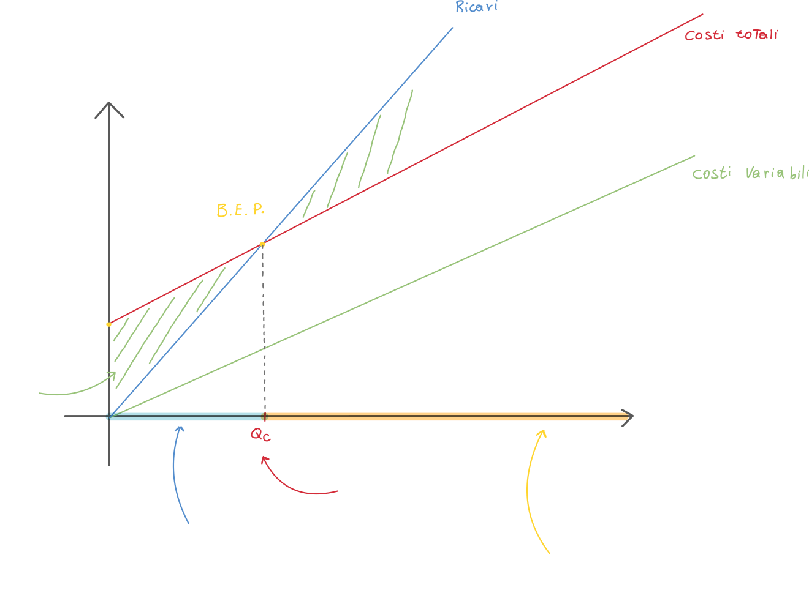
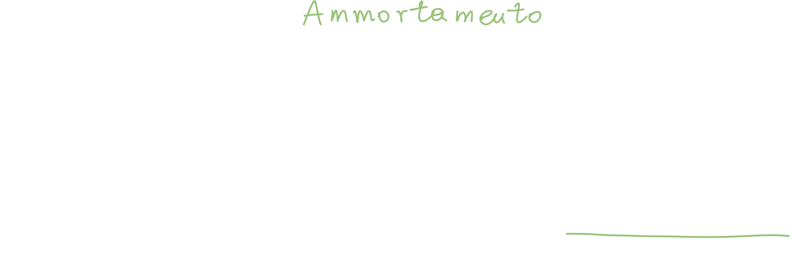
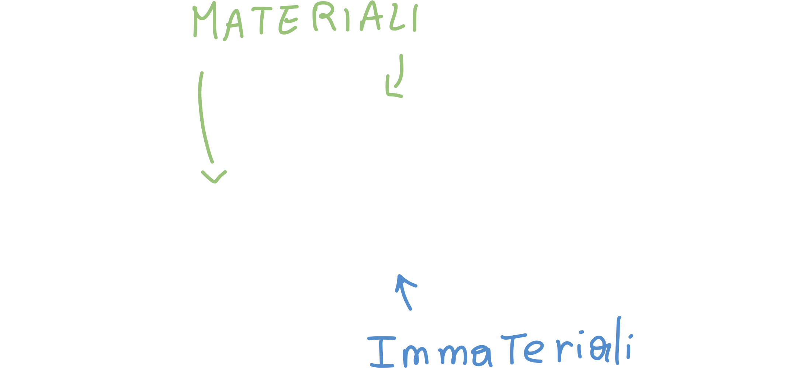
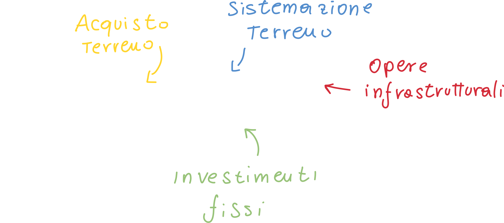
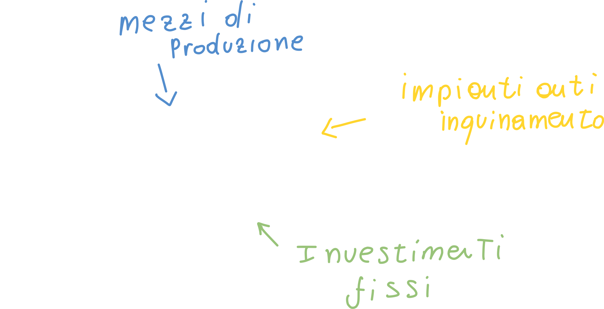
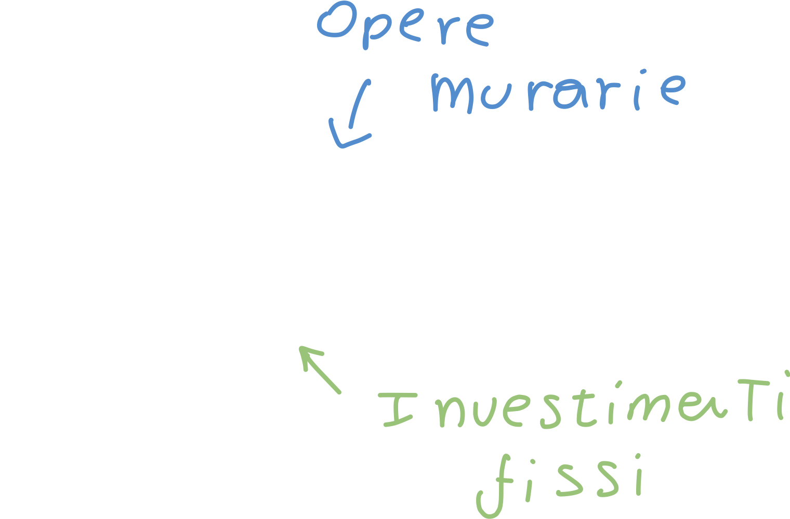
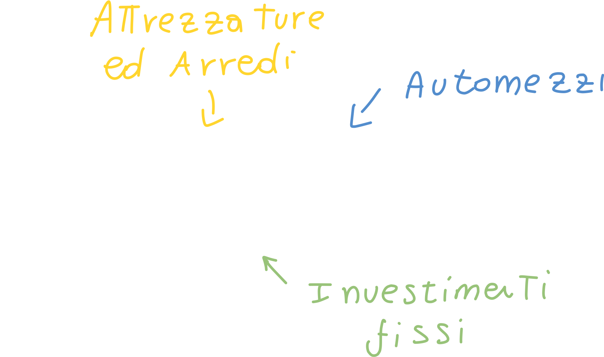

# Cost Accounting

Il cost accounting è un elemento critico dell'impresa: se non venisse calcolato correttamente, potrebbe portare ad una sottostima o sovrastima dei costi di produzione; entrambi gli scenari porterebbero ad una perdita di utile.

> Da pagina 33 del libro

Per poter procedere dobbiamo dare uno sguardo alle **categorie di costo**

## Analisi dei costi di impianto e di esercizio

### Costi di impianto

Sono tutti quei costi che si sostengono per la **realizzazione** delle infrastrutture (come acquisto del solo, oneri di progettazione, acquisto di macchinari, etc.)

### Costi di esercizio

Tutti quei costi che possono essere imputati **al funzionamento dell'impianto e dell'attività**, compresi i **costi logistici**, ovvero il *trasporto* del prodotto dall'impianto di produzione fino ai depositi che si occupano poi della distribuzione.

Possiamo fare un esempio banale di costo di esercizio nel caso di un impianto che produce automobili: l'energia elettrica che viene utilizzata all'interno dell'impianto (illuminazione, riscaldamento, macchinari, etc.) è un costo di esercizio.

Sono costi di esercizio anche la *manutenzione dei macchinari*, la *manodopera* e gli *affitti* dei locali.

## Costi diretti ed indiretti

### Costi diretti

Ovvero i costi direttamente collegati al prodotto, come le materie prime utilizzate, la manodopera diretta)

### Costi indiretti

In questa categoria rientrano le materie prime indirette, ovvero tutte quelle materie prime che non compaiono nel prodotto finale (come gli scarti); rientrano in questa categoria anche tutti i costi di esercizio.

## Costi fissi e variabili

### Costi fissi

Questi non dipendono dal volume di produzione (invarianti); un esempio potrebbe essere proprio il **salario del personale**, che non varia a seconda del volume. Bisogna però fare una precisazione: qualora ci fosse bisogno di aumentare il volume di produzione, inevitabilmente il costo della manodopera aumenterà per via del fatto che ci sarà un maggior numero di operai (o maggior numero di ore) a lavorare nella produzione.

## Il volume ottimale di produzione

> A partire da pagina 37

L'analisi **costi-volume-profitto** può essere rappresentata mediante un diagramma, che viene detto **diagramma di redditività** dove lungo l'asse delle x indichiamo il *volume di produzione*, mentre lungo l'asse delle y indichiamo i *costi e ricavi per periodo di tempo*.

Bisogna notare che i costi riportati sono relativi ai **costi unitari**, ovvero il prezzo del singolo prodotto (*!!!non sono sicuro di questa affermazione credo che il prof si sia sbagliato. i ricavi su un singolo prodotto sono costanti, mentre nel grafico che mostra lui aumentano a seconda delle vendite!!!*).

Inoltre, ipotizziamo che i costi variabili, totali ed i ricavi siano **lineari**:

I costi totali **iniziano** dall'origine dei **costi fissi**: anche quando la produzione è zero c'è un costo fisso da sostenere.

I ricavi, invece, iniziano da zero: anche se ho sostenuto dei costi iniziali, ma non ho venduto nulla, non avrò ricavi.

Ad un certo punto, l'equazione dei costi totali **intercetta** quella dei ricavi: questo punto viene chiamato **break even point**.
N.B. Il **BEP** è il valore sull'asse delle y: costi e ricavi.

L'area compresa tra i ricavi ed i costi, a sinistra del BEP, è detta **area di perdita**; in quest'area il volume dei ricavi non copre ancora i costi sostenuti fino a quel punto.

### Break-even-point

Dal BEP possiamo calcolare diversi valori che ci tornano molto *utili*:

#### Utile

Possiamo definire **l'utile** come i *ricavi* meno i *costi*:  

- **Costi di produzione**: manodopera diretta, energia, ammortamenti
  - **Ammortamento**: il valore (costo) sostenuto per l'acquisizione di un prodotto, ripartito in *tutto l'intervallo di vita utile* dell'utile stesso.
    Ad esempio, se si acquista un autocarro a 300k€ ed ha una vita utile di 10 anni, il costo di ammortamento sarà pari al costo dell'autocarro diviso il tempo di vita utile:
    
    Il periodo di ammortamento **è fissato dalla legge**, inoltre si dice "il costo dell'autocarro viene *ammortizzato* (e non ammortato o simili) in tot anni."
- **Costi generali**: sono i *costi amministrativi* e *costi commerciali*, come ad esempio la pubblicità e campagne promozionali.

#### Utile netto di esercizio

In questo caso i ricavi rimangono invariati, mentre i costi vengono **suddivisi** in 3 categorie:

Gli **oneri finanziari** sono tutti gli **interessi** che vengono pagati sul capitale immobilizzato (capitale sociale, capitale investito, etc.).

#### Utile complessivo di esercizio

Questo valore si ottiene aggiungendo ai costi anche gli **oneri tributari**, ovvero le **tasse** che vengono pagate sul capitale (denaro e beni)  posseduto.

## Progetto finanziario

> Nome alternativo sul libro: *redditività degli investimenti industriali*  a partire da pagina 41

Un **investimento** è l'impiego di un certo ammontare di capitale in acquisizione di beni strumentali che possono sostituire quelli già presenti (ad esempio andare a sostituire un macchinario vecchio e lento con uno più veloce).

### Fabbisogni dell'impianto

Ovvero che tipo di fabbisogno economico è necessario per coprire i costi di impianto e di esercizio; tra questi è presente il **capitale circolante**: questo capitale non è altro che la *quantità di capitale che deve essere **sempre disponibile** al fine di far funzionare l'impianto a regime*:

In altre parole il capitale circolante è il denaro che (solitamente, quindi ripetutamente) viene speso per acquistare energia, materiale, combustibili, etc. al fine di far *funzionare* l'impianto.
Questo capitale **si rinnova continuamente**, ma a regime rimane più o meno costante.

### Fonti

E' il denaro necessario a **far partire l'impianto**: tra questi abbiamo il *capitale sociale*, i *finanziamenti*.
In altre parole le fonti **provengono dall'esterno**.

Se le fonti non sono almeno pari ai fabbisogni **il progetto non può partire**.
Anche se però raggiungiamo la parità tra fonti e fabbisogni, potrebbe non bastare: abbiamo infatti una serie di fattori (ratios di impianto) che ci danno l'idea di come abbiamo progettato la spesa:

## Progetto finanziario

Abbiamo diversi indici:

### Immobilizzazioni materiali (MA)

Le chiamiamo *immobilizzazioni* perché abbiamo speso del denaro per acquisirli, e quindi abbiamo *immobilizzato* del denaro, che non può essere speso per acquistare altro.

Sono inoltre detti *materiali* perché i beni acquistati con questo capitale sono **tangibili**.

- **TE** acquisto del terreno
- **SE** spesa per la sistemazione delle *aree di sedime* e più in generale per la sistemazione delle infrastrutture nei dintorni all'impianto.
- **OM** opere murarie e fabbricati (contenitore dell'impianto)
- **OI** opere infrastrutturali, che sono sempre collegate alla struttura dell'impianto, come le strade di accesso all'impianto.
- **MP** mezzi produttivi, ovvero tutto quello che serve o è di supporto alla produzione, come **l'impianto elettrico**, **climatizzazione**, etc.
- **IA** antinquinamento, ovvero la parte di depurazione dell'impianto
- **AT** attrezzature ed arredi (meno importante).
- **AU** automezzi (meno importante)

### Immobilizzazioni immateriali (IM)

- Brevetti
- **Prestazioni professionali**: questo ci fa capire che, ad esempio, una software house (che quindi ha un personale più specifico e ben pagato) avrà delle immobilizzazioni immateriali maggiori rispetto ad una azienda di produzione (che ha un personale per lo più composto da operai).
- **Oneri di impianto**: come ad esempio imballi, trasporti, montaggi e collaudi.
- **Oneri di avviamento**: come ad esempio l'avviamento del personale
- Corsi d'aggiornamento: tutto ciò che è formazione (esperienza) del personale fa parte dell'immobilizzazione immateriale.
- Acquisto di licenze software
- **Blasone del marchio**: ovvero l'azienda che ha maggiore capacità di fare *presa sul mercato*; ad esempio il marchio Ferrari ha una capacità nettamente maggiore di *proporsi sul mercato* di una qualsiasi altra marca di automobili livello *consumer*.

## I ratios

I ratios provengono direttamente dalle definizione di MA ed IM appena fatte; i ratios **valutano l'incidenza delle immobilizzazioni**:

### Ratios "materiali"

#### L'indice m (immobilizzazioni materiali)

Questo rapporto ci dice quanto incidono le spese per *immobilizzazioni immateriali*.

Se ad esempio dovessimo confrontare questo indice di due aziende diverse: un'azienda che produce ed una che eroga servizi (ad esempio software), troveremmo che **l'indice delle immobilizzazioni materiali** della seconda dovrebbe essere molto più basso della prima.

#### L'indice s

Questo indice mette in relazione gli indici dell'acquisto del terreno, alla sistemazione del terreno e le opere infrastrutturali, rispetto agli investimenti fissi:

Un alto valore dell'indice SE ci farebbe capire che  la **scelta ubicazionale** non è stata fatta adeguatamente.

**In poche parole** l'indice **s** è l'incidenza della scelta ubicazionale sugli investimenti fissi.

#### L'indice p

Ovvero la somma tra mezzi di produzione ed impianti anti inquinamento sugli investimenti fissi:

 

#### L'indice f

Questo indice ci dice **l'incidenza delle opere murarie sugli investimenti fissi**:

Anche in questo caso ci aspettiamo un valore dell'indice f molto più basso in una società di software che in un'azienda di produzione.

#### L'indice a

Questo è l'indice di incidenza degli **automezzi sui costi fissi**:

 

##### Relazioni tra i ratios

I ratios devono essere tra di loro:

1. p > s
2. p > f
3. p > a

Abbiamo inoltre delle **agevolazioni finanziarie se**

1. p > 2f

Ovvero se la spesa in impianti anti inquinamento è più che doppia della spesa per le opere murarie. 

### Ratios "immateriali"