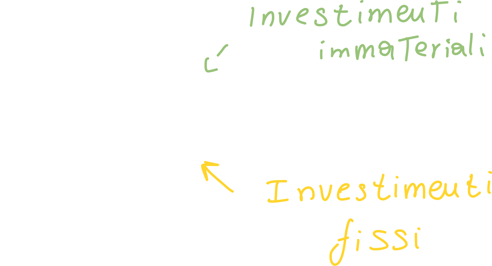
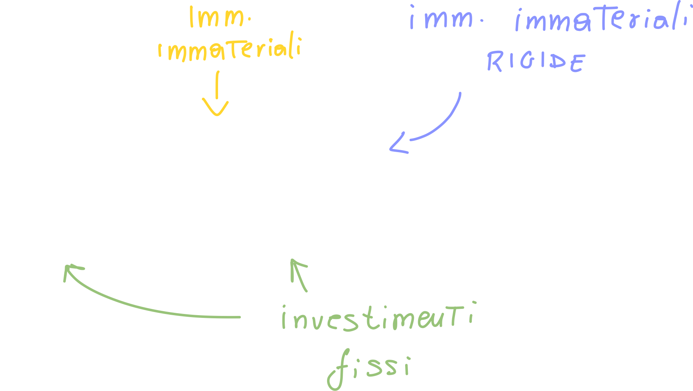

# Cost Accounting

Il cost accounting è un elemento critico dell'impresa: se non venisse calcolato correttamente, potrebbe portare ad una sottostima o sovrastima dei costi di produzione; entrambi gli scenari porterebbero ad una perdita di utile.

> Da pagina 33 del libro

Per poter procedere dobbiamo dare uno sguardo alle **categorie di costo**

## Analisi dei costi di impianto e di esercizio

### Costi di impianto

Sono tutti quei costi che si sostengono per la **realizzazione** delle infrastrutture (come acquisto del solo, oneri di progettazione, acquisto di macchinari, etc.)

### Costi di esercizio

Tutti quei costi che possono essere imputati **al funzionamento dell'impianto e dell'attività**, compresi i **costi logistici**, ovvero il *trasporto* del prodotto dall'impianto di produzione fino ai depositi che si occupano poi della distribuzione.

Possiamo fare un esempio banale di costo di esercizio nel caso di un impianto che produce automobili: l'energia elettrica che viene utilizzata all'interno dell'impianto (illuminazione, riscaldamento, macchinari, etc.) è un costo di esercizio.

Sono costi di esercizio anche la *manutenzione dei macchinari*, la *manodopera* e gli *affitti* dei locali.

## Costi diretti ed indiretti

### Costi diretti

Ovvero i costi direttamente collegati al prodotto, come le materie prime utilizzate, la manodopera diretta)

### Costi indiretti

In questa categoria rientrano le materie prime indirette, ovvero tutte quelle materie prime che non compaiono nel prodotto finale (come gli scarti); rientrano in questa categoria anche tutti i costi di esercizio.

## Costi fissi e variabili

### Costi fissi

Questi non dipendono dal volume di produzione (invarianti); un esempio potrebbe essere proprio il **salario del personale**, che non varia a seconda del volume. Bisogna però fare una precisazione: qualora ci fosse bisogno di aumentare il volume di produzione, inevitabilmente il costo della manodopera aumenterà per via del fatto che ci sarà un maggior numero di operai (o maggior numero di ore) a lavorare nella produzione.

## Il volume ottimale di produzione

> A partire da pagina 37

L'analisi **costi-volume-profitto** può essere rappresentata mediante un diagramma, che viene detto **diagramma di redditività** dove lungo l'asse delle x indichiamo il *volume di produzione*, mentre lungo l'asse delle y indichiamo i *costi e ricavi per periodo di tempo*.

Bisogna notare che i costi riportati sono relativi ai **costi unitari**, ovvero il prezzo del singolo prodotto (*!!!non sono sicuro di questa affermazione credo che il prof si sia sbagliato. i ricavi su un singolo prodotto sono costanti, mentre nel grafico che mostra lui aumentano a seconda delle vendite!!!*).

Inoltre, ipotizziamo che i costi variabili, totali ed i ricavi siano **lineari**:

I costi totali **iniziano** dall'origine dei **costi fissi**: anche quando la produzione è zero c'è un costo fisso da sostenere.

I ricavi, invece, iniziano da zero: anche se ho sostenuto dei costi iniziali, ma non ho venduto nulla, non avrò ricavi.

Ad un certo punto, l'equazione dei costi totali **intercetta** quella dei ricavi: questo punto viene chiamato **break even point**.
N.B. Il **BEP** è il valore sull'asse delle y: costi e ricavi.

L'area compresa tra i ricavi ed i costi, a sinistra del BEP, è detta **area di perdita**; in quest'area il volume dei ricavi non copre ancora i costi sostenuti fino a quel punto.

### Break-even-point

Dal BEP possiamo calcolare diversi valori che ci tornano molto *utili*:

#### Utile

Possiamo definire **l'utile** come i *ricavi* meno i *costi*:  

- **Costi di produzione**: manodopera diretta, energia, ammortamenti
  - **Ammortamento**: il valore (costo) sostenuto per l'acquisizione di un prodotto, ripartito in *tutto l'intervallo di vita utile* dell'utile stesso.
    Ad esempio, se si acquista un autocarro a 300k€ ed ha una vita utile di 10 anni, il costo di ammortamento sarà pari al costo dell'autocarro diviso il tempo di vita utile:
    
    Il periodo di ammortamento **è fissato dalla legge**, inoltre si dice "il costo dell'autocarro viene *ammortizzato* (e non ammortato o simili) in tot anni."
- **Costi generali**: sono i *costi amministrativi* e *costi commerciali*, come ad esempio la pubblicità e campagne promozionali.

#### Utile netto di esercizio

In questo caso i ricavi rimangono invariati, mentre i costi vengono **suddivisi** in 3 categorie:

Gli **oneri finanziari** sono tutti gli **interessi** che vengono pagati sul capitale immobilizzato (capitale sociale, capitale investito, etc.).

#### Utile complessivo di esercizio

Questo valore si ottiene aggiungendo ai costi anche gli **oneri tributari**, ovvero le **tasse** che vengono pagate sul capitale (denaro e beni)  posseduto.

## Progetto finanziario

> Nome alternativo sul libro: *redditività degli investimenti industriali*  a partire da pagina 41

Un **investimento** è l'impiego di un certo ammontare di capitale in acquisizione di beni strumentali che possono sostituire quelli già presenti (ad esempio andare a sostituire un macchinario vecchio e lento con uno più veloce).

### Fabbisogni dell'impianto

Ovvero che tipo di fabbisogno economico è necessario per coprire i costi di impianto e di esercizio; tra questi è presente il **capitale circolante**: questo capitale non è altro che la *quantità di capitale che deve essere **sempre disponibile** al fine di far funzionare l'impianto a regime*:

In altre parole il capitale circolante è il denaro che (solitamente, quindi ripetutamente) viene speso per acquistare energia, materiale, combustibili, etc. al fine di far *funzionare* l'impianto.
Questo capitale **si rinnova continuamente**, ma a regime rimane più o meno costante.

### Fonti

E' il denaro necessario a **far partire l'impianto**: tra questi abbiamo il *capitale sociale*, i *finanziamenti*.
In altre parole le fonti **provengono dall'esterno**.

Se le fonti non sono almeno pari ai fabbisogni **il progetto non può partire**.
Anche se però raggiungiamo la parità tra fonti e fabbisogni, potrebbe non bastare: abbiamo infatti una serie di fattori (ratios di impianto) che ci danno l'idea di come abbiamo progettato la spesa:

## Progetto finanziario

> A partire da pagina 55

Abbiamo diversi indici:

### Immobilizzazioni materiali (MA)

Le chiamiamo *immobilizzazioni* perché abbiamo speso del denaro per acquisirli, e quindi abbiamo *immobilizzato* del denaro, che non può essere speso per acquistare altro.

Sono inoltre detti *materiali* perché i beni acquistati con questo capitale sono **tangibili**.

- **TE** acquisto del terreno
- **SE** spesa per la sistemazione delle *aree di sedime* e più in generale per la sistemazione delle infrastrutture nei dintorni all'impianto.
- **OM** opere murarie e fabbricati (contenitore dell'impianto)
- **OI** opere infrastrutturali, che sono sempre collegate alla struttura dell'impianto, come le strade di accesso all'impianto.
- **MP** mezzi produttivi, ovvero tutto quello che serve o è di supporto alla produzione, come **l'impianto elettrico**, **climatizzazione**, etc.
- **IA** antinquinamento, ovvero la parte di depurazione dell'impianto
- **AT** attrezzature ed arredi (meno importante).
- **AU** automezzi (meno importante)

### Immobilizzazioni immateriali (IM)

- Brevetti
- **Prestazioni professionali**: questo ci fa capire che, ad esempio, una software house (che quindi ha un personale più specifico e ben pagato) avrà delle immobilizzazioni immateriali maggiori rispetto ad una azienda di produzione (che ha un personale per lo più composto da operai).
- **Oneri di impianto**: come ad esempio imballi, trasporti, montaggi e collaudi.
- **Oneri di avviamento**: come ad esempio l'avviamento del personale
- Corsi d'aggiornamento: tutto ciò che è formazione (esperienza) del personale fa parte dell'immobilizzazione immateriale.
- Acquisto di licenze software
- **Blasone del marchio**: ovvero l'azienda che ha maggiore capacità di fare *presa sul mercato*; ad esempio il marchio Ferrari ha una capacità nettamente maggiore di *proporsi sul mercato* di una qualsiasi altra marca di automobili livello *consumer*.

## I ratios

I ratios provengono direttamente dalle definizione di MA ed IM appena fatte; i ratios **valutano l'incidenza delle immobilizzazioni**:

### Ratios di struttura

> A partire da pagina 56

#### L'indice m (immobilizzazioni materiali)

Questo rapporto ci dice quanto incidono le spese per *immobilizzazioni immateriali*.

Se ad esempio dovessimo confrontare questo indice di due aziende diverse: un'azienda che produce ed una che eroga servizi (ad esempio software), troveremmo che **l'indice delle immobilizzazioni materiali** della seconda dovrebbe essere molto più basso della prima.

#### L'indice s

Questo indice mette in relazione gli indici dell'acquisto del terreno, alla sistemazione del terreno e le opere infrastrutturali, rispetto agli investimenti fissi:

Un alto valore dell'indice SE ci farebbe capire che  la **scelta ubicazionale** non è stata fatta adeguatamente.

**In poche parole** l'indice **s** è l'incidenza della scelta ubicazionale sugli investimenti fissi.

#### L'indice p

Ovvero la somma tra mezzi di produzione ed impianti anti inquinamento sugli investimenti fissi:

 

#### L'indice f

Questo indice ci dice **l'incidenza delle opere murarie sugli investimenti fissi**:

Anche in questo caso ci aspettiamo un valore dell'indice f molto più basso in una società di software che in un'azienda di produzione.

#### L'indice a

Questo è l'indice di incidenza degli **automezzi sui costi fissi**:

 

##### Relazioni tra i ratios

I ratios devono essere tra di loro:

1. p > s
2. p > f
3. p > a

Abbiamo inoltre delle **agevolazioni finanziarie se**

1. p > 2f

Ovvero se la spesa in impianti anti inquinamento è più che doppia della spesa per le opere murarie. 

#### L'indice i

**Grado di immaterialità**

E' il rapporto tra gli investimenti immateriali e gli investimenti fissi, e ci dice quanto incidono le immobilizzazioni immateriali rispetto agli investimenti fissi:

#### L'indicatore c:

**Grado di capitalizzazione**

Si parla di **indicatori** quando il valore risultante da un rapporto (ratio) ha una dimensione: mentre i **gli indici** sono *adimensionali* (o numeri puri), gli indicatori hanno un'unità di misura, proprio perché **sono un rapporto tra due grandezze diverse**.

L'indicatore c ci dice tutto quello che è stato speso in relazione alla *numerosità* degli addetti; più è basso, maggiore è la preponderanza del numero degli addetti rispetto agli investimenti fissi.

##### Un esempio di grado di capitalizzazione

Prendendo come esempio un'azienda in ambito **tech**, che ha degli investimenti fissi bassi, perché gli investimenti immateriali sono alti mentre gli investimenti materiali sono bassi; inoltre hanno un personale ben specializzato. Di conseguenza **hanno un basso grado di capitalizzazione**.

Le aziende di produzione hanno invece in genere un grado più alto di capitalizzazione.

Questo grado può anche essere espresso nel seguente modo:

#### L'indicatore g

 **Grado di automazione**

Rapporta i mezzi di produzione rispetto al numero degli addetti **direttamente impiegati nella produzione**:

Diciamo quindi che *un'azienda ha un alto grado di automazione* quando ha speso molto denaro per acquistare i mezzi di produzione rispetto al numero degli operai direttamente  impiegati nell'utilizzo di questi mezzi.

 

## Spese flessibili e rigide

### Spese Flessibili

Si definiscono **componenti flessibili** di un impianto, quelle componenti che possono essere utilizzate anche per altri tipi di produzione dopo la **riconversione** dell'impianto (per produrre un prodotto diverso).

### Spese Rigide

Vengono chiamate spese rigide le spese per quei mezzi di produzione che **non possono essere più utilizzati** dopo la riconversione dell'impianto; quindi queste macchine vengono utilizzate per produrre un certo prodotto e poi vengono dismesse (spesso vendute).

### Ratios delle spese flessibili e rigide

I ratios legati alle spese in mezzi di produzione flessibili o rigide sono i seguenti:

- **Opere murarierigide su opere murarie**
  
- **Opere infrastrutturalirigide su opere murarie**
  
- **Mezzi di produzionerigidi su mezzi di produzione**
  

Vengono detti **investimenti fissi rigidi** la somma delle immobilizzazioni immateriali più le immobilizzazioni materialirigide diviso gli investimenti fissi:

Un esempio di **immobilizazione immateriale rigida** potrebbe essere uno dei seguenti:

- Corsi di aggiornamento: l'azienda spende del denaro per "istruire" i dipendenti per la progettazione CAD, ma successivamente:
  - L'azienda smette di progettare in CAD --> la spesa è rigida
  - Il dipendente lascia l'azienda
- Progetti dell'impianto: le spese per poter progettare l'impianto sono di tipo "rigido" se il progetto (e quindi l'impianto) può essere usato solo per un tipo di prodotto.

Ovviamente vorremmo vedere l'indice **IFR/IF** il più basso possibile: questo ci direbbe che gli investimenti sono **flessibili**.

### Ratios di Costo

> A partire da pagina 59

Su questi rapporti è fondato lo **studio di progetto** di una nuova iniziativa industriale; andando ad *esaminare* questi rapporti potremo valutare l'iniziativa industriale durante il suo ciclo di vita.

Andiamo quindi a definire:

- **R** - Ricavi netti vendite
- **C1** - Costo dei prodotti venduti
  - Consumo delle materie prime necessarie
  - Stipendi
- **C2** - Spese commerciali: ad esempio la pubblicità
- **C3** - Spese generali: ovvero gli stipendi ed ammortamenti
- **C4** - Oneri finanziari: ovvero il pagamento dei mutui / banche
- **C5** - Oneri tributari: ovvero le tasse 

> Lezione 2 00:45' manca qualche ratio

Il primo rapporto che andiamo a vedere è quello che ci dice **quanto vale l'utile rispetto al fatturato**:

Quanto più riusciamo ad abbassare i *costi totali CT*, maggiore diventa il rapporto. Inoltre, qualora i costi totali tendessero a zero, avremmo che il rapporto (e quindi l'utile netto) vale 1; questo ovviamente non è realizzabile in realtà, perché sull'utile netto deve essere pagata una parte di oneri (tasse).

Con questo calcolo andiamo a vedere se **l'utile rispetto al fatturato** (a fronte di *ciascun* costo); questo ci serve per capire *qual è quella categoria di costo che incide troppo*.

E' detto **costo interno per addetto** il rapporto:

E' detto rapporto di **ricavi rispetto agli investimenti fissi**:

Ci permette di dire, rispetto al denaro ricavato dalla vendita della produzione, quanto i ricavi possono rendere quello che gli investimenti fissi hanno richiesto inizialmente.

Possiamo definire i rapporti di costi interni e costi esterni nel seguente modo:

Possiamo definire In **utile netto** che viene calcolato come *fatturato - oneri tributari*; usiamo In per calcolare i rapporti:

- **Indice di redditività degli investimenti fissi**, ovvero quanto gli investimenti fissi stanno rendendo all'azienda
- **Indice di redditività del capitale**
  

# Analisi di convenienza per gli investimenti

Per fare in modo che gli investimenti abbiamo un elevato **indice di redditività** (sia del capitale che degli investimenti fissi) dobbiamo **classificare gli investimenti**:

## Classificazione degli investimenti - flusso di cassa

Gli investimenti si classificano in funzione di come il capitale investito *entra ed esce* in relazione al tipo di servizio che è stato acquisito.

### Point input - Point Output

Abbiamo (ad intervalli) un flusso di denaro in ingresso di tipo *one shot* (ovvero in un singolo "colpo") ed un corrispondente flusso di denaro in uscita. Questo "comportamento" è tipico dei finanziamenti statali o per alcune spese che si affrontano per alcuni tipi di *immobilizzazioni immateriali* come le spese per le **consulenze**.

In questo caso **attendiamo che il denaro entri** (ad esempio un finanziamento), successivamente *rendicontiamo allo stato* (giustifichiamo) la maniera in cui il denaro è stato speso.

### Point input - Continuous Output

Acquisiamo il bene, e poi **periodicamente** versiamo delle quote; ad esempio quando compriamo un'automobile, questa ci "arriva" in un'unica soluzione. periodicamente, poi, paghiamo delle rate in maniera *continuata*.

### Continuous input - Point output

In questo caso concediamo, ad esempio, in leasing una macchina che ci genera un input continuo, e compriamo un macchinario che genera un point output.
Questo tipo di comportamento è tipico del **settore dei servizi**, come ad esempio aziende che offrono automobili in leasing.

### Continuous input - Continuous output

Ad esempio acquisto delle attrezzature pagandole a rate/leasing, di conseguenza c'è un flusso in uscita costante. C'è anche però un input continuo che deriva dalla vendita di prodotti/servizi.

Questo è il **tipico investimento di tipo produttivo**.

## Classificazione degli investimenti - funzione dell'investimento

Possiamo classificare gli investimenti anche a seconda del contesto in cui l'investimento viene effettuato:

### Investimenti Indipendenti

Gli investimenti indipendenti sono quel tipo di investimento dove si va ad acquistare un bene (o servizio) per uno scopo, potrà essere usato anche per altri scopi:
Ad esempio acquistando un computer, questo può svolgere un gran numero di funzioni.

### Investimenti dipendenti

Questi acquisti sono detti *dipendenti* proprio perché **dipendono da un investimento precedente** che ne ha generato la necessità.
Ad esempio se acquisto delle attrezzature informatiche, come il lettore di un codice a barre, devo anche acquistare un software che processa i dati letti dall'hardware.

Questi si dividono a loro volta in:

- **Interconnessi**: associa al fatto di essere *concatenato*, anche il fatto di essere rigido, ovvero **non posso utilizzarlo per uno scopo terzo**. Un esempio è sicuramente un'optional di un'automobile: questo, una volta comprato, non potrà essere usato per un altro scopo.
- **Concatenati**: è un qualcosa da comprare **necessariamente**: se compro un computer devo comprare anche una licenza di sistema operativo.
- **Sussidiari**: è la categoria che impatta meno; è un investimento **aggiuntivo** (non necessario) che si acquista per far funzionare *meglio* ciò che già si ha. Ad esempio un investimento dipendente sussidiario, **dopo** aver acquistato un computer, è quello di un software di scrittura.

## Strumenti per la valutazione degli investimenti

La valutazione di un qualsiasi investimento verte principalmente su due punti cardine:

- Periodo di recupero
- "costo" dell'investimento

### Periodo di recupero

Il periodo di recupero di un investimento è **l'arco temporale necessario per il recupero della spesa iniziale**.

Possiamo *valutare* l'arco temporale usando un **sistema di assi** in cui pongo sugli assi:

- Asse y: flusso di cassa (continuous input/output)
- Asse x: tempo

Notiamo che inizialmente abbiamo un **flusso di cassa negativo**, questo perché abbiamo una **somma algebrica** tra output ed input, e siccome inizialmente l'input è zero, il flusso sarà negativo.

Bisogna notare che **l'esborso iniziale** non è limitato solo per T=0, ma continua anche fino a T0; infatti il cash flow inizia "negativo" perché per avviare l'investimento ho bisogno di immobilizzare una parte (o tutto) del denaro; successivamente l'investimento "inizia a lavorare", ma impiegherà del tempo prima di  rendere il cash flow positivo.

Dopo T0, il cash flow passa da negativo, a zero, fino a diventare positivo; in questo punto non abbiamo ancora recuperato l'investimento.

Recuperiamo il denaro investito nel momento in cui la funzione (retta in questo caso) intercetta l'asse del tempo.

> Quando il grafico **intercetta l'asse del tempo** (non T0!), quello verrà detto **tempo di recupero**.

**Inoltre**, anche quando arriviamo ad intercettare l'asse del tempo non siamo certi di aver recuperato l'investimento; questo perché se nel tempo impiegato avessimo depositato il capitale iniziale (invece di aprire un'azienda!) in banca o in un fondo fruttifero, avremmo sicuramente **guadagnato degli interessi**.

Questo ci fa giungere alla conclusione che **il denaro "ci costa"**.

## Capitalizzazione - Il Net Present Value

> A partire da pagina 43

La capitalizzazione consiste nel cercare di capire, mediante dei calcoli, quanto ci può **rendere** una somma di denaro in funzione di un parametro detto **tasso di interesse**, che è proprio il *costo del denaro*.

Definiamo quindi:

- **C0** - capitale iniziale all'anno zero
- **i** - Tasso di interesse: questo valore varia **tra zero ed uno**
- **n** - durata dell'investimento

Possiamo calcolare il capitale che avremmo per un qualsiasi anno conoscendo il tasso di interesse:

La cosa interessante, però, è quella di **invertire la formula** e ricavare il **valore di una somma disponibile ora, tra n anni**; in altre parole: il denaro di cui dispongo in questo momento, investito ad un tasso **i**, tra **n** anni, a quanto sarà uguale?

Chiamiamo C0 **Net Present Value NPV**, dove n è **l'orizzonte temporale dell'investimento**.

---

Bisogna notare che non possiamo usare questo ragionamento (e quindi questa formula) nel caso in cui abbiamo dei **flussi di cassa** (il grafico che abbiamo visto quando abbiamo definito il periodo di recupero); la ragione è semplice: questa formula ci permette di calcolare l'NPV **di una singola somma di denaro** (ovvero sempre la stessa somma che si accumula al tasso i).

Nel caso dei flussi di cassa, questo possono essere sia positivi come negativi, inoltre **la somma investita varia di volta in volta**.

### NPV con il criterio dei flussi di cassa - Metodo del valore finale

Il valore finale viene definito come il ricavo (quello che si ottiene) da una serie di flussi di cassa (dalla **somma algebrica dei flussi di cassa**) *capitalizzati all'anno n*;

La prima cosa da fare per calcolare l'NPV è trovare il **valore finale**:

Successivamente troviamo la formula dell'NPV invertendo la formula:

Possiamo infine unire le due formule:

Conoscendo il valore finale dell'investimento possiamo trovare l'NPV (invertendo l'ultima formula); il **fattore di capitalizzazione o interesse composto** è (1+**i**)n.

---

E' importante che l'NPV, affinché l'investimento sia reputato "buono", deve essere **sia positivo che di alto valore**. Qualora l'NPV fosse negativo, vorrebbe dire che i flussi d'entrata sono *minori* di quelli in uscita: ovvero staremmo perdendo soldi.

Inoltre, i valori **Fn**, qualora fossero negativi, dovrebbero essere capitalizzati per un numero di anni contenuto, perché altrimenti si correrebbe il rischio di **rendere negativo l'NPV!**