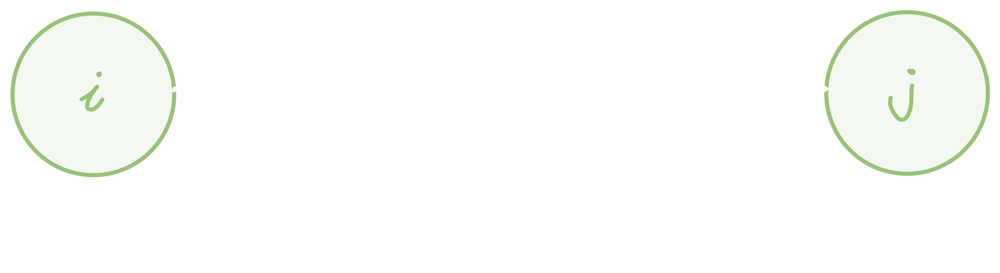

# Project Management - Gestione dei progetti di impianto

> A partire da pagina 97 - Capitolo 4
>
> Lezione 2020 11 10

## Introduzione al Project Management

Con il capitolo sul project management abbiamo come obbiettivo quello di comprendere ed applicare in produzione i seguenti punti:

- Rispetto dei tempi di consegna
- Individuazione delle attività che **condizionano** la durata del progetto
- Minimizzazione del tempo di realizzazione
- Controllo dell'avanzamento del lavoro
- Eliminazione dei tempi morti
- Utilizzare al meglio la manodopera ed i mezzi tecnici
- Tempestivo afflusso dei materiali

## Strumenti di base per il PM

Una delle caratteristiche principali del **progetto di impianto** è quella dell'**indeterminazione** della fase iniziale; ovviamente ci sono molti interrogativi su come progettare l'impianto, e per questo motivo si sono sviluppate delle vere e proprie tecniche per semplificarne (e strutturarne) l'organizzazione.

La fase del progetto di un impianto è composta da **fasi** che si *susseguono* tra di loro ed a volte vengono anche **iterate** diverse volte: è il caso dell'ingegnerizzazione iniziale e della costruzione; queste vengono iterate fino ad ottenere un risultato soddisfacente.

In questo contesto tutta la realizzazione del progetto **viene scomposta a livelli sempre più bassi**, fino ad arrivare alle **attività elementari**. Una singola attività è dotata di una **durata**, e quindi di un **livello di partenza** ed un **livello di fine**. Sapendo le interazioni e l'ordine con cui le attività si devono succedere, è possibile sapere con un buon anticipo:

- Quando rendere disponibili i mezzi finanziari per i pagamenti ai fornitori (*ovvero tenere pronti i soldi*)
- Quando i vari reparti dovranno essere pronti per iniziare i lavori
- Quando acquistare i materiali necessari all'avvio della produzione

Per poter strutturare il susseguirsi delle attività possiamo usare un **diagramma a barre** (bar chart), dove sull'asse delle ascisse vengono riportati i **tempi**, mentre sull'asse delle ordinate vengono riportate le varie attività:


Il problema di questa organizzazione è che non vengono evidenziate le **relazioni di dipendenza** tra le attività e soprattutto l'organizzazione diventa problematica oltre la decina di attività.

## Tecnica di programmazione reticolare: il PERT

> L'obbiettivo del PERT è rendere l'organizzazione delle attività il più **dinamica** possibile (a differenza del diagramma di Gantt): il suo compito è quello di **Minimizzare i tempi** in modo da arrivare ad una data del completamento del progetto il prima possibile.
>
> Il PERT ci permette di **trasferire risorse** dedicate ad ogni attività, andando a spostarle dalle **attività non critiche** (che possono essere ritardate) alle **attività critiche** (che **non** possono essere ritardate) in modo da poter accorciare i tempi.

Siccome il metodo precedente è un metodo per nulla soddisfacente, si è sviluppato un metodo molto più efficace e strutturato: il **PERT** - Program Evaluation and Review Technique.

Questo metodo consiste nell'utilizzare la **teoria dei grafi** (rappresentando quindi il progetto mediante un **reticolo** di attività ed *eventi*) per trovare il **percorso critico** (critical path), ovvero la *successione* di operazioni che **condizionano la durata** totale del progetto.

L'analisi del grafo con la tecnica PERT prevede le seguenti fasi:

1. Analisi del progetto e raccolta dati
2. Costruzione della **Work Breakdown Structure**
3. Costruzione del reticolo (grafo)
4. Elaborazione dei dati
5. Ottimizzazione

Andiamo quindi a vedere nel particolare le varie fasi del PERT.

### 1. Analisi del progetto e raccolta dati

La prima fase del PERT è fondamentale: ci permette di avere un quadro generale del progetto e di **mettere in evidenza le fasi principali del programma**; in un primo momento individuiamo delle "macro attività", andando via via a *specializzarle* giungendo infine ad avere delle attività quanto più *elementari* possibile:

> Un'attività si considera **elementare** quando riguarda operazioni che possono svolgersi con **continuità** nel tempo, ovvero senza avere interruzioni, spostamenti di luogo o cambiamenti di attrezzatura e/o manodopera.
>
> In poche parole: un'attività è elementare quando arreca la minor perdita di tempo e di denaro possibile. (N.d.S.)

Dopo aver determinato le attività elementari, dobbiamo determinare *per ciascuna di esse*:

- Le attività che devono **precederla**
- Le attività che sono **condizionate** da essa
- La **durata** presumibile dell'attività

#### Regole fondamentali per la stesura del reticolo

E' opportuno seguire le seguenti regole fondamentali quando si stende il reticolo:

1. Ogni attività deve essere sempre preceduta e seguita da un **evento**; un evento deve essere sempre posto tra un'attività e la successiva, tranne per il primo e l'ultimo evento (che sono marginali).

   > Definizione di **evento**: l'istante in cui si verificano tutte le condizioni per cui le attività seguenti possono iniziare.

2. Se non si arriva all'evento che precede un'attività, questa non può avere inizio. Allo stesso modo se tutte le attività che precedono un evento non sono state completate, l'evento non si considera raggiunto.

3. Se ci sono **dipendenze di tempo**  tra gli eventi, le dipendenze vengono rappresentate mediante **attività fittizie di durata nulla**. 

4. **Non sono ammessi loop**: ovvero nessun evento può essere seguito da un'attività che riconduca, successivamente, allo stesso evento.

5. Tutte le attività sono seguite e precedute da almeno un'altra attività, ad eccezzione della prima ed ultima attività.

##### Attività fittizie

Le attività fittizie sono solitamente delle **attese** (ad esempio attesa di materiali necessari all'attività successiva). Se ad esempio abbiamo un reticolo del genere


Se in questo particolare esempio abbiamo t<sub>13</sub> < t<sub>12</sub> l'evento 3 si verificherebbe **prima** dell'evento 2; andando a posizionare un'attività fittizia (quella che va da 2 a 3 con t=0), imponiamo che prima dell'evento 3 si deve verificare l'evento 2, anche se la durata dell'attività 1,2 è minore di quella 1,3.

#### Durata delle attività

Dobbiamo anche assegnare ad ogni attività una **durata**, scegliendo anche la più opportuna **unità di tempo** (ore, giorni, settimane).

Ovviamente la **durata effettiva** dipende principalmente da **fattori esterni**: ad esempio un'attività che comprende una colata di cemento può avere diverse durate a seconda dei fattori atmosferici: potrà impiegare 15 giorni se le condizioni sono ideali (**ottimistiche**) ma può anche impiegarne 30 se le condizioni sono sfavorevoli.

Dobbiamo quindi prevedere **tre durate diverse**, che vengono contrassegnate con le lettere:

- **Durata ottimistica - a**: Condizioni favorevoli
- **Durata più probabile - m**: Condizioni normali; è detta anche **moda**
- **Durata pessimistica - b**: condizioni sfavorevoli

Possiamo rappresentare la probabilità delle durate attraverso una **distribuzione di probabilità**:;utilizziamo la distribuzione **Beta** (o di Pearson):


- Andiamo ad attribuire al **valore medio - m** la probabilità media, ovvero quella con la maggiore probabilità.
- Andiamo a porre gli estremi della curva le durate *ottimistiche* e *pessimistiche*; in modo che queste **coprano lo 0.5% (0.05)** dell'area sottesa; in questo modo possiamo affermare chè:
  - La durata ottimistica ha la probabilità minore al 0.5% di essere **anticipata**.
  - La durata pessimistica ha la probabilità minore al 0.5% di essere **superata**.


Per la costruzione del reticolo, utilizzeremo i valori risultanti dalla nostra distribuzione notevole: **Valore atteso** (durata attesa) e **deviazione standard**.

- **Valore atteso** - E' essenzialmente la **durata media**
- **Deviazione standard** - E' un valore numerico che ci dice quanto il valore atteso è **attendibile**: quanto più è bassa la S.D. quanto più sarà attendibile il valore atteso (media).
  In altre parole, quanto più sono **vicini gli estremi** a e b, tanto più il valore atteso sarà veritiero.

Possiamo calcolare valore atteso e deviazione standard con le formule della distribuzione notevole:


Possiamo quindi ricapitolare i dati che ci interessano:

- a - Estremo inferiore (durata minore meno probabile: *è molto improbabile che i lavori richiedano **meno** tempo di a*)
- b - Estremo superiore (durata maggiore meno probabile: *è molto improbabile che i lavori richiedano **più** tempo di b*)
- m - **Moda**: è il valore più probabile (*probabilmente i lavori richiederanno un tempo m*)
- D<sub>e</sub> - **Valore atteso** (*in media i tempi richiederanno un tempo D<sub>e</sub>*)
- **σ** - **Deviazione standard**: ci dice quanto D<sub>e</sub> è attendibile (σ << bene, σ >> male)

### 2. La Work Breakdown Structure

> La WBS è una **tabella** in cui:
>
> - Vengono **enumerate** le attività
> - Le attività vengono **ordinate** sequenzialmente seguendo la cronologia dei tempi
> - Tempificazione delle attività
> - Programmazione - si decide cosa fare, come farlo ed in quanto tempo.

La **WBS** è una **struttura gerarchica** che suddivide il lavoro del progetto in componenti sempre più **piccole gestibili** che prendono il nome di **pacchetti di lavoro** (work packages). 
La WBS può essere **rappresentata con una struttura ad albero**; capiamo quindi che usiamo una struttura gerarchica per organizzare il lavoro.

#### Come costrure la WBS

Indipendentemente dal progetto in atto, possiamo riconoscere dei passaggi comuni in ogni (o quasi) caso:

1. L'**Unione** di tutti i **Work Packages WP** che appartengono ad uno stesso livello di disaggregazione ci da un livello di aggregazione **superiore**; in altre parole unendo un livello di nodi otteniamo la radice dei nodi (N.d.S.)
2. Quanto più un Work Package è **piccolo**, tanto più sarà semplice da gestire da parte del **responsabile** ad esso assegnato; inoltre diminuiscono anche le **relazioni di interfaccia** tra di essi.
3. Ci possono essere delle "**sotto WBS**": ad esempio gli attori esterni all'organizzazione del **main contractor** (ovvero l'appaltatore principale), come i **fornitori/subappaltatori**, sviluppano una WBS **per conto loro**.

#### Logica di disaggregazione

La disaggregazione avviene secondo la logica:

1. In un primo momento si individuano delle **macro-fasi** del progetto:
   

2. Succssivamente ogni macro-fase può essere ulteriormente scomposta secondo una logica specifica:

   1. **Ingegneria di dettaglio** - civile, elettrica, meccanica, etc.
   2. **Approviggionamento** - macchinari, tubature, etc.
   3. **Montaggio** - montaggi meccanici, montaggi elettrici, etc.

   

Un esempio di WBS in forma tabellare potrebbe essere la seguente, che ha **tre livelli di dettaglio**:

1. **Livello 1** - progetto principale
2. **Livello 2** - Fasi del progetto
3. **Livello 3** - Attività specifiche all'interno di ciascuna fase

| Livello | Attività                 | Descrizione                                  | Attività Totali |
| ------- | ------------------------ | -------------------------------------------- | --------------- |
| 1       | Progetto XYZ             |                                              | 8               |
| 2       | Fase 1: Pianificazione   |                                              | 2               |
| 3       | 3.1 Raccolta requisiti   | Identificazione dei requisiti del progetto   |                 |
| 3       | 3.2 Definizione budget   | Stima dei costi e assegnazione delle risorse |                 |
| 2       | Fase 2: Sviluppo         |                                              | 2               |
| 3       | 3.3 Progettazione        | Progettazione dell'architettura del sistema  |                 |
| 3       | 3.4 Codifica             | Implementazione del codice                   |                 |
| 2       | Fase 3: Test             |                                              | 2               |
| 3       | 3.5 Test funzionali      | Verifica delle funzionalità del sistema      |                 |
| 3       | 3.6 Test di integrazione | Verifica dell'integrazione tra i moduli      |                 |
| 2       | Fase 4: Implementazione  |                                              | 2               |
| 3       | 3.7 Installazione        | Installazione del sistema presso il cliente  |                 |
| 3       | 3.8 Formazione           | Formazione degli utenti sul sistema          |                 |

### 3. Costruzione del reticolo

Rappresentiamo quindi le **attività** e gli **eventi** attraverso la notazione dei grafi:

- **Nodo** (un cerchio) -- > **evento**
  Con T<sub>i</sub> indichiamo la **data attesa** dell'evento i
  con T<sub>j</sub> indichiamo la **data attesa** dell'evento j
- **Arco** (una freccia) --> **attività**
  Con t<sub>ij</sub> indichiamo il **tempo necessario per il completamento** dell'attività ij
  Essenzialmente, T<sub>i</sub> e T<sub>j</sub> sono gli *estremi* (sottoforma di date) dell'attività N.d.S.



Si utilizzano inoltre delle **tecniche** nel momento in cui il reticolo da costruire è particolarmente impegnativo: Si procede a **ritroso** partendo quindi dall'ultimo nodo (evento finale) individuando tutte le attività **necessarie** necessarie al compimento dell'evento finale.

Bisogna notare che la **posizione** dei nodi e la **lunghezza** degli archi è puramente simbolica, e **non rappresenta** alcun valore ai fini del PERT.


Inoltre si aggiungono delle **informazioni aggiuntive** al grafo:

- **Data minima e massima** dell'evento di inizio e di fine di ogni attività
- **Slittamento** di ogni attività
- **Percorso critico**
- **Data di fine progetto**

### 4. Calcolo dei dati e percorso critico

In questa fase andiamo ad elaborare il grafo mediante degli **algoritmi** che ci permettono di trovare il **percorso critico**:

> Il **Percorso Critico** è il percorso **più lungo** <sub>(non è un errore)</sub> e rappresenta il **tempo necessario** per la completa esecuzione del progetto.
>
> Si definisce ulteriormente come quel percorso che collega tutte le **attività critiche** e che porta alla **data finale** del progetto.

Per tutti gli altri percorsi alternativi a quello critico, **si possono avere ritardi (scorrimenti)** che non ritarderebbero in alcun modo il progetto.

Definiamo le seguenti sigle:

- **ED<sub>i</sub>** - Earliest Date - Indica il momento in cui **l'evento** potrebbe iniziare.
- **LD<sub>i</sub>** - Latest Date - Indica il momento in cui **l'evento** potrebbe finire.
- **EST<sub>ik</sub>** - Earliest Start Time -  Indica l'istante di tempo (data, estremo <u>inferiore</u>) in cui **l'attività** potrebbe iniziare
- **EFT<sub>ik</sub>** - Earliest Finish Time - Indica l'istante di tempo (data, estremo <u>inferiore</u>) in cui **l'attività** potrebbe essere completata.
- **LST<sub>ik</sub>** - Latest Start Time -  Indica l'istante di tempo (data, estremo <u>superiore</u>) in cui **l'attività** potrebbe iniziare
- **LFT<sub>ik</sub>** - Latest Finish Time - Indica l'istante di tempo (data, estremo <u>superiore</u>) in cui **l'attività** potrebbe essere completata.

#### ED - Earliest Date

**ED<sub>i</sub>** (Earliest Date) rappresenta la data **prima della quale l'evento non può essere completato**, tenendo conto delle dipendenze temporali e delle durate delle attività precedenti. Indica il momento in cui l'attività potrebbe iniziare.


Nel caso elementare in cui abbiamo solo un'attività e due eventi avremmo:


Bisogna notare che tutte le **date minime** degli **eventi** che precedono (ovvero che sono sul cammino del nodo in esame) devono essere calcolate prima di calcolare la data minima del nodo in esame.
Inoltre, in questo modo possiamo calcolare la **data minima dell'evento finale**, ovvero la data di fine del progetto.

#### LD - Latest Date

La latest date rappresenta **la data oltre la quale l'evento non può verificarsi**; infatti qualora l'evento si verificasse oltre questa data, andrebbe a **rallentare** l'intero progetto.

In questo caso, invece di dover calcolare tutte le date dei nodi *precedenti* a quello in esame, **dobbiamo calcolare tutte le date dei nodi *successivi* a quello in esame**.


#### S - Slittamento totale 

> Si definisce slittamento o scorrimento la **differenza** tra la latest date (L<sub>j</sub>) e la Earliest date (T<sub>j</sub>) dello stesso elemento.
>
> - Slittamento **S<sub>j</sub> = L<sub>j</sub> - T<sub>j</sub>**
>
> Lo **slittamento dell'attività**  (o scorrimento ammissibile) è pari a:
>
> - **S<sub>ij</sub> = L<sub>j</sub> - (T<sub>j</sub> + t<sub>ij</sub>)**
>
> Quest'ultimo valore di slittamento ci dice **di quanto possiamo ritardare un'attività**; questo valore avrà valori del tipo:
>
> - **Valore minimo**: 0 - ovvero L<sub>j</sub> è uguale alla somma tra parentesi - ci indica che l'attività *ij* non può essere ritardata: attività critica
> - **Positivo**: se lo slittamento è maggiore di zero l'attività può essere ritardata.
> - **NON può essere minore di zero**: se lo slittamento di un'attività fosse minore di zero, vuol dire che è un'attività che **va in ritardo**, ovvero che la latest date è minore della earliest + t<sub>ij</sub>. In ogni caso un valore minore di zero indica un ritardo.

Una volta calcolate le date minime e massime per *ciascun* evento, possiamo calcolare lo **slittamento totale**, ovvero il *l'intervallo di tempo del quale essa può essere ritardata senza avere ritardi sulla **data finale** del progetto.*

Questo valore si calcola *sottraendo* alla **data massima** dell'evento di **fine attività** e la somma tra la **data minima** dell'evento di partenza (inizio attività) e la durata attesa dell'attività:


Quando la **data massima** e la **data minima** di un evento **coincidono**, allora siamo in presenza di un **evento critico**:

- LD<sub>i</sub> = ED<sub>i</sub> --> **Evento Critico**

Quando, calcolando il tempo di slittamento di un'attività, si ottiene **zero**, allora quell'attività è dette **attività critica** e quell'attività **non permette alcun tipo di slittamento**, altrimenti andrebbe a ritardare l'intero progetto:

- S<sub>ij</sub> = 0 --> **Attività Critica** - Indicata in **grassetto** sul grafo.

Se invece otteniamo un valore **negativo** per il tempo di slittamento di un'attività, allora quell'attività è detta **ipercritica**; questo risultato indica che **non sarà possibile completare l'attività entro la latest date** dell'evento finale.

- S<sub>ij</sub> < 0 --> **Attività Ipercritica**

Se un percorso è composto **interamente da attività critiche**, allora è detto anch'esso **critico**; questo vuol dire che qualora ci fosse un qualsiasi ritardo in una qualsiasi delle attività che lo compongono, genera un pari ritardo sulla data massima dell'evento finale del progetto.

### 5. Ottimizzazione - Critical Path Method


Possiamo rappresentare su un asse cartesiano i **costi** in funzione del **tempo** che ci si impiega ad ultimare un'attività. Vediamo come c'è un **punto limite**, che è quel punto in cui non si può ulteriormente ridurre il tempo di completamento detto **tempo limite**, anche utilizzando dutto il budget disponibile; questo corrisponde al **costo limite**, ovvero il costo massimo dell'attività.

Abbiamo anche un altro punto: il **punto normale**, ovvero quel punto dove si ha il **costo minimo** (ovvero il costo più basso dell'attività), ma anche il **tempo normale**.

Possiamo infine **approssimare linearmente** (ovvero unire le coordinate corrispondenti al punto limite e punto normale) la curva nell'intervallo T<sub>L </sub>- T<sub>N</sub> in modo da poter approssimare il suo **coefficiente angolare**: questo valore ci dice **l'incremento di costo diretto per unità di tempo**. Il nostro compito è quello di scegliere **per la riduzione del tempo di realizzazione** le attività aventi il coefficiente α minore:


Chiamiamo α **costo di accelerazione**; a seconda di questo valore avremo:

- **Costo accelerazione positivo**: Indica che accelerare l'attività richiederà risorse finanziarie aggiuntive. Ciò significa che investire ulteriori risorse per completare l'attività in un tempo più breve comporterà costi aggiuntivi. 
- **Costo accelerazione negativo**: Indica che accelerare l'attività può portare a risparmi finanziari. 
- **Costo accelerazione uguale a zero**: Indica che non ci sono implicazioni finanziarie dirette associate all'accelerazione dell'attività.

## Esempio di applicazione di PERT e CPM

Usiamo i dati delle tabelle:


> WBS


> Durate-costi
>
> Bisogna tenere conto che la riga dei *premi* ha dei valori circondati da parentesi: questi sono valori che andranno **sottratti** al conto finale, perchè sono degli incentivi, non penali!

Otteniamo il grafo dalla tabella del WBS:


Siccome la durata del progetto totale, 


Possiamo calcolare i costi di accelerazione mediante la formula vista in precedenza; su excel abbiamo:

```excel
=IFERROR((Table1[@CL]-Table1[@CN])/(Table1[@Tn]-Table1[@TL]);0)
```

Otteniamo la tabella dei costi di accelerazione


Possiamo **sommare** il **totale** dei costi normali della tabella della WBS (**1220**) ai valori corrispondenti alla durata (12) della tabella dei costi (penali + canoni = 400 + 1200 = **1600**) ottenendo i **costi diretti** pari a **2820** unità di moneta.

Dopo aver calcolato questo valore, guardiamo la tabella delle accelerazioni e cerchiamo di **velocizzare il progetto** andando a pescare tra le attività che hanno il costo di accelerazione più basso; siccome l'attività 3,4 ha un costo di accelerazione zero, la ignoriamo. Prendiamo in considerazione invece l'attività 1,3:


Notiamo come questa decisione si ripercuota su gran parte del grafo e sul tempo totale, che passa da 12 ad 11. Di conseguenza, i costi passano da 2820 a **2270**:


---

**Esercizio aggiuntivi** al seguente [link](https://my.liuc.it/MatSup/2002/Y71017/lez2.pdf).

# Dalla lezione

> Lezione 2020 11 10				01:00 

Il reticolo viene costruito **sempre a partire dalla fine**, ovvero dall'ultimo evento: quello di consegna del progetto.

## Strutturare il reticolo

Si parte sempre dalla **latest date**


- In questo caso, nell'evento 6 abbiamo una latest date di 17 unità di tempo (le consideriamo come **settimane**, la latest date è riportata nella posizione in alto a destra delle croci).

  Successivamente andiamo a ritroso: l'attività che va da 5 a 6 si compie in 3 settimane, quindi la latest date dell'evento 5 è data da `LD5 = 17 - 3 = 14` --> l'attività 5 si compie in 14 settimane.

  Tra parentesi possiamo trovare lo **slittamento**: l'attività 5-6 può essere completata in 3 unità di tempo, ma **ammette uno slittamento** di 6 unità di tempo. L'attività 4-6, invece, **deve** essere completata in 5 settimane, ma ha slittamento zero: è un'attività critica. Questo ci porta a dire che la latest date dell'evento 4 è 17 - 5 = 12.

- Le attività critiche vengono **indicate in grassetto**, come avviene in figura.
- Osserviamo che l'evento 3 non può essere completato finché non si completa l'evento 2: l'attività 2-3 è un'attività dummy (a durata nulla).
- La **Latest Date** dell'evento 3 viene calcolata a partire dall'attività 3-4 e 4-6: questo perché l'attività 3-4 ha tempo di completamento maggiore rispetto all'attività 3-5. Nel calcolo della latest date dobbiamo sempre prendere il percorso massimo.
- Anche nel caso dell'evento 2 la latest date viene calcolata a partire dal percorso maggiore: invece di prendere 2-4-6 (ovvero 17 - 5 - 6 = 6), scegliamo 2-3-4-6 (ovvero 17 - 5 - 7 = 5)

### Il percorso critico

Nel nostro caso il percorso critico è dato dalla sequenza `Critical Path = 1-3-4-6`: **il ritardo di anche una sola attività conduce al ritardo del progetto.**

Infatti, il ritardo di anche una sola attività si ripercuote su tutte le altre: se ritarda l'attività 1-3, l'attività 3-4 comincerà in ritardo, poi ritarderà anche la 4-6, e di conseguenza manda in ritardo anche **l'evento 6**, ovvero la fine del progetto.

## Ridistribuire le risorse - il PERT e CPM

Una volta realizzato il reticolo cerchiamo di **ridistribuire le risorse**: le attività critiche che hanno problemi di completamento e che potrebbero ritardare l'intero progetto, necessitano di ulteriori risorsi, che andiamo ad attingere dalle attività non critiche.

### Cosa ci serve?

- Durata minima del progetto
- Conoscere gli eventi ed attività critiche
- Scorrimenti

### Il Critical Path Method - CPM

Utilizziamo diversi valori del tempo:

- **T<sub>A</sub> - Tempo abituale**: il tempo misurato senza alcuna ottimizzazione
- **T<sub>N</sub> - Tempo Normale**: tempo ottenuto dopo aver ottimizzato il più possibile il lavoro
- **T<sub>L</sub> - Tempo Limite**: è il tempo al di sotto del quale non si può più andare. Possiamo quindi investire tutte le risorse possibili, ma non riusciremo mai a sfondare questa soglia.

Definiamo **costo di accelerazione** il valore:

- C<sub>A</sub> = (C<sub>L</sub> - C<sub>N</sub>) / (T<sub>N</sub> - T<sub>L</sub>)

Che si ricava da una tabella; il costo di accelerazione è essenzialmente la retta che si ottiene dalla curva dei costi (vedi il punto 5).

