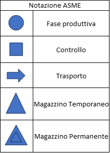
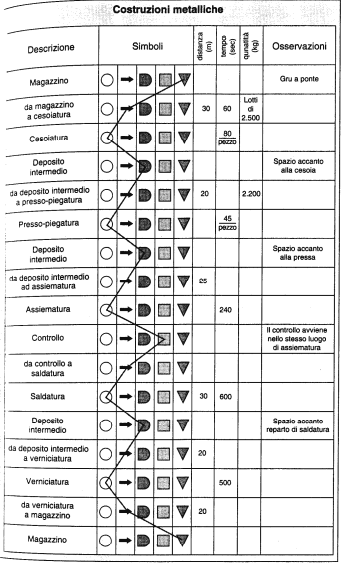
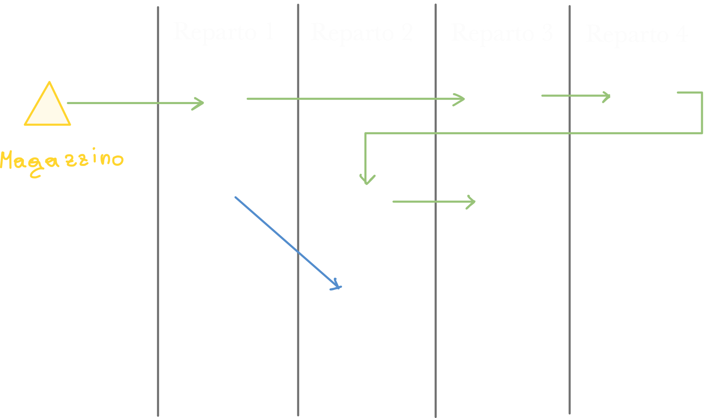
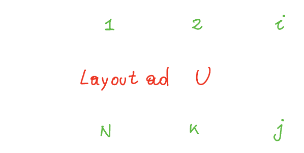
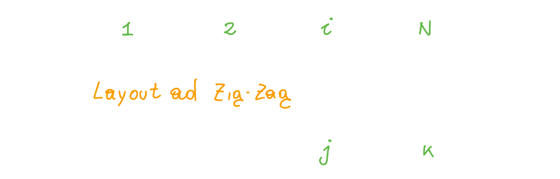
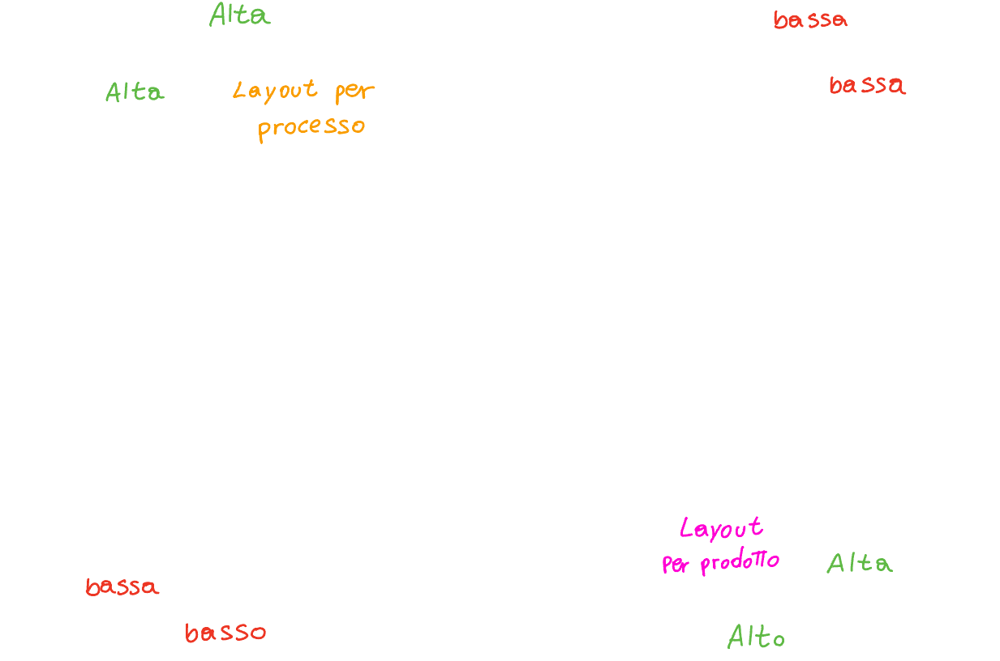
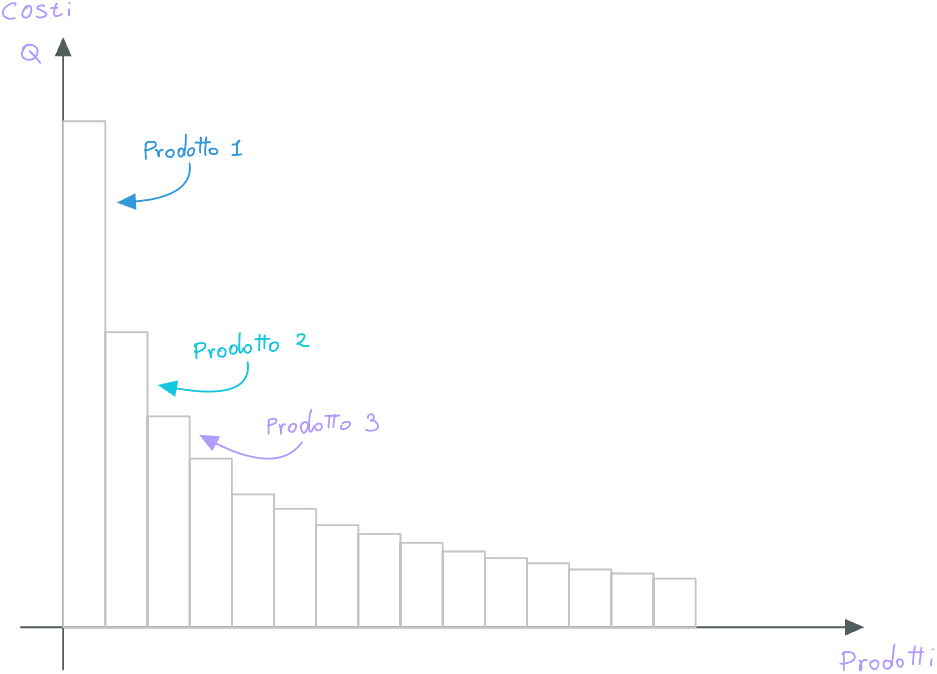
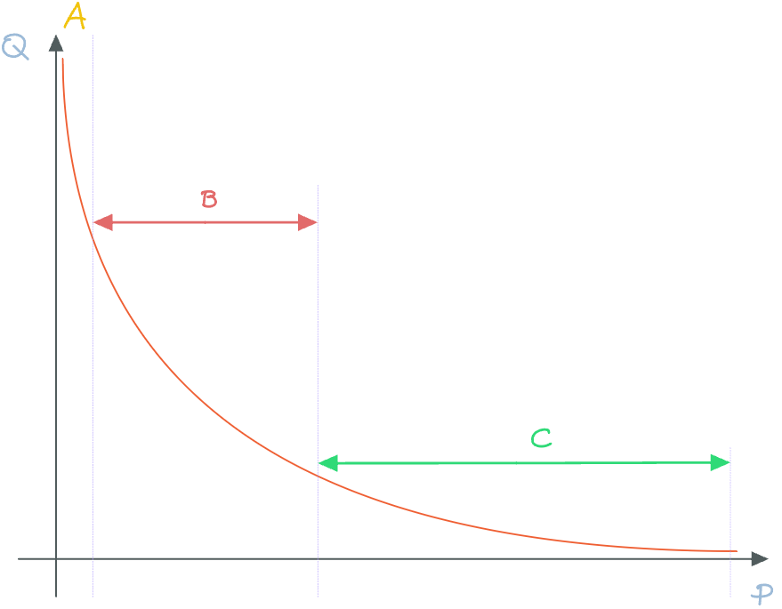

# Studio del Plant Layout

> A partire da pagina 64 capitolo 3

Lo studio del Plant Layout ha la seguente definizione:

> Il Plant Layout è la progettazione della sistemazione plano-altimetrica di tutte le risorse di un impianto industriale

Questo non comprende solo la **disposizione delle macchine**, ma anche quellad degli uffici, degli addetti e dei materiali.

Lo studio del Plant Layout avviene solitamente nel momento in cui si deve:

- Realizzare un **nuovo impianto** partendo da zero.
- Modificare un **impianto esistente** per produrre un nuovo prodotto.
- **Variazione della domanda** che richiede, ad esempio, un volume di prodotto maggiore
- **Obsolescenza** dell'impianto e dei macchinari.

Ovviamente quando si esegue lo studio del PL ci si pone i seguenti obbiettivi:

- **Utilizzare al meglio lo spazio** che si ha a disposizione (ottimizzare lo spazio).
- **Minimizzare gli investimenti** di capitale.
- **Minimizzare i costi** dovuti al **trasporto interno** del materiale.
- Garantire condizioni di lavoro **conformi agli standard legislativi**.
- Prevedere eventuali **ampliamenti futuri**.

## Fasi fondamentali dello studio

Possiamo suddividere lo studio del PL in 3 fasi principali:

- Raccolta ed analisi dei dati
- Elaborazione dei dati e ricerca delle possibili configurazioni
- Determinazione della soluzione migliore

### Raccolta ed analisi dei dati

La prima fase è sicuramente quella di raccogliere più dati possibile al fine di avere un'idea generale ben chiara di ciò che servirà all'impianto; possiamo quindi elencare le informazioni più utili:

- **Articoli da produrre** - avere una lista dettagliata degli articoli (e quindi sapere qual è l'obbiettivo finale N.d.S.) 
- **Cicli di produzione** - Essere a conoscenza di quali operazioni dovranno essere compiute per ottenere i prodotti finiti
- **Volumi di produzione** - Conoscere, oltre a "cosa" produrre, anche "**quanto**" produrre.
- **Macchinari** - Conoscere quali (e quanti) macchinari serviranno alla produzione
- **Risorse umane**

Per organizzare tutto questo, usiamo la **notazione ASME** - American Society of Mechanical Engineers:

Questa notazione ci è molto utile per rappresentare le varie fasi di produzione:

> [source](https://my.liuc.it/MatSup/2014/N13306/M1%20-%2003%20-%20Introduzione%20ai%20Sistemi%20Produttivi.pdf)
> L'ordine riportato sul libro a pagina 67 è diverso, ma a grandi linee è equivalente N.d.S.

Questa notazione viene usata sia nel **Diagramma del flusso** (come quello riportato sopra) e sia nel **Grafico di flusso**;
entrambi rappresentano la **successione delle operazioni** produttive, oltre a **trasporti**, **collaudi** ed **immagazzinamenti**.

### Classificazione delle configurazioni di layout

Possiamo classificare le configurazioni di layout attraverso le seguenti tre macrocategorie:

- Layout per **Processo**
- Layout per **Prodotto**
- Layout a **Posizione Fissa**

#### Layout per processo - Job shop

In questo caso si va ad accumunare  le **lavorazioni dello stesso tipo**, e di conseguenza le **macchine della stessa tipologia**, all'interno dello **stesso reparto**.
Un esempio potrebbe essere quello di accumunare nello stesso reparto tutte le operazioni di *tornitura*, *saldatura*, *controllo qualità*.

**Quando possiamo adottare il layout per processo?**
Questo layout si presta molto bene per quel tipo di produzione in cui non si devono realizzare **volumi troppo alti** e dove la produzione non è **particolarmente standardizzata**;
Possiamo quindi adottare questo metodo ogni volta che ci troviamo nelle seguenti condizioni (tutte devono essere vere):

- Ogni prodotto è realizzato in **lotti piccoli** rispetto alla *capacità produttiva* dei macchinari che compongono il reparto.
- Il processo di produzione dei prodotti è **poco standardizzato** e di conseguenza molto flessibile.

#### Layout per prodotto - Layout per linee

In questo genere di layout, invece di avere le stesse tipologie di macchine raggruppate in reparti, abbiamo una serie (linea) di macchinari anche **molto diversi tra loro**, ma che permettono di essere utilizzate una dopo l'altra su di un unico prodotto; in questo modo si **riducono notevolmente i tempi di trasporto** tra una sezione e l'altra; infatti i prodotti viaggiano su dei **rulli motorizzati** o **trasportatori aerei**.

Questo tipo di layout è adottato in quelle aziende che producono **prodotti altamente standardizzati**, come automobili, ed elettrodomestici.

Si possono adottare ulteriori accorgimenti per rendere ancora più ottimizzato questo layout: infatti il problema principale di questo layout è che utilizza molto spazio, sopratutto se è organizzato in **linea**. Di conseguenza se il prodotto parte da un deposito ad un estremo, dopo aver completato il processo arriva all'altro estremo che si trova molto lontano dal deposito; quaora il prodotto dovesse essere nuovamente portato al deposito iniziale, ci sarebbe un tempo di trasporto maggiore.

Possiamo quindi disporre questo layout in questi due modi:

- Layout ad U:
  
- Layout a Zig-Zag:
  

Inoltre, a volte si tende a raggiungere il **volume minimo di prodotto** che consente di lavorare a costi più bassi (in questo layout) andando ad **aumentare la standardizzazione** del prodotto, ovvero rendendo i prodotti sempre meno diversi tra loro.

Notiamo da questo grafico che:

- **Maggiore è la flessibilità**
  - maggiore è la differenziazione della produzione
  - minore sarà il volume di produzione
  - minore sarà l'efficienza della produzione
- **Minore è la flessibilità**
  Siccome la flessibilità è minore, realizzo un solo prodotto, e la produzione di quel prodotto viene realizzata **senza set-up**, di conseguenza perdo meno tempo.
  - minore è la differenziazione della produzione
  - maggiore sarà il volume di produzione
  - maggiore sarà l'efficienza della produzione

#### Layout a posizione fissa

In questo layout abbiamo la **parte principale del prodotto** che rimane ferma in un unico punto durante gran parte del processo di produzione. Questo tipo di layout è meno importante per la scarsità di problemi organizzativi del sistema di produzione. 

Questo layout viene adottato per la produzione di prodotti altamente specifici, come motori di supercar, cantieri navali, etc.

## Criteri di selezione della configurazione di layout ottimale

In questa analisi ci prefissiamo come obbiettivo quello di selezionare, attraverso un'opportuna analisi, il layout più indicato al la tipologia della *nostra* produzione.

Sicuramente in un'azienda possono esserci sia il **layout per prodotto** che il **layout in linea (per processo)** e bisogna selezionare per ogni prodotto, il suo layout ottimale; lo facciamo grazie ad un'analisi del **volume di produzione** di ciascun prodotto.

Infatti, esiste un valore del volume **al di sopra del quale** conviene utilizzare una lavorazione in linea, invece che una lavorazione per reparti, come avviene per **volumi minori**.

Andiamo quindi a rappresentare su di un grafico i volumi per ognio prodotto, ordinandoli per volume (decrescente):

Possiamo quindi effettuare **un'interpolazione** ed ottenere la seguente curva:

