# Studio del Plant Layout

> A partire da pagina 64 capitolo 3

Lo studio del Plant Layout ha la seguente definizione:

> Il Plant Layout è la progettazione della sistemazione plano-altimetrica di tutte le risorse di un impianto industriale

Questo non comprende solo la **disposizione delle macchine**, ma anche quellad degli uffici, degli addetti e dei materiali.

Lo studio del Plant Layout avviene solitamente nel momento in cui si deve:

- Realizzare un **nuovo impianto** partendo da zero.
- Modificare un **impianto esistente** per produrre un nuovo prodotto.
- **Variazione della domanda** che richiede, ad esempio, un volume di prodotto maggiore
- **Obsolescenza** dell'impianto e dei macchinari.

Ovviamente quando si esegue lo studio del PL ci si pone i seguenti obbiettivi:

- **Utilizzare al meglio lo spazio** che si ha a disposizione (ottimizzare lo spazio).
- **Minimizzare gli investimenti** di capitale.
- **Minimizzare i costi** dovuti al **trasporto interno** del materiale.
- Garantire condizioni di lavoro **conformi agli standard legislativi**.
- Prevedere eventuali **ampliamenti futuri**.

## Fasi fondamentali dello studio

Possiamo suddividere lo studio del PL in 3 fasi principali:

- Raccolta ed analisi dei dati
- Elaborazione dei dati e ricerca delle possibili configurazioni
- Determinazione della soluzione migliore

### Raccolta ed analisi dei dati

La prima fase è sicuramente quella di raccogliere più dati possibile al fine di avere un'idea generale ben chiara di ciò che servirà all'impianto; possiamo quindi elencare le informazioni più utili:

- **Articoli da produrre** - avere una lista dettagliata degli articoli (e quindi sapere qual è l'obbiettivo finale N.d.S.) 
- **Cicli di produzione** - Essere a conoscenza di quali operazioni dovranno essere compiute per ottenere i prodotti finiti
- **Volumi di produzione** - Conoscere, oltre a "cosa" produrre, anche "**quanto**" produrre.
- **Macchinari** - Conoscere quali (e quanti) macchinari serviranno alla produzione
- **Risorse umane**

Per organizzare tutto questo, usiamo la **notazione ASME** - American Society of Mechanical Engineers:

Questa notazione ci è molto utile per rappresentare le varie fasi di produzione:

> [source](https://my.liuc.it/MatSup/2014/N13306/M1%20-%2003%20-%20Introduzione%20ai%20Sistemi%20Produttivi.pdf)
> L'ordine riportato sul libro a pagina 67 è diverso, ma a grandi linee è equivalente N.d.S.

Questa notazione viene usata sia nel **Diagramma del flusso** (come quello riportato sopra) e sia nel **Grafico di flusso**;
entrambi rappresentano la **successione delle operazioni** produttive, oltre a **trasporti**, **collaudi** ed **immagazzinamenti**.

### Classificazione delle configurazioni di layout

Possiamo classificare le configurazioni di layout attraverso le seguenti tre macrocategorie:

- Layout per **Processo**
- Layout per **Prodotto**
- Layout a **Posizione Fissa**

#### Layout per processo - Job shop

In questo caso si va ad accumunare  le **lavorazioni dello stesso tipo**, e di conseguenza le **macchine della stessa tipologia**, all'interno dello **stesso reparto**.
Un esempio potrebbe essere quello di accumunare nello stesso reparto tutte le operazioni di *tornitura*, *saldatura*, *controllo qualità*.

**Quando possiamo adottare il layout per processo?**
Questo layout si presta molto bene per quel tipo di produzione in cui non si devono realizzare **volumi troppo alti** e dove la produzione non è **particolarmente standardizzata**;
Possiamo quindi adottare questo metodo ogni volta che ci troviamo nelle seguenti condizioni (tutte devono essere vere):

- Ogni prodotto è realizzato in **lotti piccoli** rispetto alla *capacità produttiva* dei macchinari che compongono il reparto.
- Il processo di produzione dei prodotti è **poco standardizzato** e di conseguenza molto flessibile.

#### Layout per prodotto - Layout per linee

In questo genere di layout, invece di avere le stesse tipologie di macchine raggruppate in reparti, abbiamo una serie (linea) di macchinari anche **molto diversi tra loro**, ma che permettono di essere utilizzate una dopo l'altra su di un unico prodotto; in questo modo si **riducono notevolmente i tempi di trasporto** tra una sezione e l'altra; infatti i prodotti viaggiano su dei **rulli motorizzati** o **trasportatori aerei**.

Questo tipo di layout è adottato in quelle aziende che producono **prodotti altamente standardizzati**, come automobili, ed elettrodomestici.

Si possono adottare ulteriori accorgimenti per rendere ancora più ottimizzato questo layout: infatti il problema principale di questo layout è che utilizza molto spazio, sopratutto se è organizzato in **linea**. Di conseguenza se il prodotto parte da un deposito ad un estremo, dopo aver completato il processo arriva all'altro estremo che si trova molto lontano dal deposito; quaora il prodotto dovesse essere nuovamente portato al deposito iniziale, ci sarebbe un tempo di trasporto maggiore.

Possiamo quindi disporre questo layout in questi due modi:

- Layout ad U:
  
- Layout a Zig-Zag:
  

Inoltre, a volte si tende a raggiungere il **volume minimo di prodotto** che consente di lavorare a costi più bassi (in questo layout) andando ad **aumentare la standardizzazione** del prodotto, ovvero rendendo i prodotti sempre meno diversi tra loro.

Notiamo da questo grafico che:

- **Maggiore è la flessibilità**
  - maggiore è la differenziazione della produzione
  - minore sarà il volume di produzione
  - minore sarà l'efficienza della produzione
- **Minore è la flessibilità**
  Siccome la flessibilità è minore, realizzo un solo prodotto, e la produzione di quel prodotto viene realizzata **senza set-up**, di conseguenza perdo meno tempo.
  - minore è la differenziazione della produzione
  - maggiore sarà il volume di produzione
  - maggiore sarà l'efficienza della produzione

#### Flow Shop

E' simile alla produzione in linea ma con qualche cambiamento:

- Ha più stazioni di lavoro per ogni operazione
- E' più flessibile nel cambiare tipi di prodotto
- Richiede una pianificazione più complessa

#### Layout a posizione fissa (Project Shop)

In questo layout abbiamo la **parte principale del prodotto** che rimane ferma in un unico punto durante gran parte del processo di produzione. Questo tipo di layout è meno importante per la scarsità di problemi organizzativi del sistema di produzione. 

Questo layout viene adottato per la produzione di prodotti altamente specifici, come motori di supercar, cantieri navali, etc.

## Criteri di selezione della configurazione di layout ottimale

In questa analisi ci prefissiamo come obbiettivo quello di selezionare, attraverso un'opportuna analisi, il layout più indicato al la tipologia della *nostra* produzione.

Sicuramente in un'azienda possono esserci sia il **layout per prodotto** che il **layout in linea (per processo)** e bisogna selezionare per ogni prodotto, il suo layout ottimale; lo facciamo grazie ad un'analisi del **volume di produzione** di ciascun prodotto.

Infatti, esiste un valore del volume **al di sopra del quale** conviene utilizzare una lavorazione in linea, invece che una lavorazione per reparti, come avviene per **volumi minori**.

Andiamo quindi a rappresentare su di un grafico i volumi per ognio prodotto, ordinandoli per volume (decrescente):

> Questo grafico è anche detto **grafico 80/20**, perchè l'80% della "popolazione" risiede nei primi 20% elementi.

Possiamo quindi effettuare **un'interpolazione** ed ottenere la seguente curva:

Possiamo suddividere il grafico in aree: A, B e C:

- **A** - Questa zona comprende le produzioni in grande quantità: per questi prodotti dovremo adottare una produzione in linea / **configurazione per prodotto**
- **C** - Questa zona comprende i prodotti con un volume minore: adotteremo una **produzione per reparto**.
- **B** - Questa è una *zona media*, che necessita un'analisi più approfondita per decidere se usare una produzione in linea o per reparto.

|           **Costi fissi**           | **Layout a posizione fissa** | **Layout per reparti** | **Layout in linea** |
| :---------------------------------: | :--------------------------: | :--------------------: | :-----------------: |
|     *Progettazione del layout*      |          Bassi (1)           |           2            |          3          |
|     *Investimenti in impianti*      |          Bassi (1)           |           2            |          3          |
|         *Spazio richiesto*          |         Elevato (3)          |           2            |          1          |
|         **Costi variabili**         |                              |                        |                     |
|             *Trasporti*             |         Elevati (3)          |           2            |          1          |
| *Immobilizzi in scorte di processo* |         Elevati (3)          |           2            |          1          |
|              *Scarti*               |              -               |           3            |          1          |
|              *Set-Up*               |              -               |           3            |          1          |

> Questa tabella è stata modificata trasformandola in una tabella numerica, ma sul libro è presente la tabella testuale a pagina 75.

Possiamo leggere la tabella utilizzando i seguenti esempi:

- Il layout a **posizione fissa** si presta bene per bassi volumi; ha un costo di progettazione e di macchinari molto basso; ad ogni modo necessita di molto spazio: basti pensare ai cantieri navali.
- Il layout **per reparti** è un layout *mediamente* prestante: i costi di progettazione e dei macchinari sono medi, come i costi dei trasporti. Ha un elevato costo degli scarti e di set-up.
- Il **layout in linea** è quello che ha i costi di progettazione e di macchinari maggiore, ma eccelle in tutte le altre categorie: sfrutta molto bene gli spazi e i trasporti sono ridotti al minimo.

Possiamo rappresentare, ipotizzando una crescita lineare dei costi, mediante un grafico **costi-volumi** gli andamenti dei vari layout:

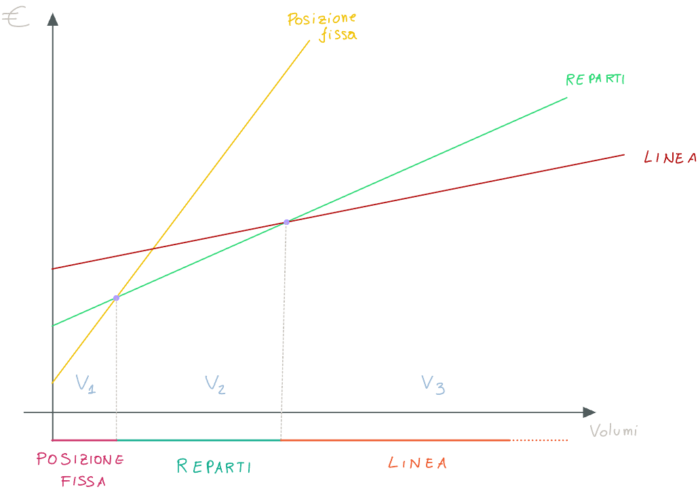

Questo grafico, sulla base delle precedenti considerazioni riguardo il grafico **costi/volumi**, ci fornisce un criterio, chiamato **volume critico di produzione**, per determinare la configurazione ottimale di layout.

> Essenzialmente, da questo grafico otteniamo 3 *range di volumi*; utilizziamo questi range per posizionare all'interno dei diversi layout, tutti i prodotti da produrre N.d.S.

## Studio delle soluzioni di plant layout

Con lo studio delle soluzioni di play layout andiamo ad analizzare **due metodi** maggiormente diffusi per la **disposizione delle macchine** sia nel caso di layout in linea che in layout per prodotto.

Il concetto principale è quello di **avvicinare** fra di loro le macchine ed i reparti; questi collegamenti vengono considerati come dei **pesi** che misurano **quanto sia importante avvicinare** tra loro i reparti.

Il costo di trasporto sarà **direttamente proporzionale alla distanza** ed il costo totale è dato dalla **somma dei prodotti (pesi)** nell'unità di **tempo** selezionata.

Possiamo quindi **rappresentare** sia la **quantità** da trasportare sia il **costo** di quel materiale attraverso due tabelle:

| da - a |  1   |  2   | ...  |      *j*       | ...  |  n   |
| :----: | :--: | :--: | :--: | :------------: | :--: | :--: |
|   1    |      |      |      |                |      |      |
|   2    |      |      |      |                |      |      |
|  ...   |      |      |      |                |      |      |
|  *i*   |      |      |      | Pij |      |      |
|  ...   |      |      |      |                |      |      |
|   m    |      |      |      |                |      |      |

> Tabella dei **flussi**: l'elemento Pij indica il costo del materiale da trasportare dal reparto *i* al reparto *j*; l'unità di misura sarà **l'unità di tempo scelta**.

| da - a |  1   |  2   | ...  |      *j*       | ...  |  n   |
| :----: | :--: | :--: | :--: | :------------: | :--: | :--: |
|   1    |      |      |      |                |      |      |
|   2    |      |      |      |                |      |      |
|  ...   |      |      |      |                |      |      |
|  *i*   |      |      |      | cij |      |      |
|  ...   |      |      |      |                |      |      |
|   m    |      |      |      |                |      |      |

> Tabella dei **costi**: l'elemento cij indica il costo del materiale da trasportare dal reparto *i* al reparto *j*; l'unità di misura sarà **l'unità di distanza scelta**.

Moltiplicando i due valori Pij * cij fornisce il **costo del trasporto** fra i reparti i e j nelle unità di distanza*tempo scelte.

Possiamo introdurre la grandezza **dij** che non è altro che la **distanza tra i reparti** al fine di calcolare il **costo del trasporto** (di quel singolo trasporto, non totale N.d.S.):

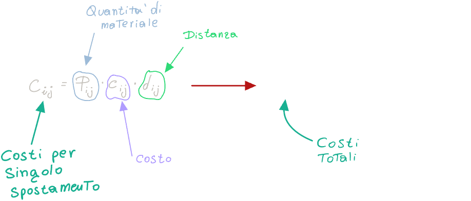

### A - Metodo delle intensità di traffico

Costruiamo il seguente diagramma, dove le righe rappresentano le **macchine** o i reparti (per l'esempio funzionano meglio le macchine N.d.S.) e le colonne rappresentano i **prodotti**:

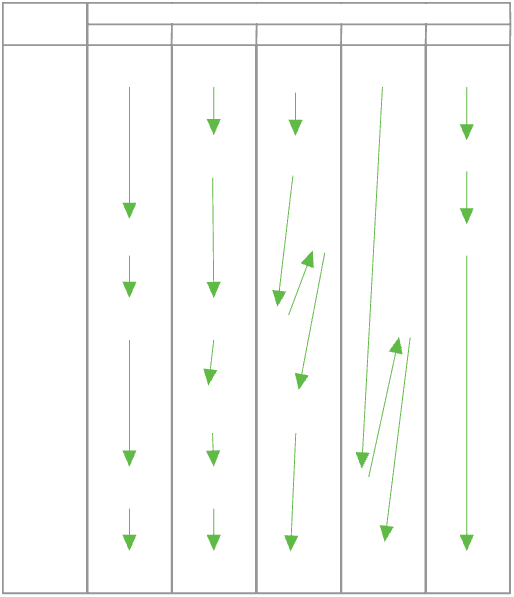

Possiamo trarre le seguenti conclusioni:

1. Per le colonne **A, B, E** possiamo adottare un layout di tipo **Flow Shop** (come il layout per linee ma con più macchine in parallelo); non adottiamo un layout di tipo in linea perchè altrimenti dovremmo avere **una produzione in linea diversa** per ogni prodotto, mentre con il Flow Shop ci basta una singola produzione per tutti i prodotti: infatti per essere completati i prodotti usano tutti le stesse macchine, ma in **ordini diversi**.
2. Per i prodotti **C,D** invece, dovremmo osservare il **diagramma PQ** (visto precedentemente, ci dice i prodotti aventi maggior volume di produzione); siccome il diagramma PQ suddivide i prdotti in fasce, possiamo decidere a seconda dei 3 casi:
   1. **Fascia C**: in questo caso abbiamo un **volume bassissimo** di produzione; sarebbe opportuno mandare in **ad outsourcing**, andando a far produrre ad una azienda terza i prodotti che fanno parte di questa fascia.
      In altre parole non ha senso creare una linea di produzione per questi prodotti, visto che i volumi sono talmente bassi.
   2. **Fascia B**: La fascia B  è la *fascia intermedia*: in questo caso è opportuno fare un **flow shop ed un job shop** solo per **C,D**.
   3. **Fascia A**: In questo caso avremmo un 20% di prodotti ma che comportano l'80% del volume di produzione; questo vuol dire che ha molto senso fare un **layout per linea** solo per questi prodotti.

Possiamo riportare su una **Matrice** i flussi (somma in modulo dei flussi)  che attraversano le macchine (o i reparti) a due a due:

E' strutturata come segue:

- Sulle **righe** e sulle **colonne** sono posti i macchinari (o reparti); lungo le righe questi sono in ordine crescente mentre lungo le colonne sono in ordine decrescente.
- I valori riportati in corrispondenza di due reparti ci dicono i **valori di intensità di traffico** che interessano quei due reparti/macchine; facciamo un esempio:
  In corrispondenza di 5-10 abbiamo un valore di 200; questo valore non ci dice quanto vale il flusso da 5 a 10 o da 10 a 5, ma ci dice solo il **la somma dei flussi in modulo**, di conseguenza sappiamo solo che dato un valore *n* da 5 a 10, avremo un N-*n* da 10 a 5.
- Nella parte finale (ad esempio 5-5, 4-4, etc.) abbiamo la **somma totale**; questa somma si fa sia per **righe** che per colonne:
  Ad esempio, in corrispondenza al reparto 5 avremo: `200+110+100+210`, dove l'ultimo fattore (210) proviene dalla cella 4-5.
  Questo valore ci dice il totale della movimentazione *da e per* il reparto 5, ovvero **tutto** quello che "parte" ed "arriva" al reparto 5.

Di conseguenza i valori **lungo la diagonale principale** abbiamo le **intensità di traffico**; ad esempio sappiamo che il reparto 2 è quello con il traffico maggiore (860).

Di conseguenza, potremmo pensare di disporre i reparti secondo un **reticolo a maglie quadrate**, andando a porre i reparti (o macchine) con il flusso maggiore al centro, proprio perchè devono essere quanto più vicini al resto dei reparti (ovviamente più vicini ai reparti *con cui comunicano*).

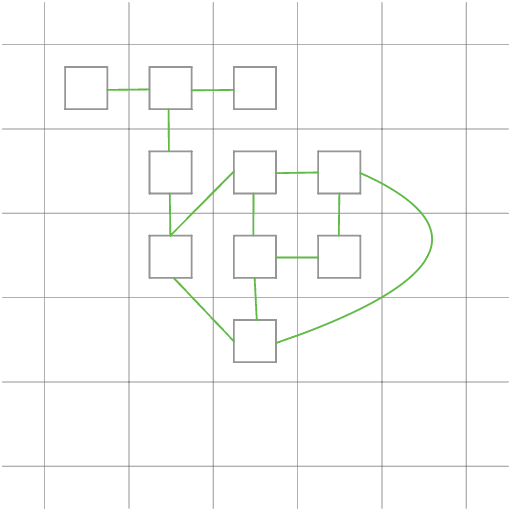

### B - Metodo dei momenti

Applichiamo questo metodo per individuare la **migliore sequenza** delle macchine in presenza di un **layout in linea**, quando abbiamo **più prodotti**.

Dobbiamo però fare le seguenti *ipotesi*:

- Tutte le macchine occupano lo stesso spazio (stesso footprint)
- I contenitori per il trasporto sono tutti uguali per ogni prodotto

Possiamo calcolare la **posizione più conveniente** per ogni **macchina** (e non più reparto) nel seguente modo:

Troviamo quindi l'ordine migliore: **A-C-B-E-D-F**

## Celle di macchine e la Group Technology

### Celle di macchine

Si può pensare di **raggruppare** le macchine in maniera che ogni gruppo sia dedicato alla produzione di una **famiglia** di più parti simili tra loro; queste parti sono **accumunate da similarità**. Chiameremo quindi il grupo di parti accumunate, **famiglia di parti**, mentre il gruppo delle macchine che lavorano alla famiglia è detto **cella di macchine**.

In questo modo otteniamo un volume di produzione abbastanza alto che giustifica i costi, che rende *economicamente conveniente* la strategia; questa strategia è molto utile quando i prodotti in esame rientrano nella **zona B**, con un volume di produzione non troppo alto.

Possiamo ottenere questo risultato nel momento in cui si una una **standardizzazione** sia dei pezzi che del progetto; andando quindi a raggruppare pezzi simili nelle famiglie citate precedentemente.
Standardizzare il **ciclo tecnologico** significa individuare un **ciclo comune** in ogni famiglia di pezzi; in questo modo avremmo una famiglia le cui lavorazioni variano solo numericamente, e non negli utensili utilizzati.

Otteniamo quindi, nei casi più favorevoli, una famiglia di pezzi simili che presentano un **ciclo di produzione molto simile**.

### Group Technology (o celle di macchine)

Il concetto di Group Technology è proprio quello di **decomporre** un sistema di produzione in sottoinsiemi **autonomi** ed indipendenti; possiamo citare i vantaggi di questo sistema:

- Riduzione del **tempo di setup** complessivo.
- Riduzione del **Lead Time** (*tempo necessario per completare un processo produttivo, dalla fase iniziale fino alla consegna del prodotto finito al cliente*).
- Riduzione del **Work-In-Progress** (*numero di unità o al valore dei prodotti o dei materiali che si trovano in vari stadi di lavorazione all'interno di un sistema produttivo in un dato momento*).
- Riduzione dello **spazio richiesto.**
- Riduzione degli **operatori** necessari.

La fase più importante al fine di progettare dei sistemi di produzioni *cellulari* (ovvero a celle di macchine) è sicuramente l'individuazione delle famiglie:

- **Famiglie di parti (PF)**
- **Famiglie di macchine (MF)**

> La cella di macchine è un compromesso tra il job shop e la linea, e coniuga i vantaggi del layout in linea con la flessibilità del job shop.
>
> Consente, al contrario della produzione in linea, di differenziare maggiormente le produzioni.
>
> Come possiamo anche vedere dalla matrice, **la group technology si colloca tra i due layout "estremi"**.

### Group Technology: Algoritmi

> Recap: lezione 5

Con la Group Technology cerchiamo di operare nell'intervallo ***B*** del grafico P/Q visto precedentemente, ovvero per quei prodotti con un medio volume di produzione. La GT è molto utile nel momento in cui vogliamo sia un volume di produzione medio/alto, sia quando vogliamo un'alta differenziazione dei prodotti: basti pensare alle case automobilistiche odierne, che devono allo stesso tempo produrre un grande numero di automobili, ed allo stesso tempo avere un'alta differenziazione dei modelli.

Il nostro obbiettivo è quindi un **layout misto** in cui vogliamo raggruppare:

- Le **Celle di macchine** - gruppo di macchine
- Le **Famiglie di parti** - gruppo di pezzi

in modo che ogni gruppo di essi produca non una singola parte, ma una *famiglia di parti* aventi delle similarità tra di loro.

#### Rank Order Clustering - ROC

Partiamo dalla matrice **binaria** *pezzo-macchina*:

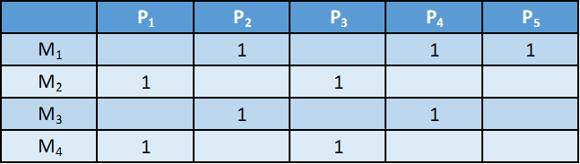

- Sulle colonne abbiamo i vari **pezzi/parti** (5)
- Sulle righe abbiamo le varie **macchine** (4)

**Come leggere la matrice**
Questa matrice ci dice, ad esempio, che:

- L Macchina 1 lavora il pezzo p2, p4 e p5.
- La macchina 2 lavora il pezzo p1 e p3.
- ...

L'algoritmo ci fornirà come output la stessa matrice ma **diagonalizzata**; utilizzeremo questa seconda matrice per valutare le famiglie di parti e le celle di macchine.

Dopo aver capito qual è l'obbiettivo dell'algoritmo, vediamo di quali passaggi si compone:

1. Ad ogni riga della matrice viene assegnato un **peso binario** e viene calcolato l'equivalente decimale
2. Si ordinano le righe in ordine decrescente del corrispondente peso decimale
3. Si ripetono i due passi precedenti anche per le colonne
4. Si itera la sequenza fino a quando la posizione di ogni elemento all'interno della matrice non subisce più variazioni.

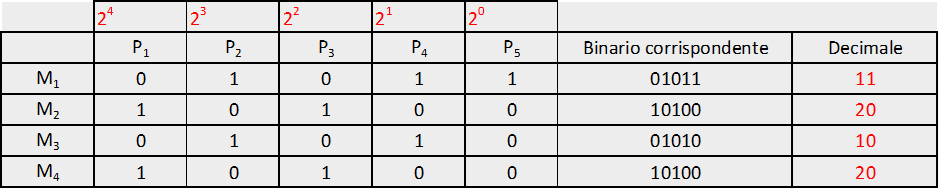

Dopo aver popolato la tabella, si ordinano le righe in ordine decrescente del corrispondente **peso decimale**:

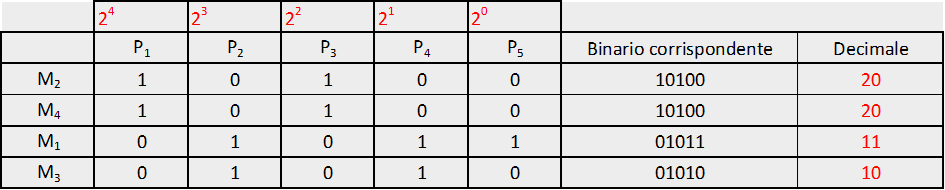

Dopo aver fatto questo, ripetiamo il tutto per le righe (usando la tabella ordinata precedentemente!)

A questo punto ordiniamo anche le colonne:

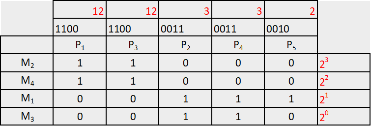

A questo punto notiamo che la matrice **è stata diagonalizzata**:

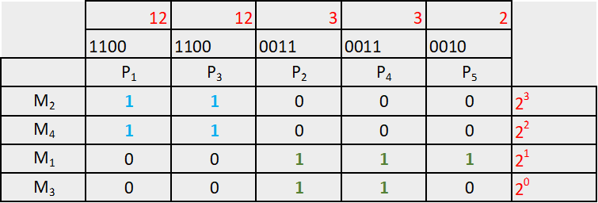

Possiamo quindi **identificare**

- **Famiglie di parti**: F1 = [P1, P3]; F2 = [P2, P4, P5]
- **Famiglie di macchine (celle)**: C1 = [M2, M4]; C1 = [M1, M3]

Spesso, però, può accadere che non riusciamo ad ottenere una **diagonalizzazione della matrice**.

#### Similarity Coefficent Method - SCM

Questo metodo valuta le *celle di macchine* e le *famiglie di parti* attraverso un **coefficiente di similarità** **sij**, che ci dice "quanto sono simili" le macchine i e j;

Consideriamo la seguente tabella

Possiamo calcolare il coefficiente s con la seguente formula:

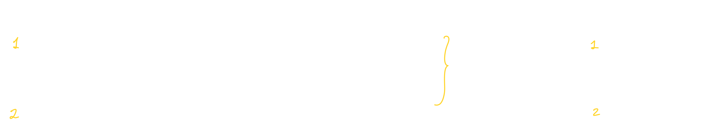

Calcoliamo s per ogni coppia di macchine, tenendo conto che (traducendo le funzioni matematiche delta riportate sopra):

- Per il **numeratore**: se le due macchine hanno lo stesso valore binario, e questo valore è 1, allora la funzione *delta* vale 1. Calcoliamo il valore di *delta* **per ogni pezzo** (p1 --> m1,m2; p2 --> m1,m2; p3 -->...) e ne sommiamo i valori (c'è la sommatoria)
- Per il **denominatore**: il processo è il medesimo, ma delta vale 0 se entrambe le macchine hanno lo stesso valore e questo valore è 1.

In pratica avremo:

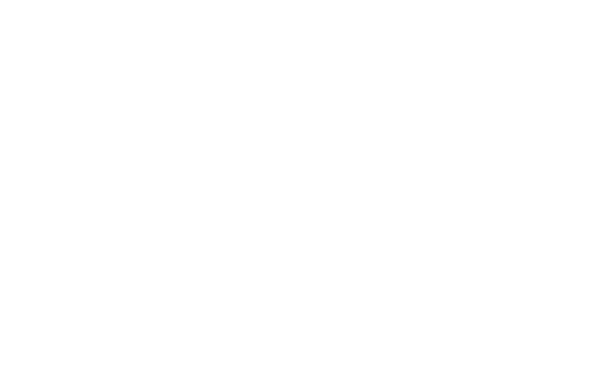

Dopo aver ottenuto tutti i coefficienti, costruiamo un grafico detto **Dendogramma** (lezione 5 31:37):

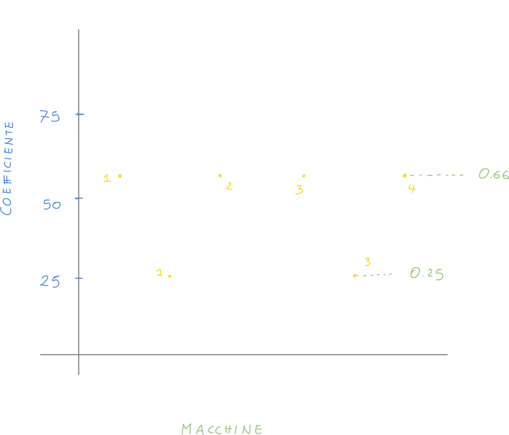

A questo punto scegliamo (o consultiamo la traccia del problema) un **valore soglia**:

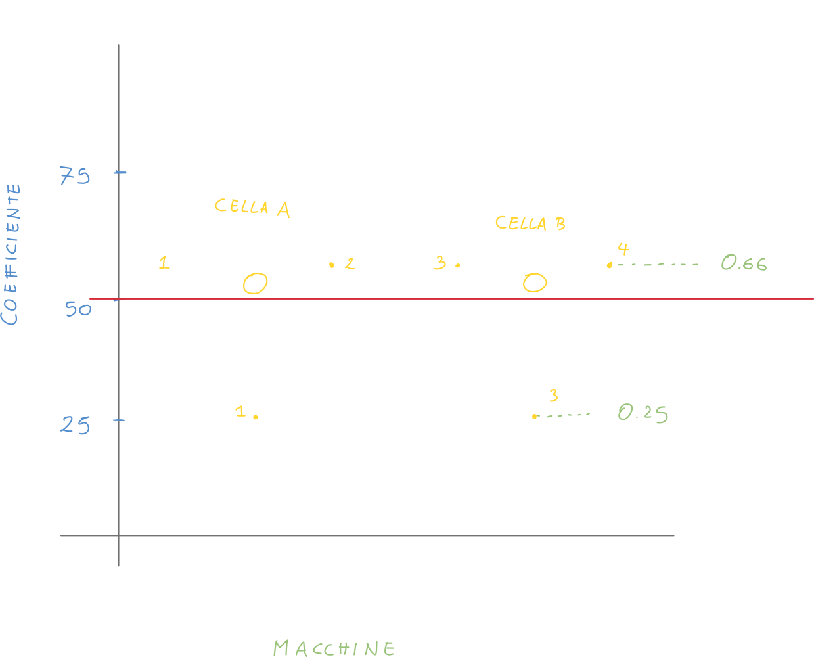

Andiamo quindi a **creare delle celle** con le macchine che si trovano **al di sopra** del valore soglia scelto; in questo caso avremo **due celle** composte da 

- C1 = [M1, M2];
- C1 = [M3, M4];

> **Nota**: bisogna essere consapevoli che l'ordine "perfetto" di questo esempio è solo un caso; potremmo avere casi molto più complessi.

### Gestione dei colli di bottiglia - Bottleneck

#### Duplicazione delle macchine

In questo caso abbiamo già applicato l'algoritmo ROC ma la matrice non risulta diagonalizzata:

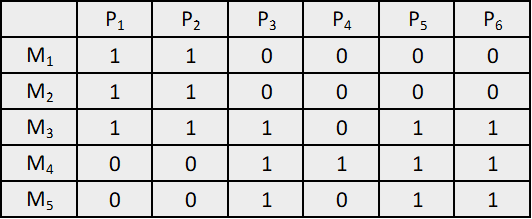

Quando ci troviamo in questi casi, la prima cosa da fare è utilizzare l'algoritmo che segue (SCM); quello che però può accadere, è di avere delle macchine dette **collo di bottiglia**, come in questo caso: la macchina **M3** è un collo di bottiglia.

> Una macchina si dice **collo di bottiglia** quando non permette la decomposizione della matrice in due celle di macchine.

Quando abbiamo un collo di bottiglia, non ci sono **soluzioni matematiche** attuabili; dobbiamo quindi intervenire direttamente sul ciclo di lavoro: 

- **Soluzione 1**: affidare la lavorazione **di un prodotto** problematico ad un'azienda esterna (outsourcing).
  
  In questo caso, potremmo far produrre il pezzo P5 all'esterno in modo da evitare ogni problema.
- **Soluzione 2**: possiamo **duplicare la macchina interessata**:
  
  Potremmo quindi duplicare la macchina **Maggiormente saturata** (ovvero quella occupata maggiormente), che in questo caso è la macchina **M3**, che diventa **M3'**.
  Ovviamente quest'azione deve **giustificare i costi**.

#### InterCellular Movements - ICM

Questo metodo ci permette di **assicurarci di essere in presenza di un Bottleneck** andando a valutare il **coefficiente ICM**:

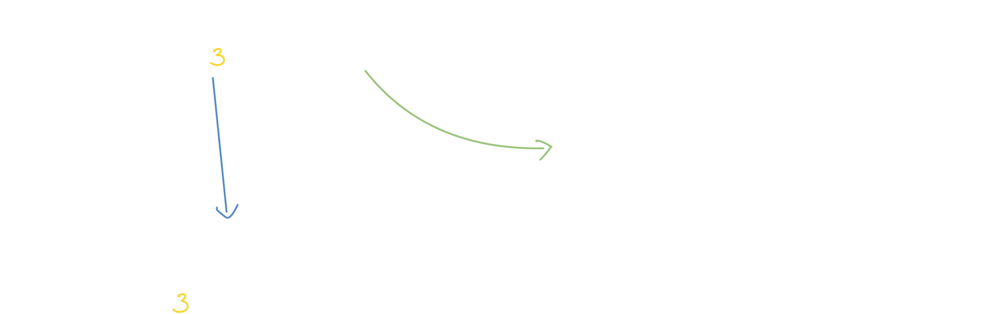

Possiamo considerare il seguente esempio:

Notiamo che alla matrice è stato applicato l'algoritmo ROC, ma che non l'ha completamente diagonalizzata: infatti notiamo che il prodotto 5 è lavorato sia da M1 che M3, ma che potrebbero appartenere a due celle diverse.

Quello che la formula di vik e della funzione delta ci dicono, è essenzialmente ciò che segue:

- Confrontiamo la prima cella (composta da M1,M2 ed M3,M4):
  - vik sarà uguale ad 1 se la somma dei pezzi è diversa da zero; otteniamo quindi v1k = [1, 1, 0, 0, 1], v2k = [0, 0, 1, 1, 1]
- Confrontiamo adesso v1k e v2k: se **i valori a due a due** (per indice!) sono **uguali tra loro e pari ad 1**, allora la delta varrà 1; 
- Sommiamo i valori della funzione delta per ogni indice (prodotti!), otteniamo: ICM1,2 = 0, 0, 0, 0, 1 = 1

Se il coefficiente ICM ottenuto è pari ad 1, allora **siamo in presenza di un bottleneck.**

Ci può risultare più semplice visualizzare il confronto tra i due vettori andando a posizionarli in colonna:

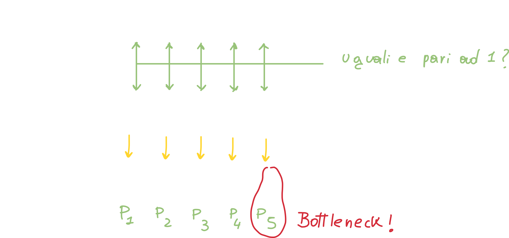