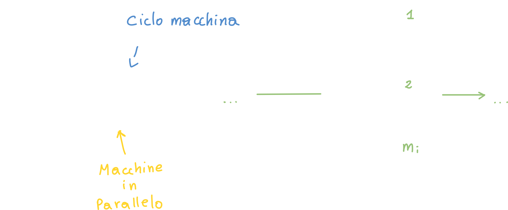

# Dimensionamento di un sistema di produzione

Il numero delle macchine che vengono utilizzate in una specifica configurazione di un sistema di produzione, non ci dice solo **l'ammontare della spesa** e dello **spazio effettivo richiesto**, ma decide anche la **capacità produttiva del sistema**; di conseguenza la prima cosa da fare in questa fase è **stabilire la capacitù produttiva** del sistema con un dato numero di macchine.

> L'obbiettivo del dimensionamento è quello di **trovare il numero di macchine**

## La capacità produttiva

Sappiamo che la capacità produttiva è la **quantità massima di prodotto** realizzabile in un **intervallo di tempo specifico.**

La capacità produttiva produttiva (in generale) può essere suddivisa in due sottocategorie:

### Capacità produttiva necessaria

Questa capacità **non è costante**: varia in funzione del tempo ed è **stagionale**.

Un esempio sono tutte quelle aziende che basano la loro produzione sui dolciumi natalizi: questi avranno delle vendite molto alte durante i mesi natalizi per poi scendere negli altri.

### Capacità produttiva disponibile

La capacità produttiva che abbiamo a disposizione è **costante**: quando compriamo un macchinario ed installiamo una linea di produzione, quel macchinario ha una sua specifica capacità di produzione che è sempre la stessa.

Un esempio può essere un'automobile: la potenza dell'automobile è sempre la stessa, siamo noi a decidere a che potenza usarla; allo stesso modo utilizzare un macchinario di produzione molto "potente", ma producendo poco rispetto alla sua capacità, stiamo **sprecando** potenzialità.

### Conciliare Capacità produttiva necessaria e disponibile

Cerchiamo ora di capire quando la capacità produttiva necessaria è *maggiore, minore o uguale* a quella disponibile; dobbiamo definire **in che periodo** si verifica la domanda:

- **Breve periodo**: Non c'è bisogno di fare particolari modifiche oltre ad **aumentare i ritmi di lavoro** dei lavoratori andando a fare ricorso al **lavoro straordinario** (2-3 mesi).

- **Medio periodo**: facciamo ancora una volta ricorso al *lavoro straordinario* ma si aggiungono anche altre contromisure:

  - Lavoro part-time
  - Subappalto a terzi (outsourcing)
  - Produzione anticipata

  E' importante tenere conto che nel medio/breve periodo **non si fanno investimenti**, ovvero **non si modifica la linea di produzione**; questo perchè gli investimenti si ripagano nel *lungo periodo*

- **Lungo periodo**: 

  - Espansione dell'impianto
  - Realizzazione di **nuovi impianti**.

## Parametri del processo produttivo

In questo caso abbiamo un layout di tipo **Flow Shop** (simile al layout in linea ma con più postazioni in parallelo); di questo layout definiamo:

- **Tempo di attraversamento - TA** di una linea o di una singola stazione di lavoro (o macchina), come l'intervallo di tempo medio che intercorre dal momento in cui sono disponibili i materiali in input, a quando è disponibile il prodotto completo in output.
  In altre parole: quanto tempo ci mette un prodotto ad attraversare tutta il layout.
- **Tempo di ciclo - TC** di una linea o singola stazione è l'intervallo di tempo **medio** che intercorre tra due prodotti in output.
  In altre parole: è una sorta di frequenza che ci dice ogni quante unità di tempo abbiamo a disposizione un prodotto finito.
- **Tempo ciclo di linea**: Questo tempo ciclo è pari proprio al **tempo ciclo della macchina più lenta**.
  **ATTENZIONE!** Non è pari alla somma di tutti i tempi di ciclo.

### Calcolare il tempo operativo di produzione

Poniamoci nel seguente caso:

- Si lavora 220 giorni in un anno
- Si lavora un turno al giorno
- Si lavora 8 ore per ogni turno (normalmente il turno non è mai di 8 ore per il motivo seguente)
- Ci sono 60 minuti per ora (normalmente il turno di lavoro l'ora è tra i 47 e 50 minuti)

Facendo un rapido calcolo otteniamo che il **tempo disponibile** è di `105'600 minuti/anno`.

**Tuttavia**, questo valore **non è sufficiente** a realizzare una produzione *vendibile*, perchè questo tempo deve essere ripartito in:

Vediamo come ogni livello "tagli via" una fetta di tempo da quello totale disponibile; si chiama **tempo operativo a valore aggiunto** il tempo residuo, che **genera valore aggiunto** perchè è il tempo che effettivamente utilizzo per produrre prodotti che generanno un ricavo.

### Rendimento composto di impianto - indici di rendimento

> Pagina 191 capitolo 7

Possiamo usare i valori temporali riportati precedentemente, per creare degli indici (rapporti) che ci danno diverse informazioni:

#### Disponibilità - D

La disponibilità di una macchina è la percentuale di tempo in cui la macchina è **funzionante** e produttiva.

#### Efficienza delle prestazioni - Ep

#### Tasso di qualità - Q

Siccome non possiamo trovare il tempo operativo  a valore aggiunto ed il tempo operativo netto, dobbiamo calcolarli in diverso modo:

---

Definiamo quindi **Indice di rendimento composto di impianto** il prodotto di questi 3 indici:

> η  prende il nome di "ETA"

Questo sarà il valore di rendimento che utilizzeremo ai fini del **dimensionamento**.

## Determinare il numero delle macchine - Per prodotto / Per processo

Per determinare il numero di macchine al fine di dimensionare il sistema di produzione, abbiamo bisogno di ottenere informazioni da diversi settori:

- **Informazioni dai progettisti**: Processo produttivo o fasi di lavorazione.
  Questo ci consente di capire cosa **possiamo ottenere** dalle macchine e dal processo che vogliamo adottare.
- **Informazioni dal settore commerciale**: Da questo settore provengono informazioni sulla **domanda da soddisfare** generando quindi il **volume produttivo** che il sistema deve generare.
- **Informazioni dai fornitori dei macchinari**: queste informazioni ci permettono di conoscere tutte le **caratteristiche delle macchine**, come:
  - Tempi
  - Affidabilità
  - Specifiche

Utilizzeremo tutte queste informazioni all'interno della **formula del dimensionamento**:

- **tp** è il **tempo teorico di produzione**, ovvero il tempo che *teoricamente* la linea impiega per realizzare **un singolo prodotto**. Di conseguenza l'unità di misura di questo indice è tempo/pezzo --> *h/u*
- **TC** il **tempo di carico** che abbiamo precedentemente visto; utilizziamo questo specifico valore perchè non conosciamo i tempi di setup, guasti, microfermate, rallentamenti, scarti, etc.
  Ma conosciamo i dati delle macchine (forniti dal produttore) e di conseguenza utilizziamo l'unico valore di cui siamo a conoscenza (anche se probabilmente non veritiero).

Possiamo fare un esempio pratico:

In questo esempio troviamo come **numero di macchine** un valore di `3.55`; è ovvio che non possiamo comprare tre macchine e mezza: dovremmo comprarne o 3 o 4.

Per sapere quante macchine dobbiamo realmente comprare

### Per quale layout vale questo calcolo?

Abbiamo visto come un **layout per prodotto - in linea** abbia un **tempo di setup** più basso (perchè abbiamo un numero limitato di prodotti) rispetto a quello (ad esempio) per processo; di conseguenza il **rendimento della macchina η** è molto più alto, e quindi otterremo un valore per il numero delle macchine minore (perchè η è al denominatore nella formula).

### Caso di m macchine uguali in parallelo

Quando abbiamo più macchine uguali che lavorano in parallelo, possiamo calcolare il **tempo ciclo** nel seguente modo:

Se le macchine in parallo **non sono uguali**, possiamo usare come tempo ciclo la **media dei tempi ciclo**.

## Determinare il numero delle macchine nella produzione per reparti

Per fissare il concetto vediamo l'esempio:

Per calcolare le macchine totali per il reparto ci basta applicare la formula: otteniamo `2,64`.
Ora dobbiamo capire se acquistare 2 o 3 macchinari.

## Dimensionamento teorico

Il dimensionamento che prevede il calcolo del numero di macchine, senza preoccuparsi della configurazione di layout, prende nome di **dimensionamento teorico**. Ovviamente questa pratica è, appunto, teorica: questo perchè nella fase di dimensionamento dobbiamo già sapere quale layout adotteremo.

Abbiamo il seguente **flusso produttivo**:

Abbiamo *teoricamente* `105'600` minuti lavorativi / anno, quindi:

- **Macchina A** - `105'600 m x 3 u/m = 316'800 unità/anno`
- **Macchina B - `105'600 m x 4 u/m = 422'400 unità/anno`**
- **Macchina C** - `105'600 m x 5 u/m = 528'000 unità/anno`

Se la domanda fosse di `1'000'000` di unità all'anno, dovremmo avere:

- `1'000'000 / 316'800 = 3,16` macchine di tipo A in *parallelo* in prima posizione.
- `1'000'000 / 422'400 = 2,37` macchine di tipo B in *parallelo* in seconda posizione.
- `1'000'000 / 528'000 = 1,89` macchine di tipo C in *parallelo* in terza posizione.

In quest'ultimo calcolo, però, **manca il valore ETA (rendimento)**; questo valore avrebbe fatto lievitare il numero di macchine da utilizzare (infatti in questo calcolo si assume che il rendimento = 1).

Possiamo quindi individuare i **problemi del dimensionamento teorico**:

1. Non si tiene conto delle *sei grandi perdite* per ciascuna macchina: il rendimento composto non viene incluso nel calcolo.
2. Non si può approssimare il numero di macchine da comprare: con un risultato di 1,89 non sappiamo se acquistare 1 o 2 macchine.
3. Non è detto che i "layout teorici" verranno attuati (invece di un layout in linea potrei adottarne uno per processo, etc.).

## Dimensionamento pratico

### Caso 1: layout in linea (più efficiente)

Consideriamo un esempio simile a prima:

Consideriamo un layout per linea con (η = 0.9 - molto efficiente) ed i seguenti dati di performance delle macchine:

- **Macchina A** - posizione 1
  - scarto = 0%
  - disponibilità = 97%
- **Macchina B** - posizione 2
  - scarto = 0%
  - disponibilità = 91%
- **Macchina A **- posizione 3
  - scarto = 0%
  - disponibilità = 97%

Possiamo quindi calcolare il rendimento per ogni macchina:

1. `3 x 0,9 x 0,97 = 2,62 u/min`
2. `4 x 0,9 x 0,91 = 3,28 u/min`
3. `5 x 0,9 x 0,97 = 4,36 u/min`

Andando a fare lo stesso calcolo di prima, disponendo di 105'600 minuti lavorativi per anno, otteniamo:

- **Macchina A** - posizione 1
  `105'600 x 2,62 = 276'566 unità per anno` invece di 316'800 unità/anno
- **Macchina B** - posizione 2
  `105'600 x 3,28 = 345'945 unità per anno` invece di 422'400 unità/anno
- **Macchina A** - posizione 3
  `105'600 x 4,36 = 460'944 unità per anno` invece di 528'000 unità/anno

Notiamo come **nella realtà** le macchine (considerando il rendimento) producano molti pezzi in meno; volendo realizzare 1'000'000 di pezzi all'anno avremmo:

- `1'000'000 / 276'566 = 3,62` macchine di tipo A in *parallelo* in prima posizione *invece di* 3,16.
- `1'000'000 / 345'945 = 2,89` macchine di tipo B in *parallelo* in seconda posizione *invece di* 2,37.
- `1'000'000 / 460'944 = 2,16` macchine di tipo A in *parallelo* in terza posizione *invece di* 1,89.

A questo punto i dubbi sul numero di macchine da comprare scendono, perchè abbiamo un'idea molto più chiara sull'arrotondare per eccesso o difetto.

### Caso 2: layout per reparti (meno efficiente)

In questo caso facciamo gli stessi calcoli, ma usando come rendimento η = 0.7 (0.7 < 0.9); andiamo direttamente alle conclusioni

- `1'000'000 / 215'107 = 4,65` macchine di tipo A in *parallelo* in prima posizione *invece di* 3,16.
- `1'000'000 / 269'068 = 3,72` macchine di tipo B in *parallelo* in seconda posizione *invece di* 2,37.
- `1'000'000 / 358'512 = 2,79` macchine di tipo A in *parallelo* in terza posizione *invece di* 1,89.

Con questo fattore di rendimento andiamo a **lavorare ancora meno pezzi** dell'ultimo caso, di conseguenza con questo particolare layout (per reparti invece che in linea) dovremo acquistare ancora più macchinari; questo è dovuto al **rallentamento** causato dal maggior setup del layout per reparti.

> Confronto linea reparti lezione 6 58:00

## Arrotondamento

Nei casi precedenti abbiamo visto come grazie al fattore di rendimento possiamo aver bisogno di più o meno macchine a seconda del layout, ma non abbiamo risolto ancora il problema dell'arrotondamento!

### Caso layout per linea

### Caso layout per reparti

---

**Ma come facciamo ad arrotondare?**

> A partire dai valori **TEORICI** del numero minimo di macchine necessario (valore calcolato precedentemente), si procede con **l'arrotondamento all'intero successivo**, e poi si verifica se l'eccesso di capacità produttiva così generato **COMPENSA** le perdite di efficienza.

Facciamo subito un esempio:

Nel caso visto precedentemente, avevamo un minimo teorico di macchine pari a `2,37 macchine B in seconda posizione`; a questo punto facciamo i seguenti ragionamenti:

A questo punto, **per capire se possiamo arrotondare o meno**, confrontiamo il **grado di utilizzazione** con il **rendimento composto**, che nel caso del layout in linea era: `tasso di qualità (1) * rendimento di disponibilità da layout (0,9) * rendimento di disponibilità da guasti (0,91)`

Se il grado di utilizzazione è **minore** del rendimento composto, allora **possiamo arrotondare** per **eccesso**:

## Interpretare l'arrotondamento

Se scegliamo di arrotondare **all'intero superiore** del numero di macchine teorico, possiamo dire che:

- La macchina utilizza il 79% delle ore di carico iniziali, e quindi
  - Lavorando per l'intero monte ore teorico, il 79% **della capacità produttiva** massima della macchina **è sufficiente a soddisfare la domanda**
  - Alternativamente, sfruttando la macchina al massimo, il 79% **delle ore** di lavoro della macchina è sufficiente a soddisfare la domanda.

Questo ci fa capire che **la macchina può essere inserita in un contesto reale** solo se le perdite per indisponibilità, scarti, inefficienza etc. **non superano il 21% del monte ore complessivo** --> di conseguenza dobbiamo avere un **grado di utilizzazione (g.u.) maggiore dell'81%** per poter inserire la macchina in un contesto reale.

Facendo due esempi pratici:

- rendimentoLINEA = 0.9 * 0.91 = 0.819 > 0.79 --> possiamo inserire
  Questo perchè il rendimento reale con un **layout in linea** è maggiore (sempre per via del fatto che richiede un tempo di setup minore)
- rendimentoREPARTI = 0.7 * 0.91 = 0.64 < 0.79 --> **NON** possiamo inserire
  Questo perchè il **layout per reparti** spreca molto più tempo di quello in linea.

## Modello ancora più complicato: tasso di scarto diverso da 0

> lezione 6 1:08

In questo caso abbiamo uno scarto, quindi se inizialmente abbiamo un goal di 1'000'000 di prodotti, man mano che si va avanti nella produzione, questo numero scenderà:

1. **1'000'000**
2. -10% --> 900'000
3. 900'000 -10% --> 828'000
4. 828'000 -10% -- > **745'200**

### Interconnessione di una linea

Dobbiamo quindi impostare una connessione delle macchine, che può essere effettuata in due modi:

- **buffer - connessione flessibile**: poniamo un buffer davanti la macchina più lenta in modo che la macchina più veloce che la precede possa accumulare i pezzi in attesa che la macchina più lenta li processi; in questo modo la macchina più veloce "non deve adeguarsi" alla velocità di quella più lenta.
- **senza buffer - connessione rigida**: La capacità è la capacità della macchina più lenta

> Considerazioni finali lezione 6 1:10