# Gestione della produzione

## Produzione per lotti

> Grafico a pagina 208 - capitolo 7

Poniamoci nel seguente esempio: FIAT riesce a produrre 1200 Panda al giorno (teoricamente); nella realtà però, ne riesce a produrre molte meno. Questo perchè tutti vogliamo relativamente una FIAT Panda diversa: colore, motore, optional, etc.

Di conseguenza viene naturale pensare ad uno strataggemma per utilizzare tutto il potere di produzione (dei macchinari e lavoratori) anche se la domanda per il prodotto standardizzato (motore standard, colore standard, etc. per cui si possono produrre 1200 pezzi invece che poche decine) è molto piccola.

> Una produzione viene definita per **lotti** quando la richiesta del bene **è limitata**, ovvero quando la **capacità produttiva** è molto più elevata rispetto alla domanda.
>
> In questo caso non è possibile instaurare una **produzione continua**.

In altre parole: se tutti comprassimo la stessa macchina, la produzione giornaliera di FIAT panda potrebbe essere di 1200 unità al giorno senza l'utilizzo della produzione per lotti N.d.S.

### Quando avviene una produzione per lotti?
Quando la richiesta di un tipo di prodotto è **limitata** rispetto alla **capacità produttiva totale** di tutto il sistema di produzione.

### In cosa consiste la produzione per lotti?

Il sistema produce un insieme di prodotti (in quantità piccola rispetto alla capacità produttiva) che sono tutti caratterizzati dalle stesse qualità (sono identiche).

### Rapporti nella produzione per lotti - la giacenza media

- **Ratio di produzione** che è definito come il rapporto tra la quantità prodotta ed il tempo impiegato a produrli.
  E' dato dalla tangente di *alpha*.
- **Ratio di assorbimento** indica con che velocità i beni vengono chiesti dal mercato.
  E' dato dalla tangente di *beta*.

Possiamo inoltre trovare la **quantità di prodotto realizzata** (giacenza media):

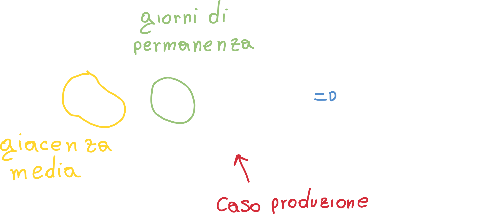

Allo stesso modo la giacenza media può essere calcolata nel caso **dell'assorbimento** o consumo:

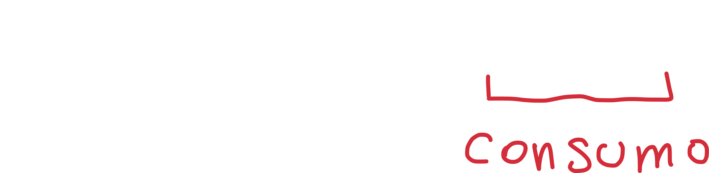

Possiamo inoltre calcolarci il **ratio di produzione - r**, che finora abbiamo definito come il numero di prodotti diviso il tempo che è necessitato a produrli; di conseguenza possiamo scrivere:

Questo modo di calcolare il ratio r ci torna utile perchè riusciamo a capire il rapporto tra il **ratio di consumo e di produzione**:

- **r = 1** Il ratio di consumo è uguale a quello di produzione; di conseguenza avremo un grafico di questo tipo:
  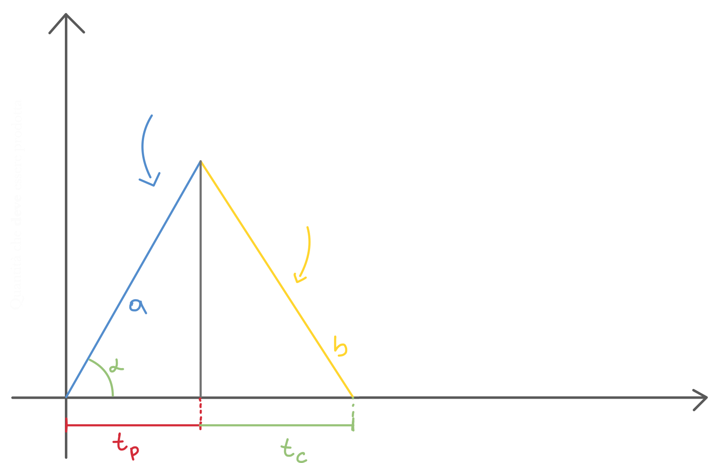
  In questo caso potremmo pensare di progettare una produzione di tipo **continua**, in modo da produrre continuamente l'esatta quantità di quella che viene consumata (venduta).
- **r = 0** In questo caso se il ratio è zero vuol dire che **la richiesta di prodotto è troppo alta**, e di conseguenza il tempo di produzione è zero. Se il tempo di produzione è zero allora il **ratio di produzione** (ovvero la quantità di prodotto rispetto al tempo, tempo al denominatore!) sarà **infinito**, ovviamente impraticabile.

  Questo cosa vuol dire? **Quando il ratio di produzione è infinito non siamo noi a produrre il prodotto!** Invece di produrlo, il prodotto ci viene **approviggionato** dall'esterno in un'unica soluzione.
  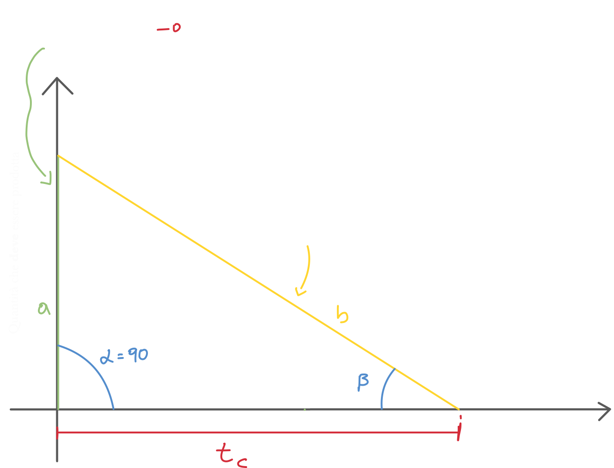

  

## Tempo (medio) di permanenza di un prodotto a magazzino

Facendo nuovamente riferimento al grafico:

Possiamo calcolare il tempo medio di permanenza andando smeplicemente a **calcolare l'area del triangolo** che forma il nostro grafico:
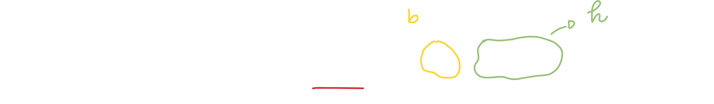

## Diagramma costi-quantità

E' un diagramma che rapporta i costi alle quantità, che determina **il valore di quella quantià ottima da approviggionare che minimizzi la somma dei costi di acquisto e di gestione del prodotto a magazzino**.

**Nell'esempio** dell'acqua da comprare al supermercato, compriamo spesso una grande quantità di acqua (ballette di bottiglie) in modo da non dover tornare spesso a comprare un prodotto che sappiamo ci servirà spesso (ne conosciamo la quantità che utilizzeremo). In questo caso il costo è intrinseco e **logistico**: tornando troppe volte al supermercato sprecheremo tempo e combustibile.

Ovviamente potremmo avere anche il problema opposto, ovvero quello di **approviggionarci troppo**: abbiamo ovviamente dei magazzini in cui andiamo a posizionare i prodotti di cui ci approviggioniamo; questi magazzini  hanno dei **costi** chiamati **Cf costi di gestione del magazzino** e comprendono:

**Costi fissi**

- Oneri assicurativi (atti vandalici, incidenti, etc.)
- Vigilanza
- Ammortamento del magazzino
- Oneri energetici (illuminazione e macchinari)
- Manutenzione

**Costi variabili**

- Supponiamo di doverci approviggionare di **pesce surgelato**: i costi variabili saranno sicuramente collegati alla **conservazione del pesce**: più è pieno il nostro magazzino maggiore saranno i costi; questo perchè un congelatore consuma maggiormente quanto più è colmo.
  Un altro costo variabile è sicuramente quello derivabile dall'**obsolescenza del componente**: se ad esempio abbiamo un'azienda che assembla computers, è soggetta a questo problema: una scheda video, ad esempio, diventa obsoleta (o poco appetibile al cliente) anche dopo 1/2 anni; con i processori questo tempo si stringe ancora di più. Non potremo quindi approviggionarci di troppi componenti, correremo il rischio di ritrovarci con dei componenti in magazzino che non potremmo più usare.

- Lo stesso vale per l'industria tessile: queste aziende non possono permettersi di ritrovarsi a *fine stagione* con dei capi ormai obsoleti: è per questo motivo che moltissime aziende annunciano periodicamente un periodo di saldo.

### Calcolo dei costi

#### Costi totali

I costi totali possono essere calcolati andando a sommare i **costi della produzione** ed i **costi del mantenimento del magazzino**; possiamo quindi scrivere:

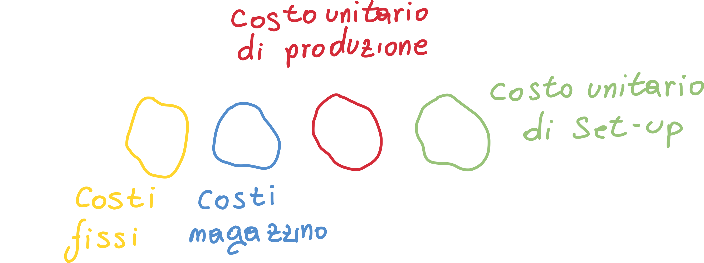

I **costi fissi** possono essere espressi mediante una **generica costante *k***; i costi di mantenimento dei prodotti nel magazzino, invece, possono essere espressi:

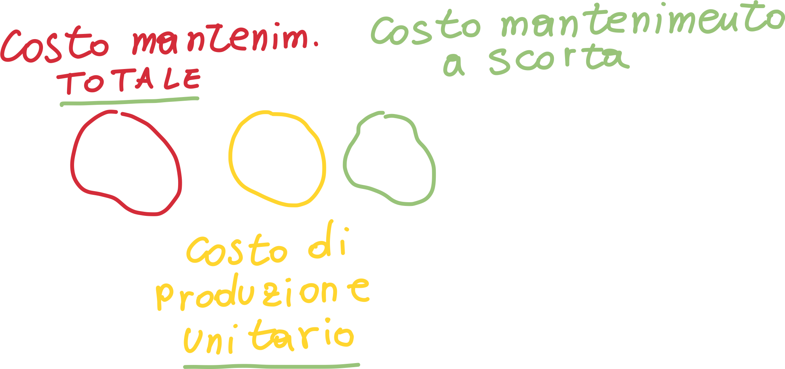

Bisogna notare che Cm è un valore unitario percentuale.

#### Costi di produzione totale del lotto

Possiamo calcolare i costi di produzione totali con la formula:

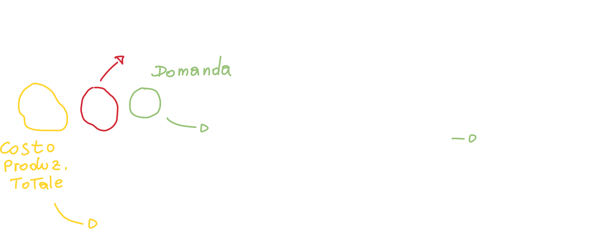

In questo caso compare la **domanda**: essa è il valore che ci dice la **quantità totale di prodotto** che il mercato richiede; non è più un rapporto (rateo) come ad esempio lo era il rateo di assorbimento.

#### Costi di preparazione del lotto - set-up

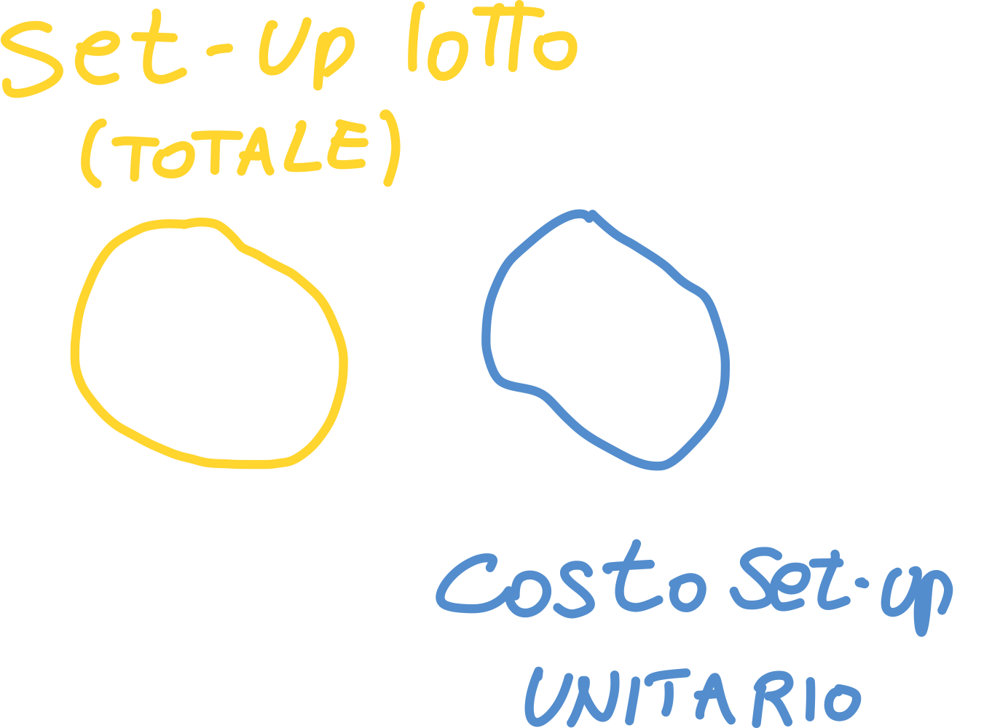

Csl è il costo di set-up. Inoltre possiamo prendere il **valore medio della domanda** andando a dividere D per 2 (prendendo quindi il valore medio).

## Lotto ottimo di approviggionamento

Per poter produrre un lotto di prodotti abbiamo sicuramente bisogno di approviggionarci di materie prime o sottoprodotti. Per scoprire quanti prodotti dobbiamo ordinare (dobbiamo per forza ordinarli in anticipo perchè l'approviggionamento richiede tempo!) è necessario effettuare il successivo ragionamento.

> La quantità ottima del lotto di componenti da approviggionare è detta **lotto ottimo di approviggionamento**; essa è la **quantità ottima che minimizza i costi**.

Possiamo quindi riscrivere i costi totali andando a scrivere le quantità ricavate finora:

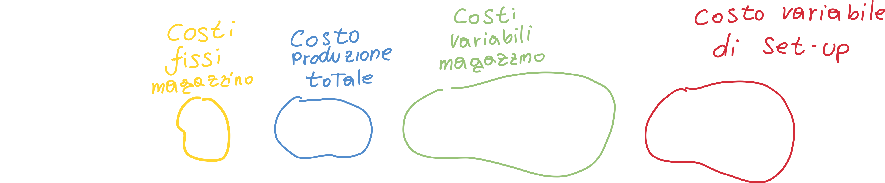

Se andiamo a **derivare rispetto a Q**, otteniamo:

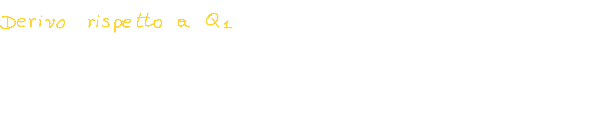

Possiamo **porre uguale a zero** il rate dei costi totali (la derivata dei costi totali) ed **isoliamo Q** in modo da ottenere **il lotto ottimo di produzione / approviggionamento**:

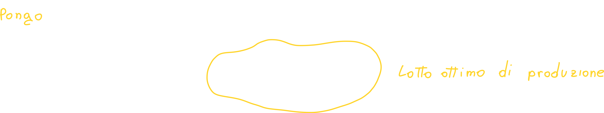

Possiamo **graficare il tutto** per capire meglio cosa stiamo cercando:

Il lotto ottimo di produzione non è altro che il valore della quantità di prodotti Q corrispondenti **al punto di minimo** del **costo totale** composto dai costi di setup e costi di mantenimento (magazzino); è per questo modo che calcoliamo la derivata (i minimi si calcolano cosi!).

Potremmo anche non calcolare la derivata andando ad **eguagliare i costi di mantenimento e produzione**, otterremmo lo stesso risultato:

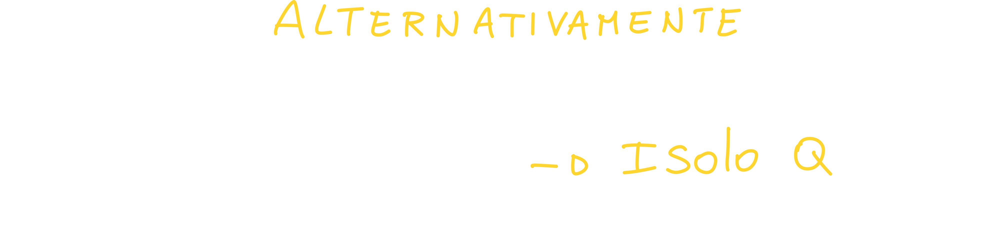

### Minimizzare la quantità di prodotto da ordinare

Quello che le aziende vorrebbero, è quello di massimizzare i guadagni con il minor numero di prodotti, ma se ordiniamo un quantitativo troppo basso di prodotti, il costo di set-up **aumenterebbe** (basta guardare il grafico precedente).

Quello che dovremmo cercare di fare, quindi, è di "portare" tutto il grafico verso l'asse delle y.

1. Potremmo pensare di **ridurre la domanda**, ma ovviamente **non è possibile** farlo, altrimenti i clienti troverebbero un fornitore alternativo.
2. Quello che invece possiamo fare, è di **negoziare costi logistici il più bassi possibili e ridurre i costi di set-up**

# Modelli di gestione delle scorte

Possiamo classificare i modelli di gestione delle scorte in due categorie:

- **Deterministici** - tutti i parametri (ovvero la domanda ed il tempo che la merce ordinata impiega ad arrivare - **tempo di riordino**) sono **noti**.
- **Stocastici** - Almeno uno dei due parametri è **aleatorio**.

Un'ulteriore classificazione dei modelli è quella che fa riferimento alla **costanza del parametri**

- **Statici** - la domanda ed il tempo di riordino non variano nel tempo
- **Dinamici** - un esempio può essere tuti quei prodotti stagionali, in cui la domanda aumenta in certi periodi dell'anno.

Un'ulteriore classificazione è la seguente:

- **Domanda indipendente** 
- **Domanda dipendente** - in cui la domanda è strettamente legata da quella del prodotto finito.

---

In questo paragrafo analizziamo il **modello di Wilson**, detto anche **Economic Order Quantity - EOQ**: prendiamo in esame un solo prodotto alla volta ed ottimizziamo la funzione costi-quantità.

Ci sono inoltre metodi specifici come il **Material Requirements Planning - MRP**, che pianificano l'acquisizione dei materiali e dei componenti in funzione delle quantità di prodotto da realizzare e dei tempi di disponibilità.

## Modello di Wilson - Modello del lotto economico - DETERMINISTICO

- Questo modello prevede il calcolo della **quantità da acquistare** per ogni ordine, che chiameremo **Qw** = COSTANTE. 

- Anche il **tempo** che intercorre tra due arrivi successivi o due emissioni di ordini sarà **costante**; questo tempo viene detto **tempo di turn over** e viene indicato con *T* (bisogna notare che questo valore indica strettamente l'intervallo di tempo tra l'emissione di due ordini, e non il **tempo** che impiegano ad arrivare N.d.S).

- La **funzione di assorbimento della scorta Q(t)** durante il tempo T **varia linearmente**, normalizzata tra Q e 0; di conseguenza la sua media vale Q/2.

- Chiamiamo **punto di riordino Pr** il tempo necessario al fornitore per processare l'ordine e farlo giungere a destinazione; la quantità corrispondente è detta **Livello di riordino Lr**.
  In altre parole, andando ad emettere l'ordine al tempo di riordino, potremo avere la nuova scorta proprio quando quella in magazzino sarà finita N.d.S.

Possiamo rappresentare graficamente il tutto:

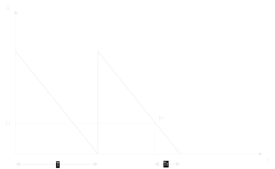

Capiamo quindi che se in un intervallo di tempo avente *ampiezza unitaria* viene consumata una quantità **D** (ovvero la domanda), allora la Quantità **Q** verrà consumata in un tempo **T**:

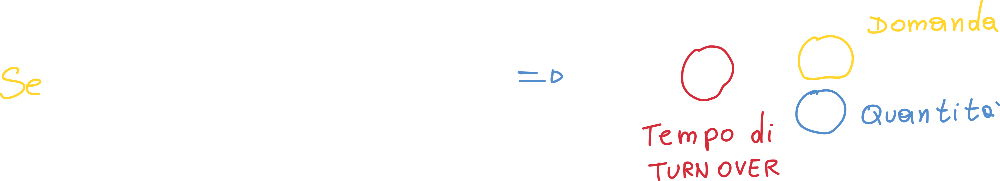

Questo tempo si dice **Tempo di turn Over**, ed è il tempo in cui una certa quantità viene *consumata* data una domanda D.

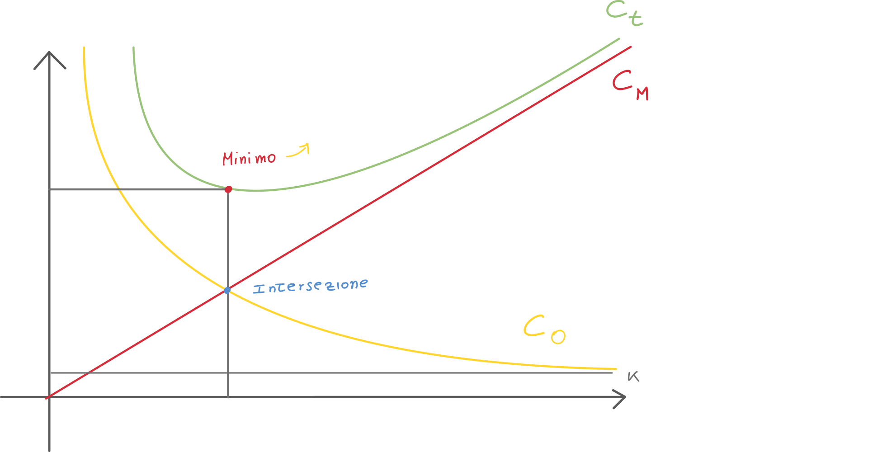

Anche in questo caso possiamo trovare la Quantità Qw nota come **lotto economico di approviggionamento - EOQ** andando a derivare l'eqazione della curva Ct e risolvendo per Ct' = 0 (trovo i minimi); l'equazione risultante è:

## Modello del periodo di riordino fisso e scorta di sicurezza

>Pagina 217

Questo modello consiste nell'effettuare degli **ordini regolari** in modo da **non avere mai la quantità disponibile al di sotto di un Livello minimo Lm**; il grafico ci chiarisce il concetto:

.png)

Possiamo trovare il valore della **scorta di sicurezza Ss** con la formula:

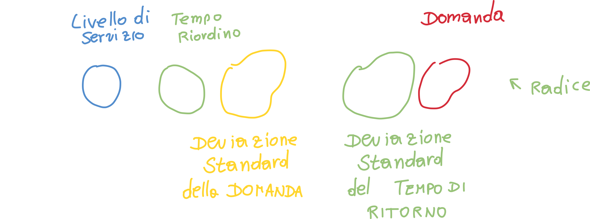

# Diversi tipi di produzione: Push/Pull

Possiamo dare una prima definizione (anche se errata) della differenza tra sistemi Push e sistemi Pull:

> I **Sistemi Push** gestiscono i processi **in anticipo** rispetto al fabbisogno dei clienti; potremmo quindi dire che i sistemi di produzione di tipo Push generano prodotti che vengono poi stoccati e solo successivamente venduti (la produzione non proviene da un cliente!), in altre parole **make-to-stock**
>
> I **Sistemi Pull** invece generano prodotti **su ordinazione di un cliente**, e quindi **make-to-order**

Questa definizione molto semplice è tuttavia *parzialmente* sbagliata; la reale definizione è la seguente:

> Un sistema di produzione di **tipo Pull** è quel sistema che **limita esplicitamente** la quantità di lavoro in corso (**work-in-progress**, ovvero i prodotto in produzione al momento) che può essere nel sistema.
>
> Un sistema di produzione di **tipo Push** è quel sistema che **non ha limiti espliciti** sul WIP che può essere nel sistema.

## Produzione Push: Material Requirement Planning - MRP

L'MRP è una tecnica computerizzata progettata per **migliorare la produttività**: le aziende utilizzano i sistemi MRP per assicurarsi che i **materiali e componenti siano disponibili nelle quantità giuste**; l'MRP viene inoltre usato per **programmare il tempo di consegna dei prodotti**.

L'MRP è uno strumento essenziale per **minimizzare l'investimento di inventario**: esso infatti è utile in fasi di produzione, quando bisogna acquistare materiali e programmarne la consegna.

### Funzioni dell'MRP

1. **Gestione dell'inventario** - L'MRP tiene traccia delle scorte di materie prime, semilavorati e prodotti finiti.
2. **Calcolo delle necessità di materiali** - L'MRP ci permette di determinare **le quantità ed i tempi di rifornimento** dei materiali necessari a soddisfare la domanda.
3. **Pianificazione degli ordini di produzione** - Basandosi sulle quantità di prodotto richiesto, l'MRP **pianifica** gli ordini di produzione, specificando quali prodotti finiti devono essere prodotti ed in quale quantità.

### Input dell'MRP

#### 1. Master production schedule - piano di produzione

E' una lista che risponde alle domande:

1. Quali prodotti finali devono essere prodotti?
2. Quante copie per prodotto devono essere prodotte?
3. Quando saranno (probabilmente) pronti i prodotti per essere spediti?

#### 2. Bill of material file - lista dei materiali

In modo da calcolare i materiali grezzi richiesti per il prodotto finale, l'MRP deve "conoscere" la **struttura del prodotto**. Questa informazione è contenuta nel file della lista dei materiali, che è una **lista di parti di componenti e sotto assemblati** che costituiscono ogni prodotto.

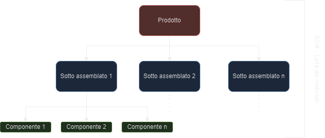

#### 3. Inventory Record File - Registro dell'inventario

E' **Obbligatorio** avere dei dati *live ed aggiornati* sullo **stato dell'inventario**. Questo obbiettivo è raggiunto utilizzando un **sistema computerizzato di inventario** che aggiorna il registro dell'inventario.

In questo registro bisogna avere il del **lead time** (tempo trascorso tra la richiesta di un prodotto e la sua consegna effettiva) per:

- **Materiali grezzi**
- **Componenti**
- **Assemblaggi**

### Processo dell'MRP

Il processo MRP può essere diviso in **4 step fondamentali**:

#### Passo 1 - stabilire la domanda ed i materiali richiesti per soddisfarla

Lo step iniziale dell'MRP è proprio quello di effettuare una **stima** della domanda e dei **requisiti** richiesti per soddisfarla.

Usando la lista dei materiali (che comprende una lista di materiali grezzi, assemblaggi e componenti richiesti per fabbricare il prodotto finale), **l'MRP suddivide la richiesta in specifici materiali grezzi e componenti.**

#### Passo 2 - Verificare la domanda rispetto all'inventario e assegna le risorse

Questo passo comprende il controllo della domanda rispetto a **quello che già abbiamo in inventario**; successivamente l'MRP distribuisce le risorse di conseguenza. 

#### Passo 3 - Programmazione della produzione

Questo passo comprende semplicemente il **calcolo del tempo e lavoro**  richiesto per fabbricare il prodotto; inoltre viene **stabilita una deadline (scadenza)**.

#### Passo 4 - Monitorare il processo

Il passo finale è semplicemente quello di **monitorare il progetto alla ricerca di un qualsiasi problema**: l'MRP può **automaticamente notificare i managers** di eventuali ritardi ed addirittura **suggerire piani** in modo da rispettare le scadenze.

### Output dell'MRP

L'MRP genera una grande varietà di outputs che possono essere utilizzati nella **pianificazione e gestione delle operazioni**; questi output comprendono:

#### Outputs primari

- **Avviso di rilascio ordine** - Per effettuare gli ordini che sono stati pianificati nel processo MRP.
- **Avviso di ri-pianificazione o cancellazione** - Mostra la ri-pianificazione o la cancellazione degli ordini aperti a causa di una modifica nel piano di produzione principale.
- **Report sullo stato dell'inventario.**

#### Output secondari

- **Rapporto sulle performance di vario tipo** - Indicazione dei costi, utilizzo degli articoli, tempi di consegna effettivi rispetto a quelli pianificati, ecc.
- **Rapporti di aspettative** - Mostrano le deviazioni dal programma, gli ordini in ritardo, gli scarti e così via.
- **Previsioni dell'inventario** - Indicano i livelli di inventario previsti nei periodi futuri.

### Pro e contro dell'MRP

#### PRO

- Avere la certezza che materiali e componenti saranno disponibili quando serviranno.
- Minimizzare i livelli di magazzino e costi associati, ovvero **mantenere solo le quantità necessarie** di materiali e prodotti finiti per soddisfare la domanda dei clienti senza accumulare eccessi di inventario. 
- Gestione ottimizzata dell'inventario.
- Ridurre il Lead Time del cliente.

#### CONTRO

- I sistemi MRP possono a volte essere difficili e costosi da implementare
- Bassa flessibilità: siccome l'MRP richiede degli input ben strutturati, se anche solo uno o due input sono inaccurati, gli errori si moltiplicano negli stadi più avanzati.

### Il Capacity Requirement Planning

Il CRP è una componente chiave dell'MRP (Material Requirements Planning) e si occupa della pianificazione delle risorse di produzione, come macchinari, attrezzature, manodopera e tempo, per garantire che siano adeguati per soddisfare le necessità di produzione.