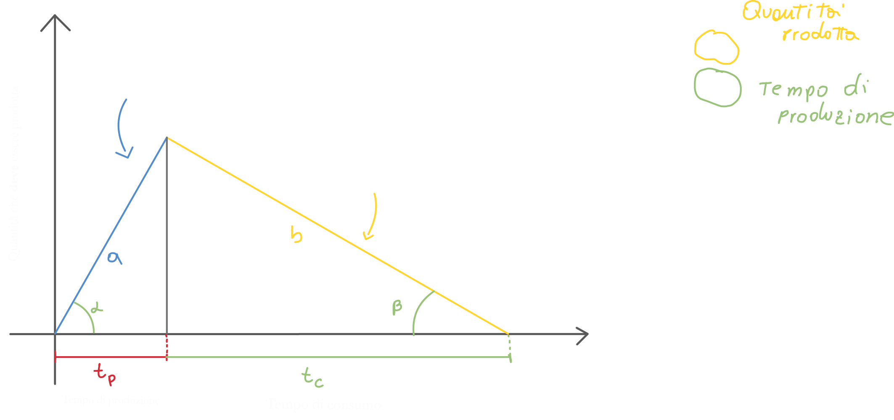
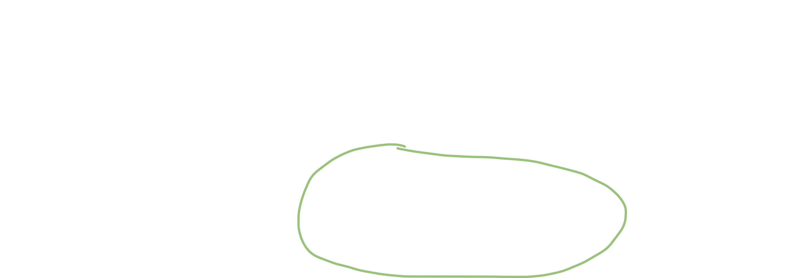
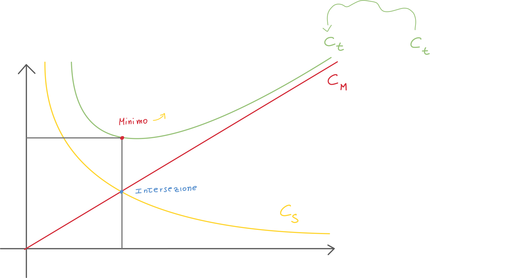

# Gestione della produzione

## Produzione per lotti

> Grafico a pagina 208 - capitolo 7

Poniamoci nel seguente esempio: FIAT riesce a produrre 1200 Panda al giorno (teoricamente); nella realtà però, ne riesce a produrre molte meno. Questo perchè tutti vogliamo relativamente una FIAT Panda diversa: colore, motore, optional, etc.

Di conseguenza viene naturale pensare ad uno strataggemma per utilizzare tutto il potere di produzione (dei macchinari e lavoratori) anche se la domanda per il prodotto standardizzato (motore standard, colore standard, etc. per cui si possono produrre 1200 pezzi invece che poche decine) è molto piccola.

> Una produzione viene definita per **lotti** quando la richiesta del bene **è limitata**, ovvero quando la **capacità produttiva** è molto più elevata rispetto alla domanda.
>
> In questo caso non è possibile instaurare una **produzione continua**.

In altre parole: se tutti comprassimo la stessa macchina, la produzione giornaliera di FIAT panda potrebbe essere di 1200 unità al giorno senza l'utilizzo della produzione per lotti N.d.S.

### Quando avviene una produzione per lotti?
Quando la richiesta di un tipo di prodotto è **limitata** rispetto alla **capacità produttiva totale** di tutto il sistema di produzione.

### In cosa consiste la produzione per lotti?

Il sistema produce un insieme di prodotti (in quantità piccola rispetto alla capacità produttiva) che sono tutti caratterizzati dalle stesse qualità (sono identiche).

### Rapporti nella produzione per lotti - la giacenza media

- **Ratio di produzione** che è definito come il rapporto tra la quantità prodotta ed il tempo impiegato a produrli.
  E' dato dalla tangente di *alpha*.
- **Ratio di assorbimento** indica con che velocità i beni vengono chiesti dal mercato.
  E' dato dalla tangente di *beta*.

Possiamo inoltre trovare la **quantità di prodotto realizzata** (giacenza media):

Allo stesso modo la giacenza media può essere calcolata nel caso **dell'assorbimento** o consumo:

Possiamo inoltre calcolarci il **ratio di produzione - r**, che finora abbiamo definito come il numero di prodotti diviso il tempo che è necessitato a produrli; di conseguenza possiamo scrivere:

Questo modo di calcolare il ratio r ci torna utile perchè riusciamo a capire il rapporto tra il **ratio di consumo e di produzione**:

- **r = 1** Il ratio di consumo è uguale a quello di produzione; di conseguenza avremo un grafico di questo tipo:
  
  In questo caso potremmo pensare di progettare una produzione di tipo **continua**, in modo da produrre continuamente l'esatta quantità di quella che viene consumata (venduta).
- **r = 0** In questo caso se il ratio è zero vuol dire che **la richiesta di prodotto è troppo alta**, e di conseguenza il tempo di produzione è zero. Se il tempo di produzione è zero allora il **ratio di produzione** (ovvero la quantità di prodotto rispetto al tempo, tempo al denominatore!) sarà **infinito**, ovviamente impraticabile.

  Questo cosa vuol dire? **Quando il ratio di produzione è infinito non siamo noi a produrre il prodotto!** Invece di produrlo, il prodotto ci viene **approviggionato** dall'esterno in un'unica soluzione.
  

  

## Tempo (medio) di permanenza di un prodotto a magazzino

Facendo nuovamente riferimento al grafico:

Possiamo calcolare il tempo medio di permanenza andando smeplicemente a **calcolare l'area del triangolo** che forma il nostro grafico:

## Diagramma costi-quantità

E' un diagramma che rapporta i costi alle quantità, che determina **il valore di quella quantià ottima da approviggionare che minimizzi la somma dei costi di acquisto e di gestione del prodotto a magazzino**.

**Nell'esempio** dell'acqua da comprare al supermercato, compriamo spesso una grande quantità di acqua (ballette di bottiglie) in modo da non dover tornare spesso a comprare un prodotto che sappiamo ci servirà spesso (ne conosciamo la quantità che utilizzeremo). In questo caso il costo è intrinseco e **logistico**: tornando troppe volte al supermercato sprecheremo tempo e combustibile.

Ovviamente potremmo avere anche il problema opposto, ovvero quello di **approviggionarci troppo**: abbiamo ovviamente dei magazzini in cui andiamo a posizionare i prodotti di cui ci approviggioniamo; questi magazzini  hanno dei **costi** chiamati **Cf costi di gestione del magazzino** e comprendono:

**Costi fissi**

- Oneri assicurativi (atti vandalici, incidenti, etc.)
- Vigilanza
- Ammortamento del magazzino
- Oneri energetici (illuminazione e macchinari)
- Manutenzione

**Costi variabili**

- Supponiamo di doverci approviggionare di **pesce surgelato**: i costi variabili saranno sicuramente collegati alla **conservazione del pesce**: più è pieno il nostro magazzino maggiore saranno i costi; questo perchè un congelatore consuma maggiormente quanto più è colmo.
  Un altro costo variabile è sicuramente quello derivabile dall'**obsolescenza del componente**: se ad esempio abbiamo un'azienda che assembla computers, è soggetta a questo problema: una scheda video, ad esempio, diventa obsoleta (o poco appetibile al cliente) anche dopo 1/2 anni; con i processori questo tempo si stringe ancora di più. Non potremo quindi approviggionarci di troppi componenti, correremo il rischio di ritrovarci con dei componenti in magazzino che non potremmo più usare.

- Lo stesso vale per l'industria tessile: queste aziende non possono permettersi di ritrovarsi a *fine stagione* con dei capi ormai obsoleti: è per questo motivo che moltissime aziende annunciano periodicamente un periodo di saldo.

### Calcolo dei costi

#### Costi totali

I costi totali possono essere calcolati andando a sommare i **costi della produzione** ed i **costi del mantenimento del magazzino**; possiamo quindi scrivere:

I **costi fissi** possono essere espressi mediante una **generica costante *k***; i costi di mantenimento dei prodotti nel magazzino, invece, possono essere espressi:

Bisogna notare che Cm è un valore unitario percentuale.

#### Costi di produzione totale del lotto

Possiamo calcolare i costi di produzione totali con la formula:

In questo caso compare la **domanda**: essa è il valore che ci dice la **quantità totale di prodotto** che il mercato richiede; non è più un rapporto (rateo) come ad esempio lo era il rateo di assorbimento.

#### Costi di preparazione del lotto - set-up

Csl è il costo di set-up. Inoltre possiamo prendere il **valore medio della domanda** andando a dividere D per 2 (prendendo quindi il valore medio).

## Lotto ottimo di approviggionamento

Per poter produrre un lotto di prodotti abbiamo sicuramente bisogno di approviggionarci di materie prime o sottoprodotti. Per scoprire quanti prodotti dobbiamo ordinare (dobbiamo per forza ordinarli in anticipo perchè l'approviggionamento richiede tempo!) è necessario effettuare il successivo ragionamento.

> La quantità ottima del lotto di componenti da approviggionare è detta **lotto ottimo di approviggionamento**; essa è la **quantità ottima che minimizza i costi**.

Possiamo quindi riscrivere i costi totali andando a scrivere le quantità ricavate finora:

Se andiamo a **derivare rispetto a Q**, otteniamo:

Possiamo **porre uguale a zero** il rate dei costi totali (la derivata dei costi totali) ed **isoliamo Q** in modo da ottenere **il lotto ottimo di produzione / approviggionamento**:

Possiamo **graficare il tutto** per capire meglio cosa stiamo cercando:

Il lotto ottimo di produzione non è altro che il valore della quantità di prodotti Q corrispondenti **al punto di minimo** del **costo totale** composto dai costi di setup e costi di mantenimento (magazzino); è per questo modo che calcoliamo la derivata (i minimi si calcolano cosi!).

Potremmo anche non calcolare la derivata andando ad **eguagliare i costi di mantenimento e produzione**, otterremmo lo stesso risultato:

### Minimizzare la quantità di prodotto da ordinare

Quello che le aziende vorrebbero, è quello di massimizzare i guadagni con il minor numero di prodotti, ma se ordiniamo un quantitativo troppo basso di prodotti, il costo di set-up **aumenterebbe** (basta guardare il grafico precedente).

Quello che dovremmo cercare di fare, quindi, è di "portare" tutto il grafico verso l'asse delle y.

1. Potremmo pensare di **ridurre la domanda**, ma ovviamente **non è possibile** farlo, altrimenti i clienti troverebbero un fornitore alternativo.
2. Quello che invece possiamo fare, è di **negoziare costi logistici il più bassi possibili e ridurre i costi di set-up**
