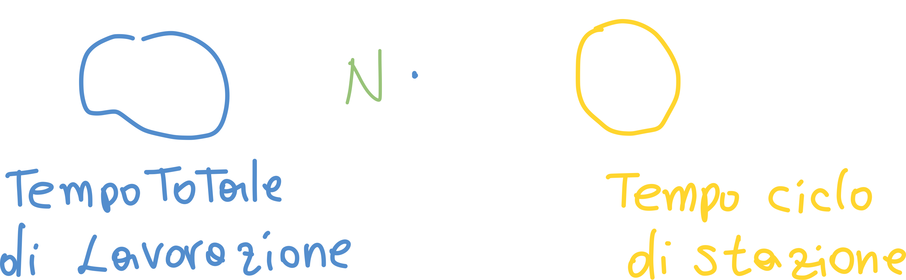
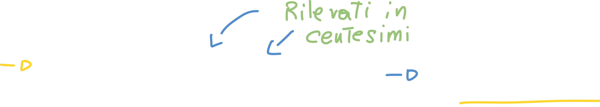

# Tempi e metodi di lavoro

A questo punto dobbiamo inziare a **gestire il sistema di produzione** che abbiamo **progettato** finora, ed il primo elemento definito nella parte gestionale è la **forza lavoro** che gestisce il sistema stesso. Dobbiamo quindi verificare i **tempi e metodi** per ogni stazione di lavoro; successivamente dobbiamo associare più di una macchina ad un solo operatore.

## Incidenza del tempo di set-up nelle operations

Le *operations* sono i tempi correlati alla produzione.

### Statement del 5%

Più precisamente va da 0.05% al 5%, e ci dice che da tutto il tempo impiegato per la produzione, tutte le fasi che **non aggiungono valore al prodotto** (ovvero non conferiscono al prodotto le sue caratteristiche finali, come: spostamenti, controllo qualità, set-up, etc.) possono impegnare fino al 95% del tempo totale.

In altre parole:

> Del tempo totale di produzione, solo il 5% viene utilizzato per conferire al prodotto il suo aspetto finale *in modo diretto*.

## Statement della tripartizione

Questo statement è **duale** al precedente, e ci dice che **il 95%** del tempo totale è composto da:

- Attesa nel frattempo che **tutto** il lotto di cui fa parte il bene viene completato
- Attesa che venga terminata una rilavorazione o modifica
- Attesa che venga emesso l'ordine di far **riavanzare** il lotto.

Se andiamo a vedere **come è composto il 5%** vediamo che esso è composto nel seguente modo:

Il 70% composto dal **caricamento e posizionamento** è proprio il **tempo di set-up**. Di conseguenza, solo il 30% del 5% del tempo totale del tempo viene effettivamente usato per trasformare il prodotto in modo diretto.

## Equazione fondamentale dello studio dei tempi

Andiamo a definire le grandezze:

### Costo TOTALE di produzione

Possiamo quindi calcolare i **costi totali**, che hanno unità di misura **Euro - €**:

### Costo UNITARIO di produzione

Per trovare il costo unitario di produzione ci basta dividere CTOT per la quantità di produzione **Q**:

 

Vediamo come, andando a dividere per Q, questo non incida sul costo unitario (dei materiali), ma incida sugli ultimi due termini; questo perchè **all'interno dei costi totali CT sono compresi i costi di set-up**!

Questa equazione ci dice quindi che i costi totali CT, e quindi anche i costi di set-up **possono diminuire solo aumentando il numero di prodotti Q!**
Allo stesso modo i costi fissi possono diminuire aumentando la quantità di prodotti.

### Calcolare il tempo di set-up

Se consideriamo un processo **multistadio**, ovvero un processo in cui il prodotto subisce una serie di processi attraversando più stadi, possiamo dire che:

- Durante l'intervallo T vengono prodotti **N elementi tutti uguali** (lotto)
- La linea di produzione viene preparata **solo una volta**: i tempi di set-up sono indipendenti dal numero di prodotti N.
- Avendo più stazioni di lavoro, ognuna indicata con un indice ***i*** chiamiamo **Tip il tempo di preparazione** della stazione i-esima.

Possiamo quindi calcolare il tempo di set-up 

> I tempi di set-up sono tutti i tempi necessari alle operazioni di attrezzaggio della macchina, al fine di renderla pronta a produrre un determinato prodotto; appartengono ai tempi di set-up:
>
> - Posizionamento del pezzo
> - Cambio dell'utensile (ad esempio la punta di un trapano)
> - Pulizia
> - Cambio impostazioni

### Calcolare il tempo totale di lavorazione

Possiamo trovare il **tempo totale di lavorazione** con una formula simile; ci basta moltiplicare la somma di tutti i **tempo ciclo di stazione** (il tempo che il prodotto passa in una stazione) per il **numero totale di prodotti**:

### Calcolare il tempo di trasporto

In questo caso calcoliamo il **tempo di trasporto tra ogni coppia di stazione**, infatti gli indici `i-1, i` indicano proprio il tempo di trasporto dalla stazione i-1 a quella i.

### Calcolare il tempo "perso" totale

Questo tempo comprende:

- Tempi di rielaborazione
- Tempi al prodotto da realizzare nuovamente (scarti)
- Tempo di trasporto
- Tempo di ciclo
- Tempo di preparazione

### Ricavare l'equazione fondamentale dello studio dei tempi

Possiamo anche calcolare il tempo **unitario** andando a dividere il valore precedente per il **numero di prodotti realizzati** (del lotto):

Contrariamente a come si potesse immaginare, **il numero di prodotti non incidono sul tempo ciclo e sul tempo di trasporto**: infatti tendiamo a pensare che quanti più prodotti dobbiamo trasportare, quanto più tempo impiegheremo; nulle di più falso!

I fattori che invece dipendono dal numero di prodotti (che ci potrebbe far diminuire il tempo di unitario) sono:

- **Tempo di setup**: se scende diminuisce il tempo unitario
- **Tempo perso**: se scende diminuisce il tempo unitario

Se però non possiamo modificare questi due tempi possiamo **aumentare il numero di prodotti** realizzati: notiamo che il numero di prodotti compare al denominatore, quindi quanto più grande è N, tanto meno questi due tempi incideranno sul tempo unitario.

## Gradi di saturazione

Nelle operations vogliamo che il grado di saturazione sia il più alto possibile, perchè gli impiegati non devono avere "tempi morti".

### Grado saturazione uomo

Per definizione, **il tempo di set-up è a totale intervento umano**, quindi definiamo grado di saturazione dell'uomo **durante il ciclo** il rapporto:

dove **TU - tempo uomo** è il tempo direttamente impiegato dal tecnico e **TC - tempo ciclo** è il tempo totale che la macchina impiega per realizzare un singolo prodotto.

### Grado di saturazione macchina

Anche in questo caso è definita da un rapporto:

In questo caso **TM - Tempo Macchina** è il tempo impiegato dalla macchina per trattare un singolo pezzo, che è  **minore di TC**, perchè TC ingloba anche altri tempi: spostamenti, set-up, carico/scarico, etc.

# Metodi per la misuazione del lavoro

E' indispensabile per pianificare e controllare la produzione andare a **misurare il lavoro**, ovvero il **dimensionamento del tempo necessario perchè un uomo svolga un insieme di operazioni**.

Abbiamo due metodi per farlo: 

- **Metodo induttivo**: studia il tempo a priori, basandosi su tabelle che forniscono i tempi di ciascuna fase
- **Metodo deduttivo**: si basa sulla rilevazione diretta dei dati, attraverso l'osservazione

## Il metodo induttivo

Non conosciamo a priori il tempo, ma abbiamoa disposizione delle tabelle, dette **Tabelle MTM - Method Time Measurement**; queste tabelle hanno una **stima di movimenti elementari** (come ad esempio la flessione del gomito, afferare un oggetto, etc.) che possiamo usare per "comporre" un movimento composto (da, appunto, micromovimenti).

In altre parole: se abbiamo un movimento "reale" possiamo usare dei micromovimenti per comporre tutto il movimento, ed attraverso le tabelle **stimiamo il tempo necessario**.

Il **tempo complessivo** è dato dalla **somma** dei tempi elementari.

### I limiti del metodo induttivo MTM

Abbiamo dei limiti ben specifici per questo metodo:

- **Costo**: ci vuole un tempo (e quindi costo) molto elevato per effettuare l'analisi dei movimenti.
- Non consideriamo i **tempi passivi**: se si effettua una misurazione in una determinata condizione non è detto che poi l'operaio mantenga la media in ogni altra condizione (ad esempio l'operaio si stanca).

## Il metodo deduttivo

Successivamente al metodo induttivo, è subentrato il metodo deduttivo: questo metodo consiste nel **dedurre** il tempo necessario alle operazioni.
Si prevede quindi di **effettaure un cronometraggio centesimale**  (non divide un minuto in 60 secondi ma in 100 parti).

1. L'operazione da misurare viene suddivisa in **fasi - blocchi** facilmente riconoscibili (ad esempio avvitamento, segaggio, etc.)
2. A questo punto, per ogni elemento o fase:
   1. Effettuiamo un certo numero di rilevazioni
   2. Si calcola la media dei tempi rilevati e la **dispersione** (si calcola la media, dev standard e dispersione per assicurarci che i dati siano attendibili/affidabili)

**Obbiettivo**: individuare il **tempo normale** per il lavoro preso in considerazione, ovvero il tempo necessario ad un uomo in condizioni normali per compiere un determinato lavoro. Capiamo quindi che il **tempo aleatorio** non è attendibile perchè il lavoratore potrebbe essere, ad esempio, affetto da stanchezza.

Dobbiamo quindi **associare ai tempi una valutazione del rendimento**, ovvero una valutazione di quanto l'attività del lavoratore ha reso dato quel tempo; questa valutazione non è altro che una **valutazione di velocità**.

Questa valutazione viene espressa mediante un **parametro V - velocità** che tiene conto di un insieme di fattori (come ad esempio la stanchezza); i valori possono essere, mediamente:

- 100 - condizioni **normali**
- 80 - prestazioni **pessime** (operatore lento)
- 133 - prestazione **ottima**

Abbiamo uno step (ovvero incremento di valutazione) di **5 unità**.

## Equazione di normalizzazione - Trovare il tempo normale

Questa equazione ci dice che **il prodotto tra il tempo e la velocità rimane sempre costante**:

Quanto maggiore è il **giudizio di velocità** dell'operaio, tanto più piccolo sarà il tempo impiegato dall'operaio. Per visualizzare il concetto ci basta isolare il tempo:

Possiamo quindi scrivere **l'equazione di normalizzazione**:

Siccome la **velocità normale vale 100** (per regola) possiamo dividere il tutto per 100, e quindi essenzialmente:

---

Possiamo quindi **trovare il tempo normale per ciascuna fase**, e la **somma di tutti i TN** fornisce il **tempo normale TOTALE** del lavoro, che però non corrisponde ancora al tempo effettivo del job.

Questo tempo deve essere **maggiorato** per una serie di motivi:

- **Bisogni fisiologici - BF**
- Per riposo - R 
  - sforzo fisico
  - sforzo neuro-psichico
- Aggiuntive o straordinarie - TAUS
  - pulizia macchina
  - microfermate
  - rallentamenti

## Abbinamento uomo-macchina

Si definisce **abbinamento uomo-macchina** il criterio che consente, in funzione dei tempi normali, l'abbinamento (ovvero la conduzione) di **più di una macchina** ad un operatore, in aggiunta a quella già inizialmente assegnatagli.

Assumiamo quindi che l'operatore possa lavorare sia quando la macchina è ferma, sia durante il **funzionamento** della macchina; questo perchè esistono delle **operazioni periodiche** (eseguite a macchina ferma) che richiedono un tempo.

Definiamo:

- **MF - macchina ferma** ovvero il tempo durante il quale l'operatore lavora con la macchina ferma. E' in questo tempo che **rientra il tempo di set-up**!
- **TM - tempo macchina** ovvero il tempo **totale** durante il quale la macchina processa il pezzo.
- **ML - macchina lavora** ovvero il tempo durante il quale operatore e macchina lavorano: la macchina richiede l'intervento dell'operatore (anche solo di osservazione); in questo tempo l'operatore non può fare altro.
- **TAUS - tempo ausiliario** ovvero azioni periodiche ricondotte al ciclo in esame
- **BF - bisogni fisiologici** ovvero il tempo per bisogni fisiologici
- **TA - tempo attivo** ovvero il tempo totale durante il quale **l'operatore lavora sulla macchina** oppure è impegnato in altri tempi
- **TP - tempo passivo** l'uomo non lavora e non deve nemmeno presidiare (osservare) la macchina.
- **TC - tempo ciclo**

Possiamo calcolare alcuni di questi valori con le formule:

### Tempo attivo:

- **TA** = MF + ML + TAUS + BF

Bisogna notare che **è incluso anche il tempo dei bisogni fisiologici**; se così non fosse, questi tempi verrebbero utilizzati per l'abbinamento. Qusto però è **contro le regole dell'abbinamento**, che prevede di abbinare una seconda macchina solo nei tempi in cui l'operatore **non fa nulla** (andare in bagno è un'attivita!).

### Tempo passivo

- **TP** = TM - ML

### Tempo ciclo

Il tempo di ciclo sarà ovviamente la somma dei precedenti:

- **TC = TA + Tp** = MF + TM + TAUS - ML

---

Possiamo quindi Osservare quindi questo diagramma che ci mostra il **susseguirsi dei vari tempi**:

1. Inizialmente la macchina è ferma, deve essere quindi preparata (set-up)
2. Successivamente quando la macchina parte, inizia il **tempo macchina**; allo stesso tempo inizia anche il tempo in cui l'operatore è occupato sulla macchina (ML)
   1. Se l'operatore termina ciò che doveva fare prima che finisca il tempo macchina, inizia il **tempo passivo TP**, in cui l'operatore non fa nulla.
3. Quando finisce il tempo macchina iniziano i tempi ausiliari e tempi fisiologici.
   1. Finchè non termina il tempo macchina, l'operatore non potrebbe andare in bagno e/o iniziare le operazioni di pulizia: non è impegnato in nulla.

### Come abbinare una nova macchina?

Per abbinare una nuova macchina **il tempo ciclo totale della seconda macchina non può essere superiore al tempo passivo dell'operatore.**

Il numero di macchine abbinabili sarà dato quindi dalla formula:

Dove **`TA' = TA + Tempo di trasferimento`**

Sviluppando la somma ci accorgiamo che il numero di macchine abbinabili è proprio uguale all'**inverso della saturazione uomo** calcolata precedentemente.

#### Caso del sovradimensionamento

> Lezione 2020 11 10 

Nel caso in cui abbiamo un **alto grado di automazione TM** possiamo **affidare più macchine allo stesso operatore**, ma solo a patto che le macchine siano disposte in maniera tale da permettere **tempi di spostamento contenuti**.

Cosa accade se il numero di macchine da assegnare è, ad esempio, **2,3**? Se abbiniamo all'operatore 3 macchine, le prime due sono "piene" mentre nella terza macchina ci sarà un **eccesso di tempo ciclo** rispetto al tempo passivo (perchè la terza macchina finisce dopo che la seconda abbia terminato N.d.S.); questo valore corrisponde all'**aliquota di arrotondamento**, ovvero `3-2,3 = 0,7`.

Il tempo della terza macchina è più grande del tempo passivo dell'insieme della prima e della seconda del 70%; in altre parole, questo vuol dire che quando la seconda macchina avrà terminato la lavorazione, il ciclo della seconda macchina sarà terminato, ma l'operatore è ancora impegnato sulla terza; di conseguenza la prima e la seconda macchina **si fermano in attesa** di un intervento dell'operatore.

> Nel caso del **sovradimensionamento** l'arrotondamento è proprio pari all'eccesso del tempo ciclo rispetto alla somma dei tempi passivi delle due macchine.
>
> Di conseguenza, le macchine precedenti all'ultima si fermeranno in attesa dell'operatore.

### Caso del sottodimensionamento

In questo caso, se scegliamo 2 macchine invece di 3, (arrotondiamo per difetto) avremo che il tempo ciclo della macchina 2 sarà minore rispetto al tempo passivo della prima (la seconda macchina "ci va larga" N.d.S.), di conseguenza l'operatore avrà del **tempo passivo inutilizzato**.

Questo tempo passivo inutilizzato sarà pari proprio all'arrotondamento per difetto: `tempo inutilizzato = 2,3 - 2 = 0,3`; di conseguenza **il 30% del tempo passivo iniziale** resta inutilizzato (il 30% è pur sempre meglio del 100!).