# Manutenzione dei sistemi di produzione

La manutenzione è un elemento fondamentale per gli impianti di produzione; essa è definita come **controlli costanti sull'impianto**, insieme a **lavori di riparazione** e revisioni che sono necessari per assicurare il corretto funzionamento degli impianti produttivi.

Ci sono diverse **politiche di manutenzione**, che andiamo ad elencare:

## Politiche di manutenzione

### Manutenzione correttiva

Questo tipo di manutenzione si applica **dopo un guasto**: la macchina viene **fermata** e quindi riparata. Lo scopo è quello di riportare la macchina (entità) allo stato in cui è possibile il corretto funzionamento.

Questo tipo di manutenzione ha dei **fattori negativi**: andiamo infatti a **perdere dei ricavi**, perdita dovuta al fermo improvviso delle macchine.
Ci conviene quindi applicare questo tipo di manutenzione solo se il **fermo macchina** non comporta gravi perdite e se l'opera di manutenzione è "semplice".

### Manutenzione migliorativa

Questo tipo di manutenzione consiste nella **modifica ad apparecchiature e macchinari funzionanti**, allo scopo di **migliorare** le loro prestazioni.

Questo tipo di manutenzione mira ad ottimizzare le prestazioni delle apparecchiature ed a ridurre i tempi di fermo macchina.

### Manutenzione preventiva

Questo tipo di manutenzione viene eseguita ad **intervalli predeterminati** o in accordo a **criteri prescritti** in modo da **ridurre le probabilità di guasto**.

Si basa sulla sostituzione programmata di un determinato componente ancora funzionante della macchina (ma possibilmente usurato e prossimo alla rottura) in modo da prevenire i guasti prima che si verifichino.

I componenti da sostituire vengono scelti a seconda di **parametri - limiti** di componenti: ad esempio ogni lampadina ha una durata in ore, oltre le quali la lampadina potrebbe smettere di funzionare da un momento all'altro.

### Manutenzione predittiva

Questa manutenzione si basa sulla **capacità di prevedere un guasto**, quindi dal riconoscimento di **un'anomalia** che porterà inevitabilmente al guasto di un componente.

Abbiamo quindi bisogno di un **servizio di informazione** e di strumenti informativi sullo **stato del macchinario**.

### Manutenzione produttiva

La filosofia dietro questo tipo di manutenzione si basa sul **continuo miglioramento delle prestazioni** assegnando alcune attività agli operatori delle macchine: l'obbiettivo è quello di permettere agli operatori stessi di identificare e risolvere i problemi di manutenzione.

### Manutenzione centrata sull'affidabilità

Questo tipo di manutenzione prevede l'utilizzo di **tecniche di analisi dei sistemi** come la **Reliability Centered Maintenance - RCM**.

Questa analisi RCM prevede l'esecuzione in successione dei seguenti step:

1. **Scomposizione fisica del sistema** in moduli, mettendone in evidenza le interconnessioni.
2. **Scomposizione funzionale.**
3. **Scomposizione affidabilistica.**
4. **Analisi dei modi di guasto**.
5. **Analisi delle criticità.**
6. **Selezione di una strategia di manutenzione.**
7. **Piano delle attività di manutenzione**.

L'RCM, attraverso un'accurata analisi del sistema e dei componenti, valutando i **modi di guasto**, consente di scegliere la **migliore politica manutentiva per ciascun elemento**

## FMEA e FMECA

Gli approcci che si basano sui concetti della **manutenzione centrata sull'affidabilità** sono scostituiti dalla metodologia **FMEA - Failure Modes and Eccets Analysis** e dalla metodologia **FMECA - Failure Modes, Effects abd Criticity Analysis**.

### Metodologia FMEA

> Pagina 238

E' un **processo sistematico** utile per **identificare e prevenire errori di progettazione** in modo da eliminarli o limitare il rischio a loro associato. 

La metodologia FMEA si compone di tre fasi:

1. La prima fase è **qualitativa** ed analizza tutti i possibili modi di guasto o rottura, valutandone anche gli effetti che possono verificarsi (rispecchiandosi sul prodotto finale).
2. La seconda fase è **quantitativa** ed ha come obbiettivo quello di quantificare effettivamente la pericolosità della terna **causa - modo - effetto**.
3. La terza fase è **correttiva** ed individua le possibili azioni correttive mirate a ridurre la pericolosità e la criticità della modalità di rottura.

### Metodologia FMECA

> Pagina 241

Questa tipologia consiste nel **suddividere i possibili effetti** delle varie modalità di rottura in quattro **classi di gravità**:

1. **Catastrofica**
2. **Critica**
3. **Marginale**
4. **Minore**

Possiamo **calcolare l'indice di criticità** mediante la formula:

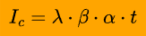

Dove ogni variabile significa:

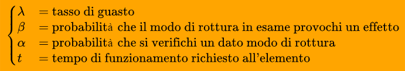

andiamo quindi a calcolare **Ic** (indice di criticità) complessivo dei modi di rottura per **ogni classe di gravità** e si sommano gli indici di criticità di tutti i modi di rottura della classe.

## Differenza tra guasto ed avaria

Si deduce che **il guasto è un evento**, ovvero un passaggio da uno stato di corretto funzionamento ad uno stato che non permette di rispettare le prestazioni prestabilite.

**L'avaria è uno stato** vero e proprio, in cui la macchina **non è in grado di operare.**

## Approcci quantitativi per la manutenzione

### Teoria dell'affidabilità

L'affidabilità di un elemento p definita come la **probabilità che l'elemento funzioni senza guastarsi per un certo tempo t** in determinate condizioni ambientali.

L'elemento in esame può assumere due stati:

- **Funzionamento buono**
- **Funzionamento cattivo**

Ovviamente dobbiamo **stabilire un criterio** per **stabilire se l'elemento è funzionante o meno**, inoltre devono essere stabilite anche le **condizioni ambientali** che si devono **mantenere costanti** durante il **tempo prestabilito** (ovvero l'arco temporale in cui ci aspettiamo che il componente funzioni correttamente).

Definiamo la variabile **T - tempo fino al guasto di un elemento** che ci dice il tempo che intercorre tra l'istante iniziale in cui si avvia la valutazione dell'affidabilità e l'istante in cui l'elemento si rompe.

Definiamo una **densità di probabilità di guasto**  una funzione f(t) tale che la probabilità infinitesima che l'elemento si guasti al tempo t o in un suo introno infinitesimo (praticamente t) sia:

In altre parole, la probabilità che il componente si guasti rappresenta l'area sottesa alla curva in un intervallo che va da *t* a *t + dt*:

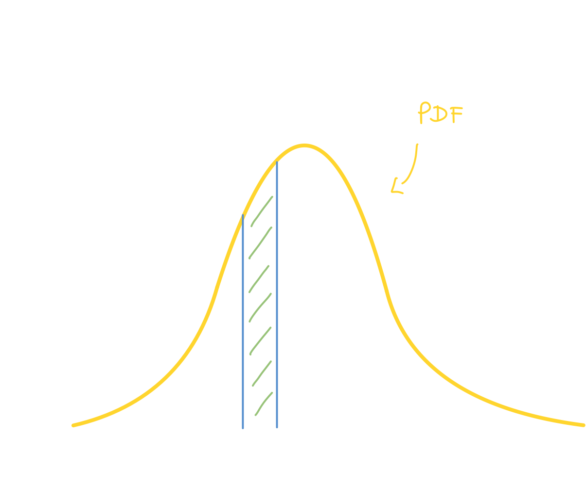

> Densità di probabilità di guasto - PDF

Sappiamo che l'area sottesa di una PDF vale 1 (probabilità di normalizzazione vista nell'[esame di fondamenti di telecomunicazioni](https://github.com/follen99/Fondamenti-Di-Telecomunicazioni/blob/main/Appunti/2.07%20-%20PDF%20E%20Gaussiana.pdf)), possiamo dire che **se calcoliamo un intervallo di tempo *infinito* la probabilità che un qualsiasi elemento si guasti è 1, ovvero certa**.

Possiamo a questo punto calcolare diversi dati:

- **Probabilità che l'elemento si guasti *entro* un certo tempo**: ci basta calcolare l'area sottesa alla curva *fino* al momento t, ovvero l'integrale tra zero e t della funzione:
  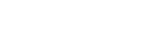
- **Probabilità che l'elemento funzioni *dopo* un certo tempo**: ci basta calcolare l'area sottesa alla curva da t a più infinito; questo non possiamo farlo perchè c'è un asintoto, per cui sottraiamo ad 1 (probabilità certa, ovvero l'area di tutta la curva), la probabilità che l'elemento arrivi sano *fino* al tempo t.
  

### Leggi statistiche della durata di vita

Per un sistema meccanico complesso possiamo individuare tre fasi di vita principale:

- Mortalità infantile
- Vita utile
- Senilità / usura

#### Mortalità infantile

Mettiamo in funzionamento al tempo **T = 0** delle macchine nuove; di conseguenza se nella popolazione di componenti ci sono dei pezzi affetti da **errori di progettazione** e quindi di struttura più debole, questi si andranno a guastare quasi subito.

La curva **λ(t)** indicherà quindi **alti valori del tasso di guasto**.

Questo periodo è detto mortalità infantile proprio perchè è il periodo di vita iniziale dei componenti: ad esempio nel caso automobilistico, ogni modello **pre serie** viene testato in pista in modo da identificare tutti quei pezzi affetti da errori di produzione; ogni volta che se ne scopre uno lo si corregge.

Di conseguenza la curva λ(t) avrà valori molto alti inizialmente, ma via via che si correggono i pezzi, questa curva scenderà, assumendo un aspetto del genere:

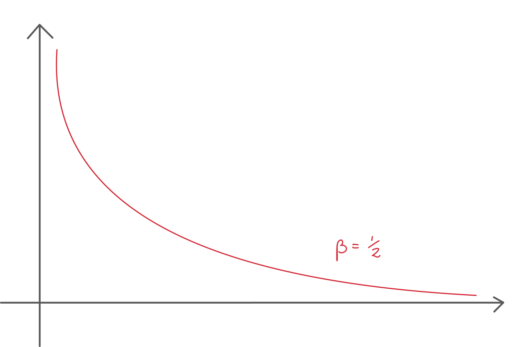

I **parametri** alpha e beta sono:

- **Apha** - Caratteristica
- **Beta** - Parametro di forma

Man mano che si va avanti nel tempo il valore si stabilizza fino a diventare **costante**.

#### Vita utile

Come abbiamo visto, dopo un certo periodo di tempo, i componenti prima o poi raggiungono un **tasso di guasto basso e costante**; il periodo di tempo in cui il tasso rimane costante viene detto **vita utile**:

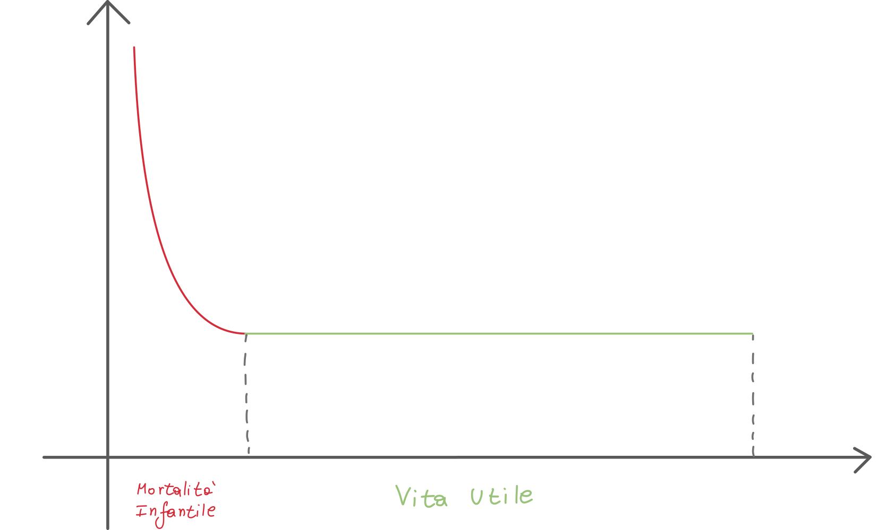

Siccome l'affidabilità è **l'area sottesa alla curva in un dato intervallo**, con il passare del tempo questa non è ovviamente costante (a differenza della funzione).

#### Senilità o usura

Quando i componenti raggiungono **l'età Tu** ha inizio il fenomeno dell'usura: da questo momento in poi il **tasso di guasto cresce** rapidamente. Otteniamo quindi la curva finale, detta **curva a vasca da bagno**:

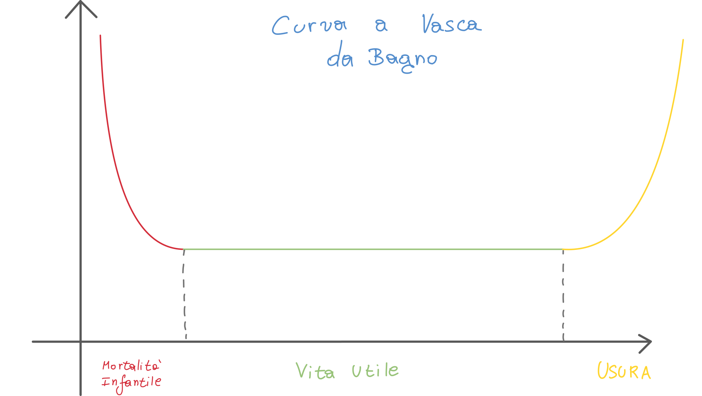

### Le politiche di manutenzione nelle fasi di vita di un prodotto

Possiamo quindi identificare le diverse politiche di manutenzione nelle diverse fasi di vita di un prodotto:

1. **Mortalità infantile** - In questo caso la politica di manutenzione è di tipo **migliorativa**
2. **Vita utile** - **Manutenzione di tipo preventiva - ciclica**. Anche un pizzico di *migliorativa*
3. **Usura** - **Preventiva**. Si sostituiscono i componenti a rischio rottura.

## Tempi della manutenzione

> Da pagina 257

Un intervento di manutenzione comporta un costo che deriva non solo dall'intervento stesso, ma anche dal **tempo in cui la macchina non produce**; diventa quindi importante riuscire a **calcolare il tempo legato ad un intervento di manutenzione**.

### Manutenzione a guasto

Nel caso di manutenzione a guasto (ovvero quelle attività di manutenzione che si verificano solo dopo un guasto), definiamo il **tempo medio fino al guasto - MTTF (Mean Time Till Failure)** che viene calcolato con il seguente integrale:

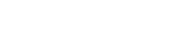

Possiamo anche **integrare la probabilità che l'elemento funzioni dopo un certo tempo**:

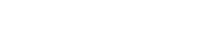

### Sistemi riparabili

Il caso che analizzeremo è quello in cui si parla di **tempo medio tra due guasti, ovvero Mean Time Between failures - MTBF** e possiamo calcolarlo con la seguente formula:

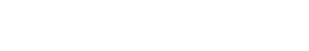

Possiamo Rappresentare su un diagramma temporale le fasi della riparazione:

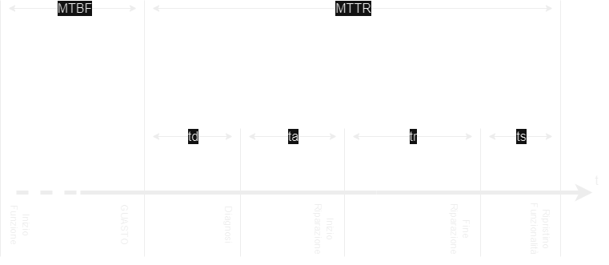

Dove:

- **MTTR - Mean Time To Repair** ovvero il tempo medio che richiede la riparazione
- **td** - tempo di diagnosi del guasto
- **ta** - tempo di attivazione dell'intervento, ovvero il tempo richiesto dalla squadra di riparazioni per sopraggiungere
- **tr** - tempo di riparazione
- **trs** - tempo di ripristino funzionalità, ovvero il tempo necessario per riportare la macchina in regime di funzionamento